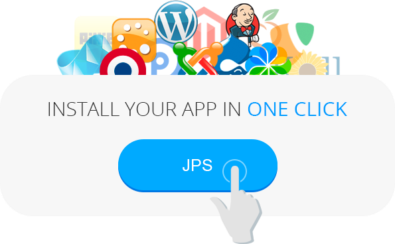
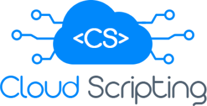
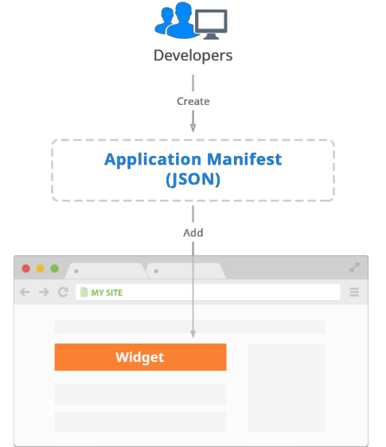
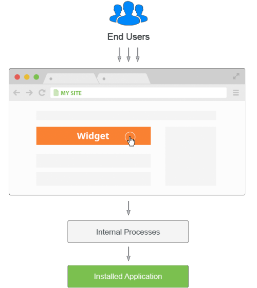

# Packaging Standard for CI/CD Automation

**Packaging Standard** (also known as JPS) is a tool to prepare ready-to-go application and add-on templates. Such preconfigured solutions can be integrated within any platform in just one click, simplifying installation and configuration for application of any type.

JPS package is based on JSON installation manifest. This file is used to describe processes of environment creation, application deployment and configuration, allocation of resources and setting scaling limits for each server within an environment.  

This technology allows to [automate complex CI/CD scenarios](#application-cicd-automation-with-cloud-scripting) and easily distribute your ready-to-go solutions with [one-click installation widgets](#widget-for-instant-application-deploy).

## Application CI/CD Automation with Cloud Scripting

Powered by a special platform-developed [Cloud Scripting](http://docs.cloudscripting.com/) language, JPS packaging technology can help to completely automate the application delivery process - e.g. to automatically transfer each new application version through development, testing and production stages. This is ensured by applying the required project processing logic through interconnecting different [platform API](https://www.virtuozzo.com/application-platform-api-docs/) methods.

Due to the variety of tuning and automation options available, you can implement almost any required scenario by means of Cloud Scripting - from executing pretty simple operations to maintaining complex distributed applications and clusters. 
To achieve this and build own custom solution, with CS you are able to:

* predefine the required configuration properties and declare expected application behavior with the help of appropriate [actions](https://docs.cloudscripting.com/creating-manifest/actions/)
* bound these operations to particular application lifecycle [events](https://docs.cloudscripting.com/creating-manifest/events/) 
* fetch [user input](https://docs.cloudscripting.com/creating-manifest/placeholders/#input-parameters) data and use it inside
* execute [custom scripts](https://docs.cloudscripting.com/creating-manifest/custom-scripts/) right within created containers

{}**Note:** Before preparing your own package, we recommend to get acquainted with the number of ready-to-go solutions at [JPS Collection](https://github.com/jelastic-jps). Any of them can be easily integrated within your projects or used as a basis to create your own automated solution.{}

## Widget for Instant Application Deploy

Once your application is packed into JPS, you can provide other developers with a **widget** for its fast installation. This helps to additionally improve application distribution efficiency and increase its general appeal due to deployment simplicity. Simultaneously, such approach reduces spends for your project support and after-install management.

Widget contains **manifest** (or a link to its source) with description of cloud environment, needed for this application, and instructions on its automated installation and configuration.

To install packaged application into the platform, a user needs to **initiate installation** by means of the chosen widget and receive confirmation URL via specified email. Once this link is followed, the platform will automatically parse and process manifest data to create or tune the appropriate environment and interconnect the required nodes. As a result, a user gets a fully configured running application without any extra configuration steps required.

Use the docs below to find out information on how to properly compose application manifest and create such installation widget:

* [Application Manifest](/application-manifest/)
* [Application Manifest Example](https://docs.cloudscripting.com/samples/)
* [Placeholders](https://docs.cloudscripting.com/creating-manifest/placeholders/)
* [JPS Collection](https://github.com/jelastic-jps)

{}**Note:** After packaging your own application due to our instructions, you can contact your hosting provider and negotiate adding your JPS to the set of solutions within [Marketplace](/marketplace/) at the dashboard. In such a way, your app will be available for automatic deploy to all users within your hosting platform.{}

## What's next?

- [Cloud Scripting](https://docs.cloudscripting.com/)
- [Application Manifest](/application-manifest/)
- [Marketplace](/marketplace/)