# FTP/FTPS Support

**File Transfer Protocol (FTP)** is a standard network protocol used to transfer files from one host to another over a TCP-based network.

**FTP** is built on a client-server architecture and uses separate control and data connections between the client and the server.

For secure transmission that hides (encrypts) the username and password, and encrypts the content, it is used FTP secured with SSL (**FTPS**).

The platform supports both **FTP** and **FTPS**.

Unlike HTTP, the FTP protocol is stateful: you establish a control connection for the duration of an FTP session that typically spans multiple data transfers.

**FTP Usage:**

* uploading/downloading resources
* downloading and reading [logs](/view-log-files/) for analysing
* editing configurations
* syncing files
* deploying applications (not recommended)

With Platform FTP feature is available for both application servers and databases.

{}**Note:** Currently, FTP add-on is not compatible with [Docker containers](/dockers-overview/).{}

To benefit from FTP with the platform, you need to meet three requirements:

* to have **FTP client** installed (for example, FileZilla)
* to have **compute node** added to the environment
* to attach **Public IP** for the node in your environment

<iframe src="//www.youtube.com/embed/kreqXdtaU6Y" allowfullscreen="" frameborder="0" height="349" width="560"></iframe>

Let's go step-by-step the process of adding FTP to your environment:

* [Create Environment](#create-env)
* [Install FTP](#install)
* [Using FTP](#usage)
* [Transfer Files](#file-transfer)
* [Download Log Files](#download-logs)
* [Synchronize Files](#synch-files)
* [Edit Configuration Files](#edit-configs)
* [Deploy Application via FTP](#deploy)
* [Switching FTPS](#ftps)
* [Reset FTP Password](#reset-password)
* [State Custom FTP Password](#custom-password)<a id="create-env"></a>
* [Uninstall FTP](#uninstall)


## Create Environment

1\. Log in to the platform dashboard.

2\. Click **Create environment** to set up a new environment.


3\. In the opened wizard select **application server** (e.g.*Tomcat*) or **database** (e.g. *MySQL*) and switch on **Public IP**.

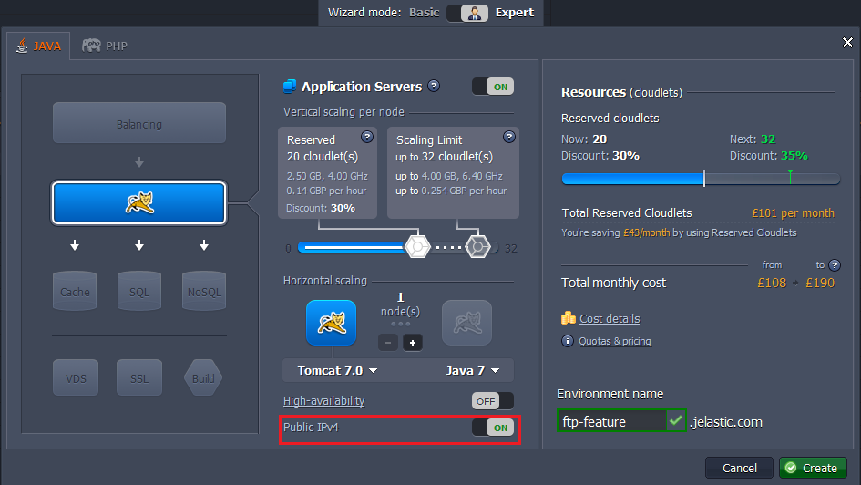

Wait just a few seconds for your environment to be created<a id="install"></a>.


## Install FTP

1\. Click **Add-ons** button for your application server (or database).

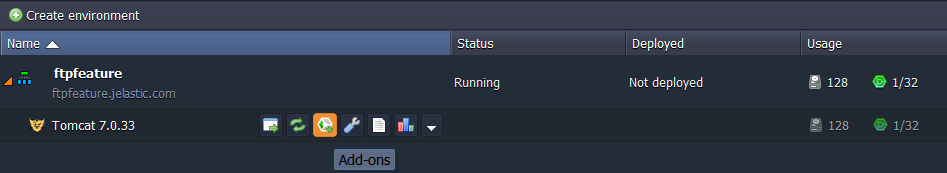

2\. In the opened tab you'll see the list of all applications available for adding to your environment. Find FTP and click **Install**.

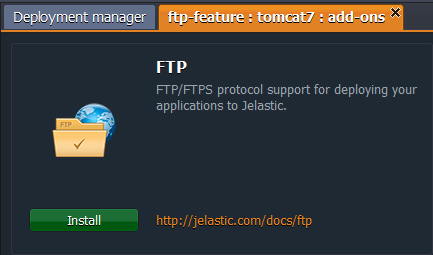

3\. Сonfirm the installation by clicking **Install** button in the opened window.

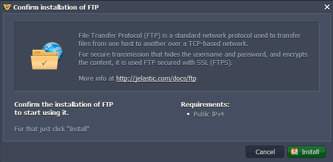

4\. After adding FTP to the environment you'll get the email with credentials for accessing (FTP links, Login, Password, IPs etc.)<a id="usage"></a>.


## Using FTP

#### Through FTP Client

1\. Install and open any **FTP client** (e.g. *FileZilla*).

2\. Enter your *Host*, *Username* and *Password* using the FTP credentials you've got in the email after installation. Perform the connection.

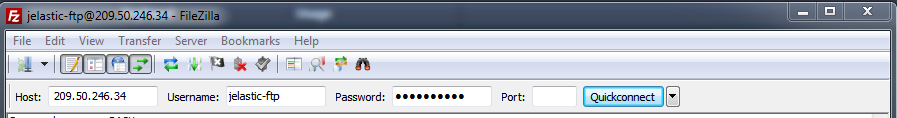

3\. Now you can see the list of the **config** folders in your FTP client.

4\. You can make the changes you need (*download, copy, delete the files etc.*) right from your **FTP client**.

5\. If you refresh the data in the **config** tab for your server (or database) in the platform dashboard, you'll see all changes made through FTP client.

#### Through Browser

1\. Click **Add-ons** button for your application server (or database).

2\. Find FTP in the list of applications. There you'll see the list of IPs available.

3\. Click on the IP link. In the opened browser tab fill in your FTP credentials (*Username* and *Password* which you've got in the email after installation).

4\. After that the list of **config** folders are going to be opened. Here you can look through the files in all the folders<a id="file-transfer"></a>.


## Transfer Files

1\. Install and open any **FTP client** (we use *FileZilla* as an example).

2\. Enter your *Host, Username* and *Password* using the FTP credentials you've got via email after FTP installation. Perform the connection by clicking **Quickconnect**.

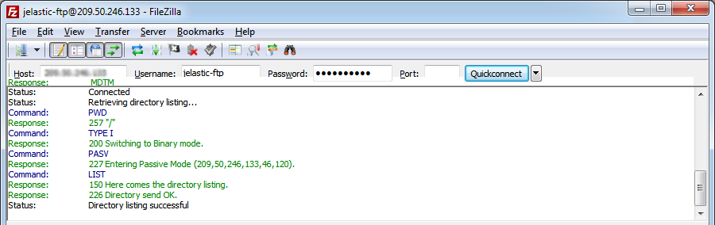

3\. You can upload or download files simply by double-clicking on them. To transfer directories and/or multiple files select them, right-click the selection and then click on **Upload/Download** in the popup menu.

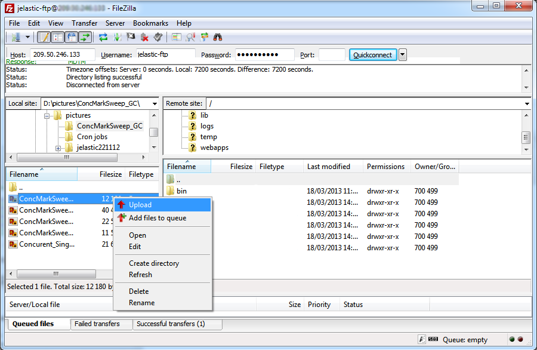

4\. You can simply drag the files from one directory and drop them on the other one for transferring.

5\. Add your files to the queue if you want to transfer them later.

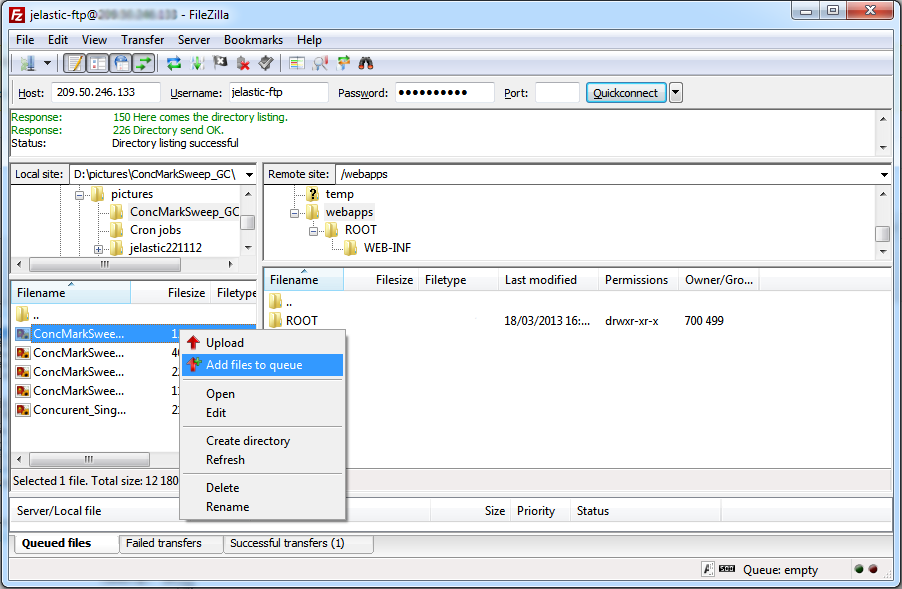

6\. One more useful feature is directory comparison. To quickly see differences between files on the local machine and the server, choose **View &gt; Directory Comparison**, select either compare file size or compare modification time and click **Enable**.

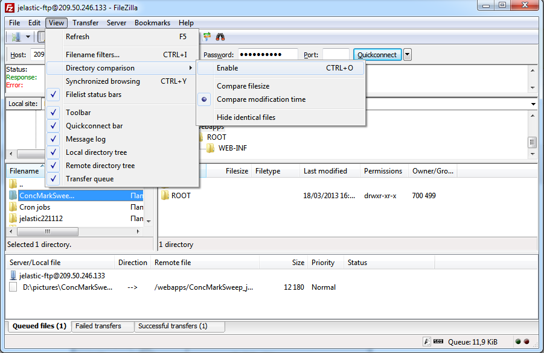
<a id="download-logs"></a>


## Download Log Files

1\. Install and open any **FTP client** (we use *FileZilla* as an example).

2\. Enter your *Host, Username* and *Password* using the FTP credentials you've got via email after FTP installation. Perform the connection by clicking **Quickconnect**.

3\. Now you can simply export your logs: navigate to the **logs** folder, select the log file you need, download it as it's shown in the screenshot below and open in any convenient editor to review.

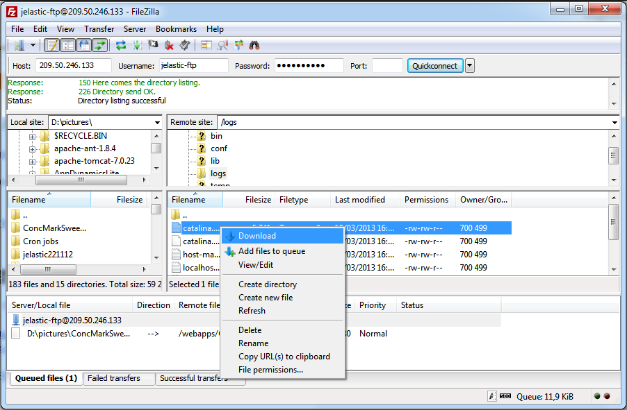
<a id="synch-files"></a>


## Synchronize Files

1\. Install and start *GoodSync*. Click the **Browse** button on the left side.

2\. In the opened window choose the **FTP** tab, fill in the required fields (*Host, Username, Password*) and click **Go** button.

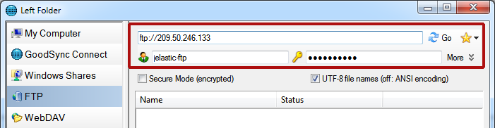

3\. Then choose the necessary folder on your server and click **OK**.

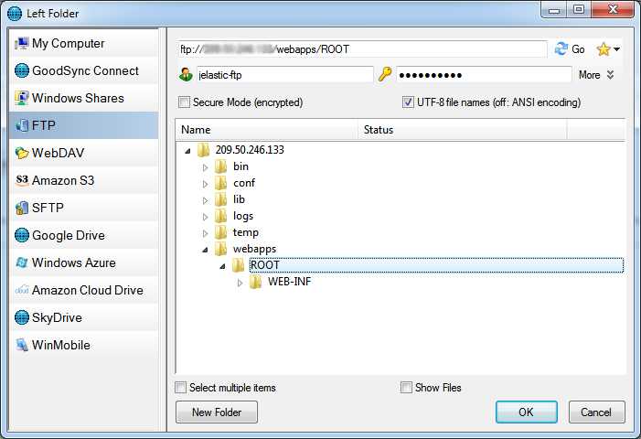

4\. After that click the **Browse** button on the right side and choose the local folder you would like to back up or sync your data to.

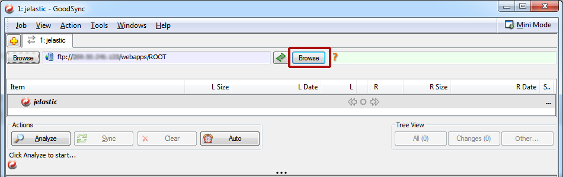

5\. Then in the main window click the **Analyze** button. You will be shown all the differences in the chosen folders.

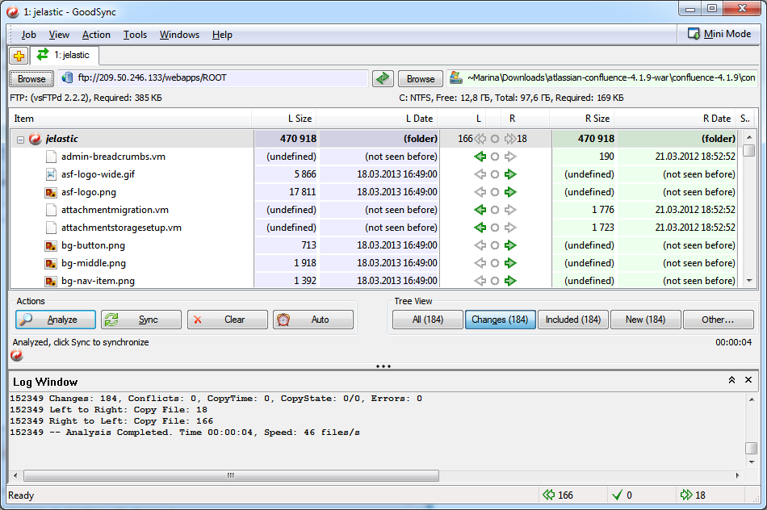

6\. Click the **Sync** button to perform the synchronization.

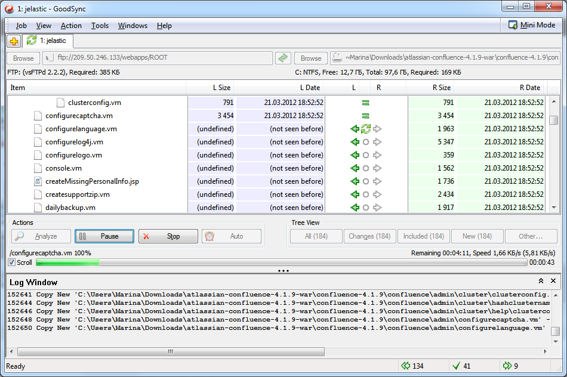
<a id="edit-configs"></a>


## Edit Configuration Files

1\. Open your config editor (we use *Sublime Text 2* as an example).

2\. Connect to your server (or database) via FTP (if you use Sublime click **File-&gt;FTP/SFTP-&gt;Browse server**) and you can start edit your files.

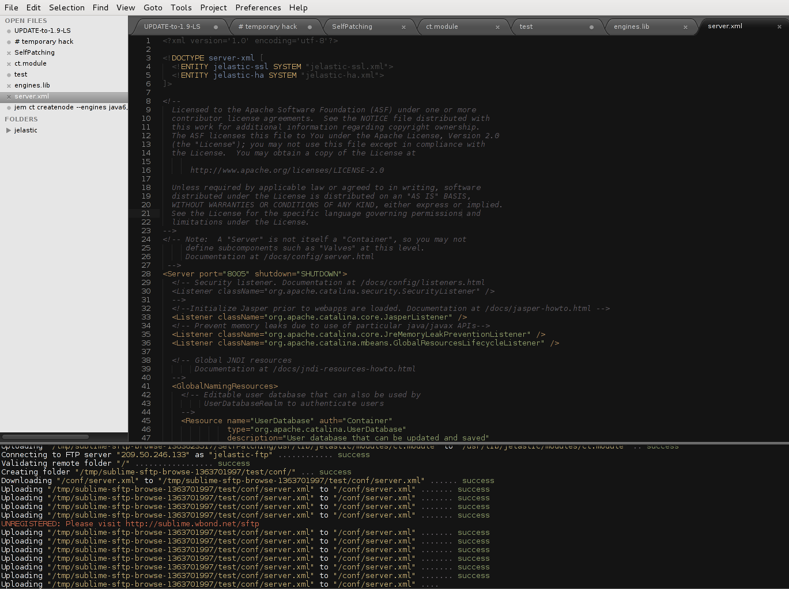
<a id="deploy"></a>


## Deploy Application via FTP

{}**Note:** We don't recommend to deploy your apps in such a way because application you've deployed won't be shown in the platform dashboard, so if you want to redeploy or delete your application you have to do this manually. Also such a deployment procedure is not suitable for GlassFish application server.{}

Let's consider a short example on how to deploy **Railo** to your environment through *FileZilla*.

1\. Install and open any **FTP client** (we use *FileZilla* as an example).

2\. Connect to your environment via FTP: Enter your **Host, Username** and **Password** and click on the **Quickconnect** button.

3\. Copy your application files into the **ROOT** folder (or create another context for your app and copy your files in it).

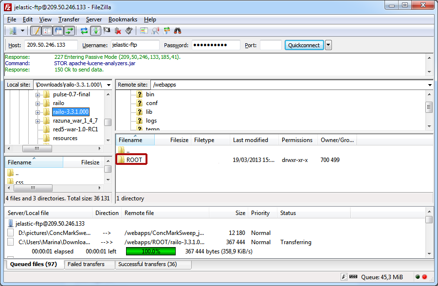

4\. Now you can return to the platform dashboard and make sure that everything is ok. For that click **Open in Browser** button for your environment.

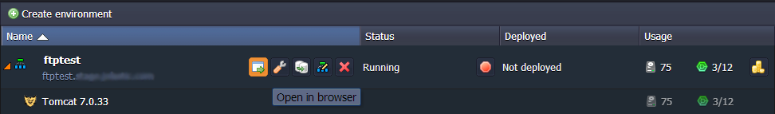
 
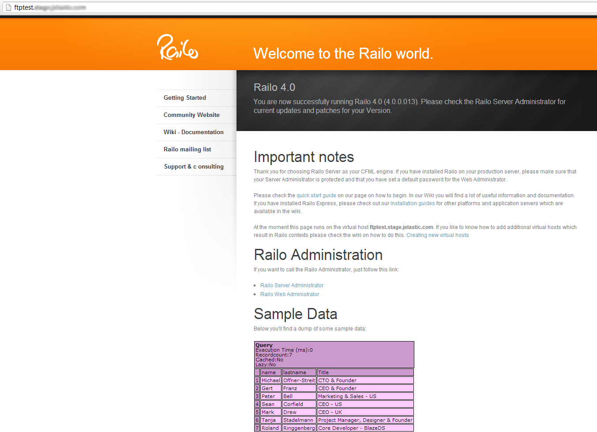
<a id="ftps"></a>


## Switching FTPS

1\. Navigate to your **FTP client &gt; File &gt; Site manager** (as an example, we use *FileZilla*).

2\. Create **New Site** and fill in required data:

* **Host** (use your FTP credentials)
* **Protocol** (FTP - File Transfer Protocol)
* **Encryption** (Require explicit FTP over TLS)
* **Logon Type** (Interactive)
* **User** (use your FTP credentials)

3\. Click **Connect**.

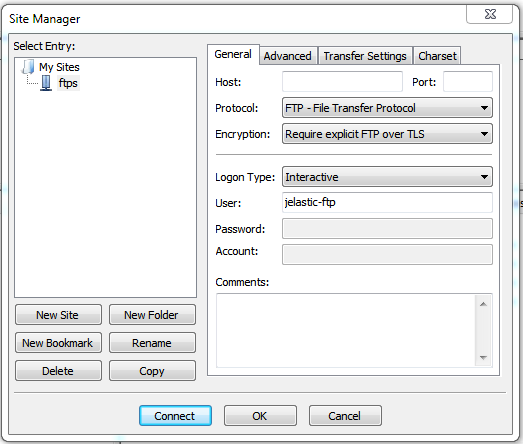

4\. Enter password.

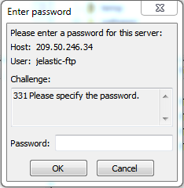

5\. Now you are connected through FTPS<a id="reset-password"></a>.


## Reset FTP Password

1\. Click **Add-ons** button for your application server (or database).

2\. Find FTP in the list of applications and click **Reset Password** button.

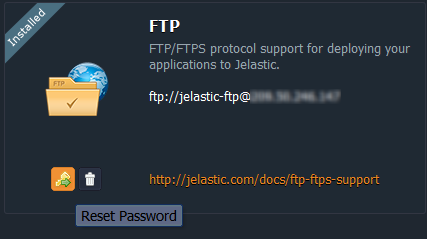

3\. You'll be sent the email with a new FTP password<a id="custom-password"></a>.


## State Custom FTP Password

You can change the password of FTP-addon, installed at your environment. Using custom password instead of one, which was automatically generated and sent to you via email while FTP-addon installation or password resetting, highly improves your application security.

Your FTP password can be changed via SSH following the next steps:

1\. [Generate](/ssh-generate-key/) an SSH key and [add](/ssh-add-key/) it to your dashboard.

2\. [Access](/ssh-access/) a necessary container with the installed FTP-addon via SSH.

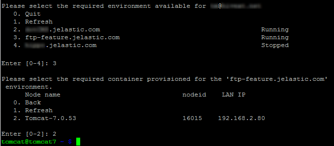

3\. Execute the following command inside the container:
```bash
sudo /usr/bin/passwd jelastic-ftp
```

4\. Enter and confirm your new password.

{}**Note:** After new password entering you can see some warning messages, e.g. ***BAD PASSWORD: it is based on a dictionary word*** or ***BAD PASSWORD: is too simple***.

It's just a recommendation for increasing your password reliability, ignore them if you consider your custom password to be secure enough. Password will be changed anyway.{}

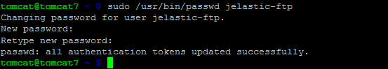

Now you can use a new password for accessing your environment via FTP protocol<a id="uninstall"></a>.


## Uninstall FTP

1\. Click **Add-ons** button for your application server (or database).

2\. Find FTP in the list of applications and click **Uninstall**.

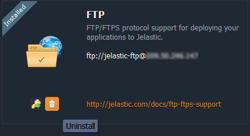

{}**Note:** If you install FTP in the environment with one application server (e.g. *Tomcat*) horizontal scaling of this environment will clone this server together with FTP. In such a way FTP will be installed on both instances with the same credentials.  

But this does not apply to **GlassFish** server. If FTP has been installed in the environment with one GlassFish it will not be cloned to the newly added GlassFish servers. So to have FTP installed on both instances at first you need to disable FTP and then reinstall it one more time. In such a way it will be enabled on both servers.{}


## What's next?

* [Secure Sockets Layer](/secure-sockets-layer/)
* [Remote Access via WebDAV](/remote-access-via-webdav/)
* [Public IP](/public-ip/)
* [SSH Access](/ssh-access/)