# External SMTP for Emails Sending

**SMTP** (Simple Mail Transfer Protocol) is a standard for sending emails via Internet protocol (IP) networks. Communication between sender and receiver is performed via emanating command strings and delivering data using a reliable data stream channel, a TCP connection usually. In this tutorial we will show how to send emails via SMTP using PaaS PHP hosting. Here we present two ways of performing this settings:

* [by using PHPMailer](#phpmailer-for-email-sending)
* [by configuring a custom code of the form for email sending](#using-custom-form-for-email-sending)


## PHPMailer for Email Sending

PHPMailer is a classic full-featured email sending class for PHP, compatible with PHP v. 5.0 and higher. Let's examine how to integrate it to the platform.

1\. Log in to the platform dashboard.

2\. Create your PHP environment. For that press the **Create environment** button and navigate to the **PHP** tab in the opened dialog box.

3\. Choose **Apache** application server and specify cloudlet limits for it. Then enable **Public IP** feature for Apache node, type the name for your new environment (for example, *phpmailer*) and click **Create**.

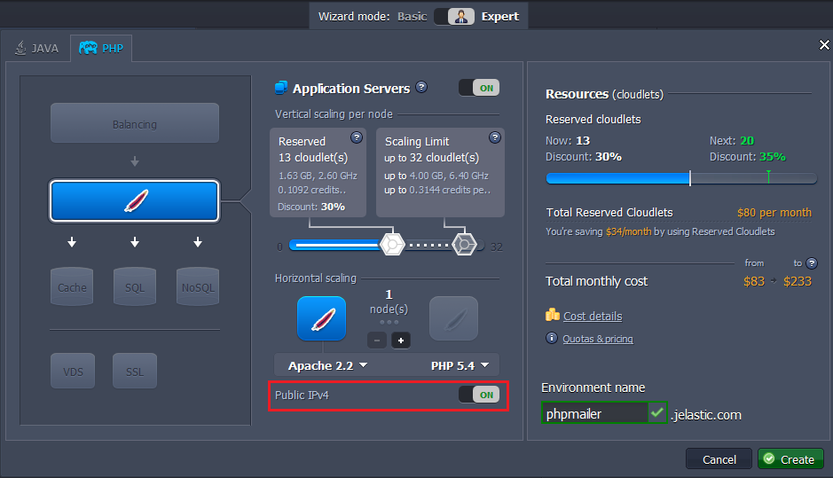

4\. Download the **[PHPMailer script](https://download.jelastic.com/public.php?service=files&t=1c0e6f02fd2da054818b86182fc5747d&download&path=//phpmailer.test.tar.gz)** (here we provide you with our custom version which excludes all extra settings and is targeted only on SMTP). 

5\. Navigate to the **Deployment manager** and **Upload** the downloaded package to the platform dashboard.

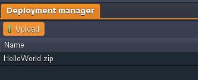

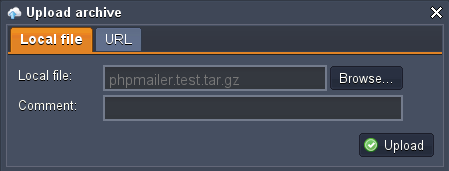

6\. When the uploading is completed, deploy **PHPMailer package** to the environment you've created before.

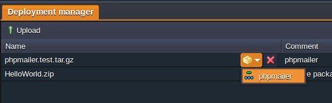

7\. Then click **Config** button next to your application server and open **webroot > {context_name} > config.php** file.

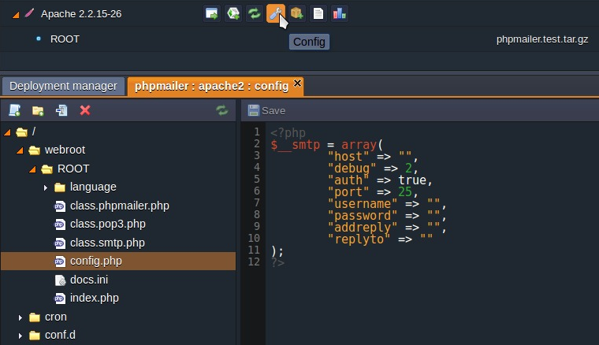

8\. Specify all the necessary data there to configure mailing via localhost or via some specific email account:

### Sending via Localhost

You can send emails directly from your app without specifying real email account. In this case you don't have any restrictions on frequency and quantity of sent emails, but your mailings can be detected as spam.

For using this configuration you should state the following parameter values: 

* **host**: state localhost value
* **auth**: state false (it will disable the authentication as it isn't required for localhost)
* **username**: state the name you would like to be shown as a sender name
* **addreply**: state the email which will be used for sending replies to your mailings. Note that it is obligatory parameter to state the value for. 
* **replyto**: state the same email as for addreply parameter

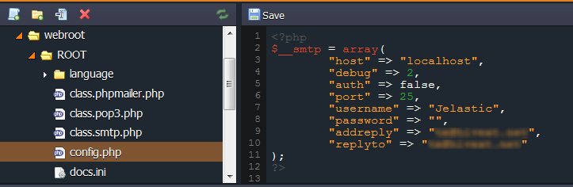

**Save** the changes made. After that you can click **Open in Browser** button next to your environment and you'll see the form for email sending.

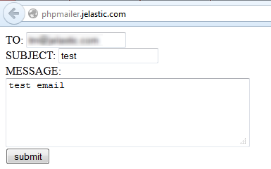

Enter the test info in the fields and click **Submit**. In a few minutes this email will appear in your inbox.

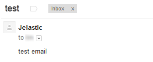

{}**Note**: If you didn't receive the email in a few minutes, check your *Spam* mail folder.{}

### Sending via Real Email Account

In case you have a special email account registered for your mailings, you can use it too. In such a way your emails most likely won't drop in the spam folder, but you'll meet some restrictions regarding, for example, amount of emails you can send. In the following example we will use the *gmail.com* email account.

You can use the following configuration as an example:
 
* **host**: state *ssl://smtp.gmail.com*
* **port**: *465* (SMTP port of your email provider, gmail in our case)
* **username:** state the email account you would like to use
* **password**: state the password to the account you've specified in the *username* line
* **addreply** and **replyto**: state the same email as in the *username* line (the one you are going to use for mailings)


**Save** the changes made. Click **Open in Browser** button next to your environment to see the form for email sending.


Enter the test info in the fields and click **Submit**. In a moment this email will appear in your inbox.

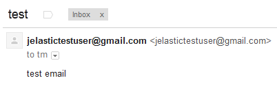


## Using Custom Form for Email Sending

You can prepare your own custom code of the form and set it to be used for sending emails:

1\. Press **Config** button next to the **Apache** server.

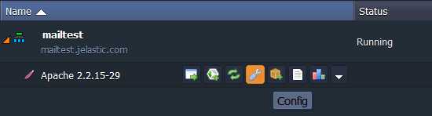

2\. Navigate to the **webroot/ROOT** (or another context) folder and create new file there, for example, *mailtest.php*.

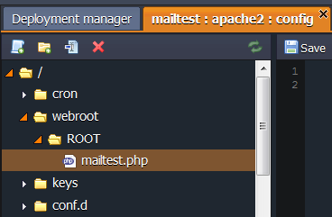

3\. Paste the code of your custom form to the file created and **Save** the changes made.

You can use our example:

```
<form method=POST ation=#>
From <input type=text name=from><br />
To <input type=text name=to><br />
Subject <input type=text name=subj><br />
Type your message  <input type=text name=text><br />
<input type=submit name=sub value=Send>
</form>
<?php
if ($_POST['sub']){
 system ("echo {$_POST['text']} | mail -s {$_POST['subj']} -r {$_POST['from']}  {$_POST['to']}");}
?>
```

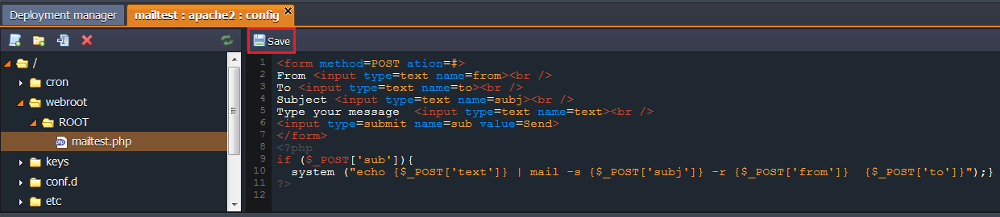

4\. Then **Open in Browser** your environment and add the name of your file to the end of the URL. You will see the following form:


5\. For sending emails you can use both localhost and real email account (just type "localhost" or necessary email in *From* field). After filling in all the fields click **Send**.

As a result the recipient will get the email.

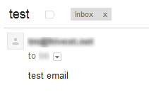

{}**Note:**  Email can drop into the *spam* folder.{}

That's all! Now you can perform your mailings directly from your application, hosted with the platform.


## What's next?

* [Sendmail Service](/sendmail/)
* [Public IP](/public-ip/)
* [Garbage Collector Overview](https://www.virtuozzo.com/company/blog/garbage-collection/)
* [Remote Debugging](/remote-debugging/)