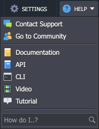
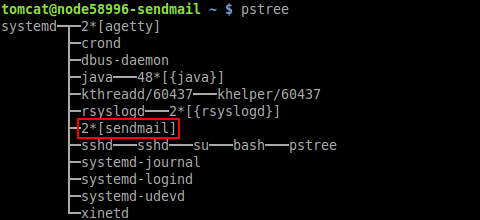
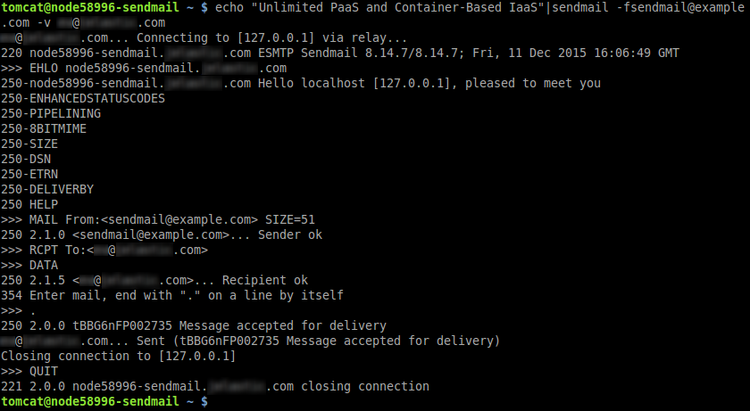
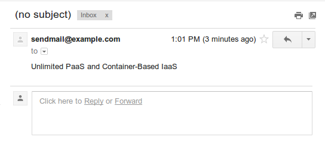

# Running Sendmail Inside a Container

{}{}

**[Sendmail](http://www.sendmail.com/)** is a highly popular open source mail transfer agent for UNIX systems, which is commonly delivered in a bundle with the majority of Linux distributions. It supports a plenty of mail transfer protocols (such as SMTP, ESMTP and others), being designed to route emails over the Internet and internal networks.

The platform delivers Sendmail included to all of the application servers' builds by default. However, the ability to run this service in a container depends on a particular hosting providers' settings - at some platforms, it could be available only in case of a bound [public IP](/public-ip/) address presence. So, let's consider how to:

* [check the Sendmail availability](#check-sendmail-availability)
* [enable Sendmail in case it is not run](#enable-sendmail)
* [send a test message](#send-message-via-sendmail)


## Check Sendmail Availability

In order to discover whether your hosting service provider allows to run Sendmail in containers with internal address only, you can either:

* send the appropriate request through the ***Help > Contact Support*** section at your dashboard

* or check this manually in a few simple steps for any of your app server containers, following the instruction below:

1\. Connect to your account via the platform [SSH Gateway](/ssh-gate/).

{}**Tip:** In case you haven't performed similar operations before, you need to:

- [generate](/ssh-generate-key/) an SSH keypair
- [add your public SSH key](/ssh-add-key/) to the dashboard
- [establish the connection](/ssh-access/) over SSH protocol
{}

2\. Once inside the application server shell, execute the ***pstree*** command to display the list of the currently handled processes in a system. Check whether it includes the Sendmail point - it's presence means that the appropriate service is already run, so you can just start using it immediately.



Otherwise, if the appropriate line is absent, proceed to the next section in order to find out how to get the Sendmail activated.


## Enable Sendmail

The easiest way to launch Sendmail is to enable [public IP](/public-ip/) for your application server via the topology wizard (either while [environment creation](/setting-up-environment/), or, for the already running environment, it can be accessed with the help of the **Change environment topology** button).

Then just turn on the corresponding switcher at the *App Server* layer and confirm the changes with the **Apply** button at the bottom right corner of the wizard frame.


After the confirmation and external IP address attachment, the Sendmail service will be automatically started, so you can start to [use](#send-message-via-sendmail) it immediately.

{}**Tip:** As an option, you can appeal to your hoster's Support team and negotiate getting the permission for running Sendmail in a server with no external address attached.{}


## Send Message via Sendmail

You can discover how Sendmail is working by sending a simple test email. This can be accomplished right from the command line - for that:

1\. Connect to your application server (with the Sendmail service already running) [via SSH](/ssh-gate/).

2\. Execute the following line of code in order to send a letter:

```bash
echo "{text}" | sendmail -f {from_address} -v {to_address}
```

where:

* ***{text}*** - text of your letter, e.g. *Unlimited PaaS*
* ***{from_address}*** - sender email address in the *mail\@example.com* format
* ***{to_address}*** - recipient email address (in the same *mail\@example.com* format)



3\. In order to ensure everything works as intended, access an email account you've sent the message to and check the inbox for a new message (its delivery can take up to a couple of minutes).



Great! Now you can be sure that Sendmail is ready for work. And in case you are interested in more detailed configurations and far complex solutions, that can be implemented by means of this tool, please refer to the [official documentation](https://www.sendmail.com/pdfs/open_source/installation_and_op_guide.pdf).

{}If you face any issues while running or configuring Sendmail, feel free to appeal for our technical experts' assistance at [Stackoverflow](https://stackoverflow.com/questions/tagged/jelastic).{}


## What's next?

* [Email using external SMTP](/email-via-external-smtp/)
* [Public IP](/public-ip/)
* [SSH Overview](/ssh-gate/)
