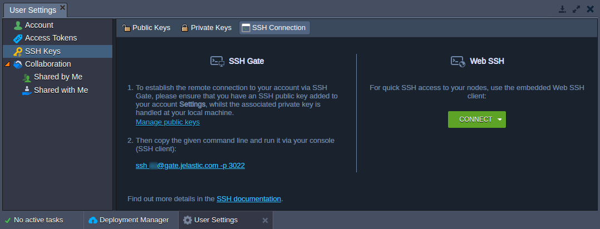

# SSH Access

The platform supports access via SSH in one of the following ways:

- ***[Web SSH](/web-ssh-client/)*** - An access to a separate node within your environment, which is based on the *user's session*; connection is initiated upon clicking the **Web SSH** button next to the desired environment in dashboard (which allows to connect from anywhere over Internet, using just a browser).

- ***[SSH Gate](/ssh-gate-access/)*** - Such connection type is based on the *SSH key pair* usage and allows access to either [whole PaaS account](/ssh-gate-access/#ssh-access-to-platform-account) or just a [particular container](/ssh-gate-access/#direct-access-to-container); it provides the substantial level of security, connecting only instances with **private SSH key** that matches the appropriate **public key**, stored within your Platform account settings.

After accessing node via SSH using any of the above-described methods, you can start managing your container.

## What's next?

* [SSH Overview](/ssh-gate/)
* [Web SSH Access](/web-ssh-client/)
* [SSH Gate Access](/ssh-gate-access/)
* [SSH Management](https://www.virtuozzo.com/company/blog/ssh-to-container/)
* [SSH Protocols](/ssh-protocols/)
* [Capistrano](/ssh-capistrano/)