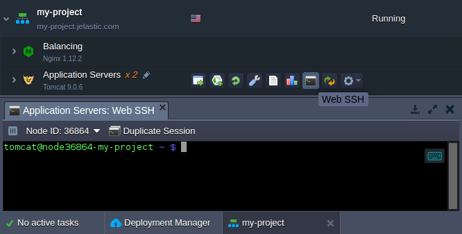

# SSH Access via Web Browser

The platform allows you connect to any container directly through the browser by means of the **Web SSH** client, without the necessity to generate dedicated SSH key pair or apply any other additional configurations.

Just click the **Web SSH** button next to the required layer or a particular node for the tab with terminal emulator to be opened:

Using the options in the tools panel above the editor window, you are able to: 

* switch between nodes of the [horizontally-scaled](/horizontal-scaling) layer, choosing a particular one within the **Node ID** drop-down list 
* open one more tab with connection to the current container by clicking on the **Duplicate Session** option (this allows to perform several simultaneous operations on a single node, e.g. to tail logs in one terminal window and to manage an application itself in another one)

Also, web SSH client is provided with the embedded shortcuts for convenient management (their list can be also viewed by hovering over the keyboard icon in the top-right corner of the tab):

* **Copy** (Ctrl + Shift + C)
* **Paste** (Ctrl + V)
* **Settings** (Ctrl + Shift + Alt) - allows to configure emulator, e.g to switch the input method, manually change the clipboard text, etc

Now, you can start managing your container via SSH (for example, set custom variables, change firewall settings, etc.).

## What's next?
* [SSH Overview](/ssh-gate/)
* [SSH Access](/ssh-access/)
* [SSH Gate Access](/ssh-gate-access/)
* [SSH Management](https://www.virtuozzo.com/company/blog/ssh-to-container/)
* [SSH Protocols](/ssh-protocols/)