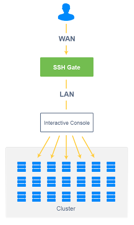
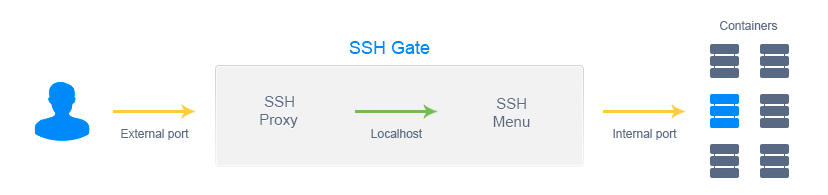
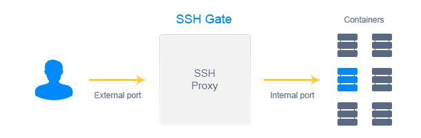

# SSH Gate Overview

**SSH (Secure Shell)** is a protocol used to connect securely to a remote container and execute the required commands on it. SSH commands are encrypted and secure: client/server connection is authenticated using a digital certificate, and passwords are protected by being encrypted.

To make SSH access available in the platform, a new infrastructure component was added to the core - **SSH Gate**. SSH Gate accepts users' connections from the internet and then transmits these connections to the desired container, using an internal network.

The authentication procedure in SSH Gate is divided into two independent parts:

* connection from end user to Gate (external authentication)
* connection from Gate to users' container (internal authentication)

Both parts of the authentication procedure are based on a standard SSH protocol, using public/private keypairs.



With SSH Gate, you can easily access:

* **the whole account** where you can navigate across your environments and containers using an interactive menu without extra authentication



* **separate containers directly** while working with them remotely via additional tools (e.g. [Capistrano](/ssh-capistrano/)) or using SFTP and FISH protocols



While accessing containers via SSH, a user receives all required permissions and additionally can manage the main services with **sudo** commands of the following kind (and others):

```
sudo systemctl start jetty
sudo systemctl stop mysql
sudo systemctl restart tomcat
sudo systemctl status memcached
sudo systemctl reload mongod
```

{}**Note:** If you deploy any application, change the configurations or add any extra functionality via SSH to your environment, this will not be displayed at the platform dashboard.{}

In addition, we provide support of **SFTP** (Secure File Transfer Protocol) by implementing the threaded daemon for SFTP connections processing. It lets you access, manage and transfer files directly to the container via SSH gate, and in such a way, ensures data security.

An additional secure network protocol is **FISH** (Files transferred over Shell protocol). It is supported by a number of popular FTP-clients and file managers (e.g. Midnight Commander, Konqueror, lftp, Krusader, etc.) and permits a user to securely access and manage a container's file system.

Using our documentation you'll find out how to:

* [generate SSH key](/ssh-generate-key/)
* [add SSH key](/ssh-add-key/)
* [access environments and containers](/ssh-access/)
* [work via SSH](https://www.virtuozzo.com/company/blog/ssh-to-container/)
* [use SFTP and FISH protocols](/ssh-protocols/)
* [manage containers via SSH with Capistrano](/ssh-capistrano/)

{}**Note:** SSH access is provided to the whole account but not a separate environment.{}