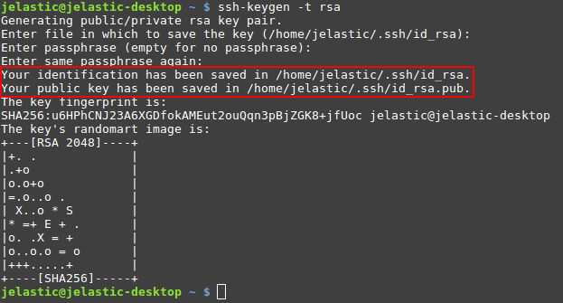
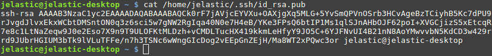
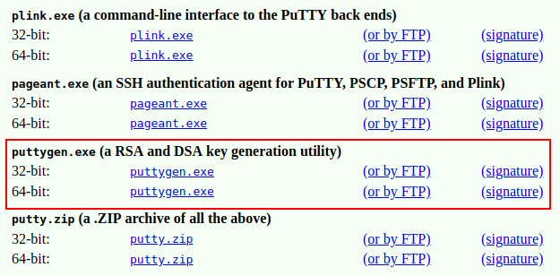
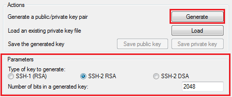
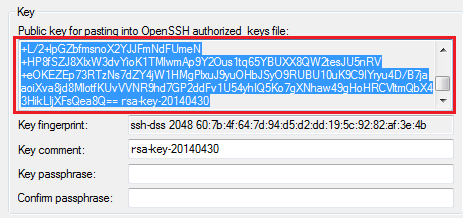
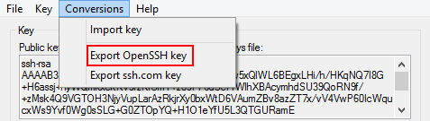

# Generate SSH Key

The instructions below walk you through the steps of generating an SSH key. Since the *8.0.2* version, the platform supports the following key types:

- *ECDSA*
- *EdDSA*
- *RSA*

Follow the steps in one of the following sections (based on your operating system):

- [Linux/MacOS](#for-linuxmacos)
- [Windows](#for-windows)


## For Linux/MacOS

Generate a new SSH key (for example, the *RSA* type) using the ***[ssh-keygen](https://linux.die.net/man/1/ssh-keygen)*** tool:

1\. Initiate generation with the following command:
```bash
ssh-keygen -t rsa
```



If needed, adjust the desired keys location and passphrase (we'll proceed with the default values).

2\. You can view the value of both public and private SSH keys with the ***cat*** command (the exact location is circled in the image above). For example:

```bash
cat /home/jelastic/.ssh/id_rsa.pub
```



3\. Now, you can [add the generated SSH key](/ssh-add-key/) to your PaaS account:

* *the public key* for access via [SSH Gate](/ssh-gate-access/)
* *the private key* for [authentication](/git-ssh/) at your remote GIT repository via SSH<a id="windows"></a>


## For Windows

1\. Download and run an SSH keygen tool, for example, [PuTTYgen](http://www.chiark.greenend.org.uk/~sgtatham/putty/download.html):



2\. For example, specify the following parameters:

* choose the *SSH-2 RSA* key type
* enter the desired number of bits (e.g. *2048*)



Click **Generate**.

3\. Now, depending on the type of key you need:

* to get the ***public key*** for SSH access to your account via [local client](/ssh-gate-access/) - copy the generated key from the output field at the top of the window


* to get the ***private key*** for [authentication](/git-ssh/) at your remote GIT repository via SSH - expand the **Conversions** menu and select the **Export OpenSSH key** option


Afterward, you can open this file in any text editor and copy the key body for being [added](/ssh-add-key/) to the platform dashboard.


## What's next?

* [SSH Overview](/ssh-gate/)
* [Add SSH Key](/ssh-add-key/)
* [Web SSH](/web-ssh-client/)
* [SSH Gate](/ssh-gate-access/)
* [SSH Management](https://www.virtuozzo.com/company/blog/ssh-to-container/)