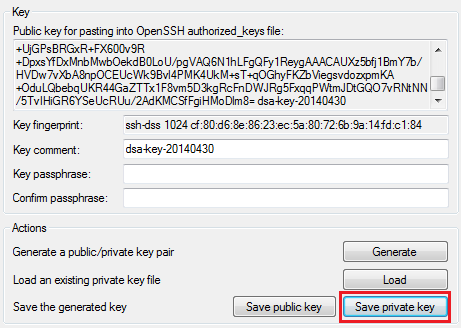
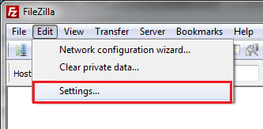
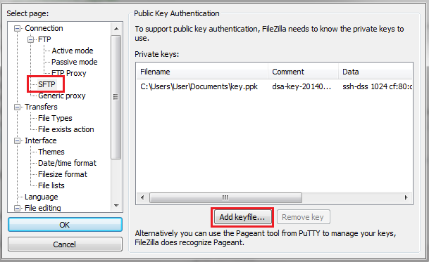
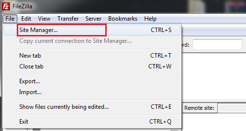
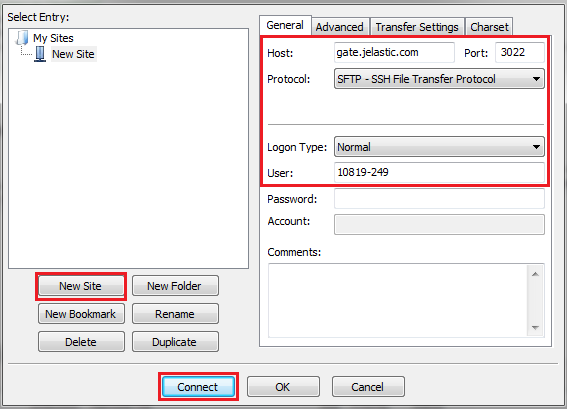
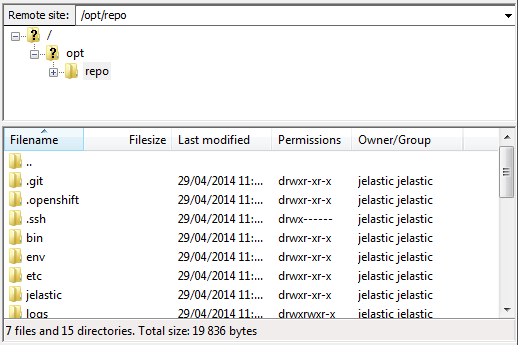
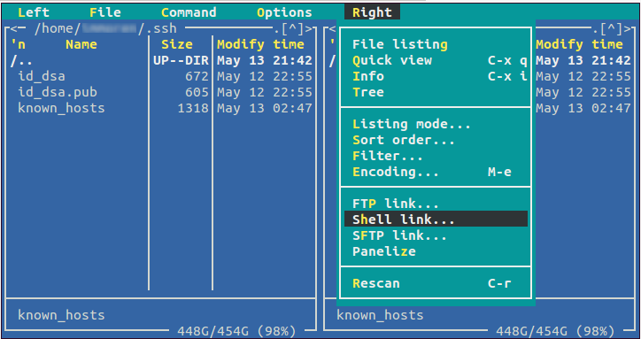
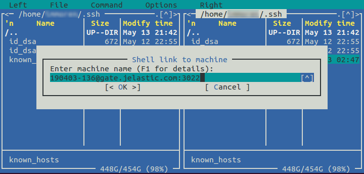
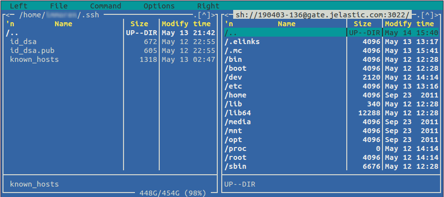

# SFTP/FISH Protocols
**SFTP** (SSH File Transfer Protocol) and **FISH** (Files transferred over Shell protocol) protocols let you perform different file management operations (accessing, transferring, etc.) over the secure channel. 

We provide support of **SFTP** (Secure File Transfer Protocol) by implementing the threaded daemon for SFTP connections processing. It lets you access, manage and transfer files directly to the container via SSH gate, and in such a way, ensures data security.  

**FISH** protocol (Files transferred over Shell protocol) is supported by a number of popular FTP-clients and file managers (e.g. Midnight Commander, Konqueror, lftp, Krusader, etc.). It permits access to securely manage a container's file system.
Let's see the examples of using these protocols.

## SFTP
To access a necessary container via SFTP protocol, you need to have a private key on your local machine which corresponds to the public SSH key previously added to the platform dashboard.  
For Linux/MacOS users, this private key is saved automatically during key generation.  
If you are a Windows user, you should additionally save the private key which corresponds to your public SSH key (we use the PuTTYgen tool as an example):

Now we can proceed to establishing the SFTP connection.

1\. Run your FTP-client with SFTP protocol support. 
We use FileZilla as an example, therefore, navigate to the **Edit > Settings** menu item.

2\. In the opened window, navigate to the **SFTP** section. 
Select the **Add keyfile** button and choose your previously saved private SSH key.
Click **OK**.

3\. After that, navigate to the **File > Site Manager** menu item. 

4\. In the opened window, click the **New site** button and specify the following parameters:

* in the **Host** field state your SSH host (*gate.{[hoster_domain](/paas-hosting-providers/)}*)
* in the **Port** field enter *3022* value.
* choose **SFTP** in the Protocol drop-down list.
* choose **Normal** Logon Type.
* in the **User** field, enter the Node ID of the desired container (can be seen in the particular environment's containers list in the separate ***nodeid*** column via SSH console) and your User ID (number before @ symbol in your SSH connection string) separated with a hyphen.
Finally, click the **Connect** button.

5\. After connection is established, you'll see the list of container's folders in the appropriate frames:

That's all! Now you can proceed to managing and transferring your application's files over the secure channel.

## FISH
Let's look at the example of FISH protocol use via establishing a secure connection between a remote container and the Midnight Commander tool. 

1\. Firstly, ensure you have a private key on your local machine which corresponds to the public SSH key previously added to the dashboard.
The default path will be */home/&lt;username&gt;/.ssh/id_rsa* or */home/&lt;username&gt;/.ssh/id_dsa* file, depending on the key pair type you've generated.

2\. Check the ownership and attributes of your private key by entering one of the following commands:

* for RSA key
***ls -la /home/&lt;username&gt;/.ssh/id_rsa***

* for DSA key
***ls -la /home/&lt;username&gt;/.ssh/id_dsa***
Ownership should be stated as your **username** and attributes should be **400**or **600**. I.e. your private key should not be available for reading by other users, otherwise a connection will not be established.

3\. Install and run your [Midnight Commander](http://en.wikipedia.org/wiki/Midnight_Commander). 

4\. Select F9 to show the menu toolbar. Then open the left or right panel's menu and choose **Shell link** item.

5\. In the opened **Shell link to machine** frame, enter the following values separated with a hyphen:

* Node ID of the desired container (can be seen in the particular environment's containers list in the separate ***nodeid*** column via SSH console)
* your SSH connection string (*{user_id}@{ssh_host}:3022* )
Click **OK**.

6\. When a connection is established, you will see the container's file structure in the appropriate panel (in our case, on the right).

Now, you can securely manage your container's file system using RSH commands. Enjoy!

## What's next?
* [SSH Overview](/ssh-gate/)
* [SSH Management](https://www.virtuozzo.com/company/blog/ssh-to-container//)
* [SSH Protocols](/ssh-protocols/)
* [Capistrano](/ssh-capistrano/)
