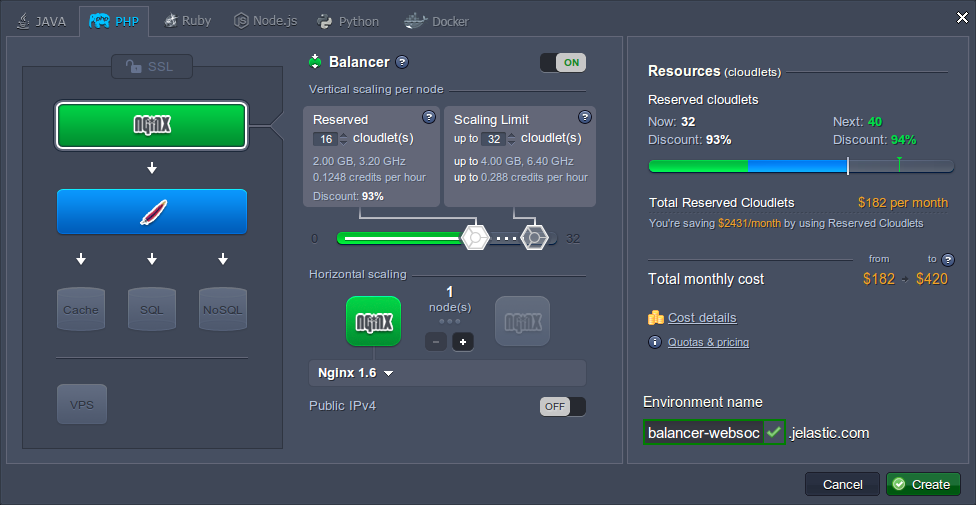

# WebSockets Support

**WebSockets** is a prominent web-technology, that ensures establishing of a continuous full-duplex connection between client and server for the bi-directional messages to be instantly transmitted with little overhead. Communication over this TCP-based protocol results in a very low connection latency and rapid interaction, thus making your applications faster and more efficient. 

You can achieve the following benefits using WebSockets:

* Reduction of response delays and unnecessary network traffic consumption due to the full-duplex distribution through a single connection
* Streaming through proxies and firewalls, both upstream and downstream at once
* Backward compatibility with the pre-WebSocket world, by switching from the HTTP connection to WebSockets

The platform provides you with an advanced and complemented WebSockets support by means of integrating this technology to the [Shared Load Balancer](/shared-load-balancer/) and [NGINX-balancer node](/nginx-load-balancer/), so you can use it even without external IP address attached to your app server. 

The easiest way to activate the WebSockets support is to place an NGINX balancer in front of your application, making it the entry point of the environment and getting rid of any additional configurations. Over and above, this server can also be used for easily overriding the default settings with your custom ones, e.g. changing the listeners' port numbers.

Nevertheless, the WebSockets technology is also supported by the application servers provided at the platform - the appropriate configuration examples are available within our documentation:

* [WebSockets for Java](/websockets-java/)
* [WebSockets for PHP](/websockets-apache-nginx/)

And the guide below will provide insights on how to configure WebSockets support for your application, hosted at the platform, with the help of the **NGINX-balancer** node. As an example, we'll use a simple chat application, written in PHP. So, let's get started and move step-by-step from the very beginning.


## Environment Creation and Application Deployment

1\. Log in to the platform dashboard with your credentials and click on the **New environment** button at its top left corner.


2\. In the appeared **Environment Topology** frame, you need to create an appropriate environment according to your application's requirements (e.g. we selected the **Apache** application server for our **PHP** app). The only obligatory element is the **NGINX-balancer** node.

Then set the resources usage limits for the chosen nodes by means of cloudlet sliders, type an environment name (e.g. *balancer-websockets*) and click **Create**.



3\. In a few minutes your new environment will appear at the dashboard.


4\. Upload and deploy your application to the desired context (we'll use the default *ROOT* one) using archive/URL or via the remote VCS repository - link to the corresponding instruction can be found in our [Deployment Guide](/deployment-guide/).

Once this is completed, the name of your project source will appear in the *Deployed* panel column.


## NGINX Balancer Configurations

Now you need to modify the default proxy settings at your NGINX-balancer server in order to define where the incoming requests should be redirected to and enable the WebSockets streaming.

1\. Access the **Configuration Manager** tab by selecting the **Config** button for your balancer node.


2\. Then open the ***nginx-jelastic.conf*** file within the **conf** directory, find the *location* block inside the first *server* code section and paste the following lines just before it:

```nginx
location /ws/ {  
   proxy_pass http://{appserver_ip}:{port};  
   proxy_http_version 1.1;  
   proxy_set_header Upgrade $http_upgrade;  
   proxy_set_header Connection "upgrade";  
}
```

where

* ***{appserver_ip}*** - IP address of the application server node with your WebSockets application deployed. It can be found by clicking the **Additionally** button for the required instance.

* ***{port}*** - number of the port, listened by your application

In our case, the required settings will look like at the image below:


{}**Note:** Usually we recommend to modify the configurations in the ***nginx.conf*** file and keep the ***nginx-jelastic.conf*** one's content as the default/backup settings. But in this case, since the required changes are rather simple and we are pretty sure that we know what we are doing, it will be easier to work directly with the ***nginx-jelastic*** file.{}

3\. That's all for NGINX configurations, just don't forget to **Save** the made changes and **Restart** balancer using the same-named button.


## Application Configurations

Once the WebSockets support is enabled, the only thing that is left to do is to configure your application. You need to adjust its code similarly to the steps below in order to specify the correct connection string, according to a new WebSocket file's location:

1\. Click the **Config** button next to the chosen application server.


2\. In the opened **Configuration Manager** tab you can access your application's files by navigating to the **webroot/ROOT** folder (or, the latter one's name can differ if you've specified your custom context during application deployment).

Open the file with the WebSockets settings stated and adjust the ***ws*** path according to the next format:  

<em>ws://**{env_domain}{path_to_ws_file}**</em>

Herewith, the ***{env_domain}*** value should be substituted with your environment domain (can be seen under the environment name at the dashboard) and the ***{path_to_ws_file}*** value should lead to the file, that needs to be accessed upon establishing the WebSockets connection.

For example, in our case this string looks like the following:


Do not forget to **Save** the performed changes.

3\. Finally, **Restart** your application server with the corresponding button in order to apply new configurations.


4\. Once the service is up again, you can click **Open in Browser** next to your environment and access your application.


5\. Great, we are done!


As you can see, our tiny chat window is running, allowing sending and receiving of messages in real time, without refreshing a browser tab.


## What's next?

* [WebSockets Support for Java](/websockets-java/)
* [Websockets Support for PHP](/websockets-apache-nginx/)
* [NGINX Load Balancer](/nginx-load-balancer/)