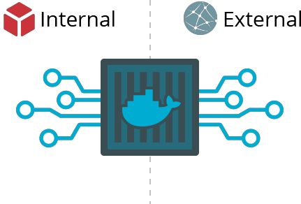
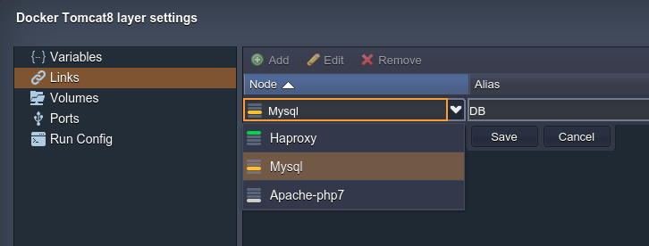
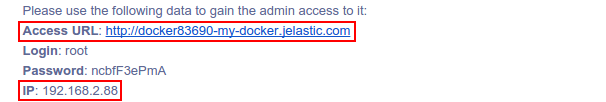
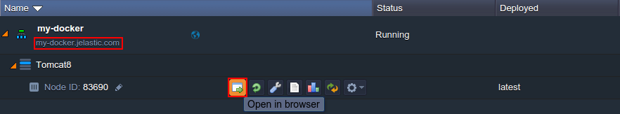
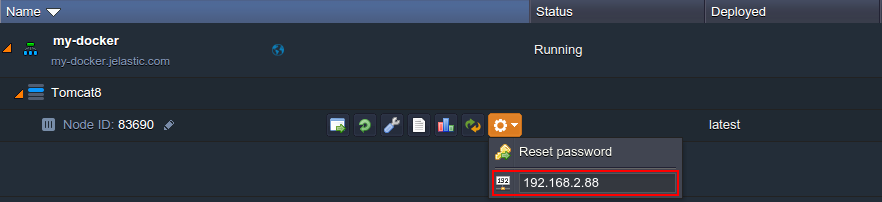
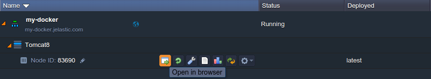
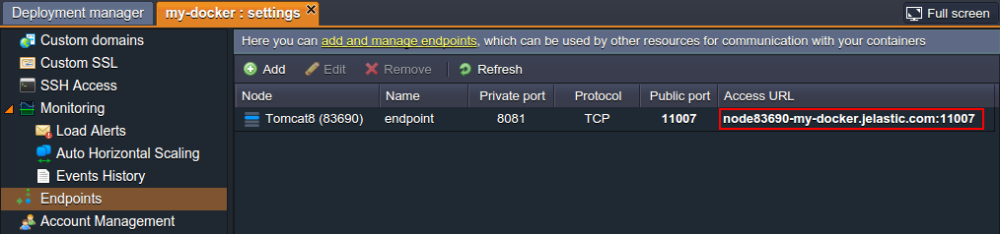
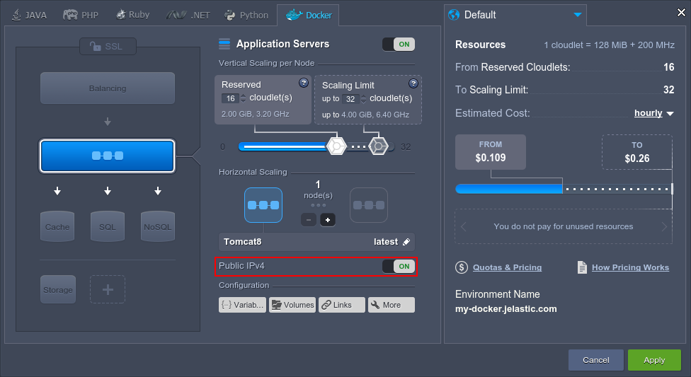

# How to Connect to Your Custom Container

[Containers](/container-types/) integration into the platform is one of the most important and demanded services. The synthesis of container portability, together with the platform flexible management, appeals to developers and allows to effortlessly host and maintain all types of applications available within Docker templates.

The following tutorial deals with the key principles of work with Docker-based applications, which may be a point of interest for both beginners and intermediate developers.

Below we'll get a particularly detailed insight into the ways of connecting to a container at the platform, considering both internal and external possibilities, and observe where to find the very basic container information that is required for such connection establishment.  

So, let's see how to:

* [set up an internal container connection](#internal-connection)
* [get access to container from outside](#external-connection)

## Internal Connection

Each container at the platform automatically gets a unique internal domain name and internal IP address right after creation. Further, these parameters can be used to access containers in confines of a single Cloud (i.e. to establish connection between them via the platform's internal network).

1\. The very first option you need to consider in case of having necessity to set up interconnection between containers is the embedded functionality of [container linking](/container-links/). It allows to connect containers from different layers within a single environment to securely transfer environment variables information from source Docker image to the recipient without exposing any ports externally.

For that, you just need to select the required layer and specify an alias for the connection denomination (whilst all of the appropriate variables will get the corresponding prefix according to it):

Don't forget to **Save** and **Apply** the changes you've made.

After that, you may refer to the [Variables](/container-variables/) section of your container settings and adjust any of them separately upon the necessity. However, changing the environment variable's value for a container, that is already linked to another one, will also cause its automatic update in a container this link was applied to.

2\. In case there is a need to establish internal connection of another type (i.e. which requires some manual adjustments via the comprised configuration files), it is required to know the exact container domain name or IP address it can be accessed through the platform's internal network.

The appropriate information can be obtained in two ways:

* through the email notification you receive after environment creation. The corresponding internal domain name and IP address are to be listed within the section with container admin data:

Here, the containers' domain name is shown at the *Access URL* string and its internal IP address - within the *IP* line below.

* within the platform dashboard, the same data can be found in the following ways:
    * click the **Open in Browser** button next to the container you're interested in for the required node interface to be opened in a new browser tab, so you can easily copy its domain from the address bar.

Or, just right-click on the domain string under the environment name (circled above) and copy the provided link.
    * internal IP address of the node can be viewed through expanding the **Additionally** list for the required container, as it is shown in the image below.

In such a way, the retrieved information can be used to establish internal connection to your containers at the platform.

## External Connection

In order to access your container from outside the platform (i.e. from the Internet), you have the following solutions:

1\. If your service or application, that is running within container, listens to the port *80*, then it will be automatically exposed to external network (over the assigned domain name) via the platform [Shared Load Balancer](/shared-load-balancer/).

In such a case, you just need to click **Open in Browser** for the corresponding node to launch it (this option works for HTTP connections).

{}**Note:** In case your container does not have an [external IP](/public-ip/) attached, the platform performs an *automatic port redirect*. This means that if application listens to a custom port on TCP level, the platform will try to automatically detect it and forward all the incoming requests to this port number. As a result, in most cases, your app or service will become available over the Internet under the corresponding node's domain right after creation.

However, in case you'd like to prohibit such a possibility, you may declare the corresponding rules within your container's [firewall settings](/custom-firewall/).{}

2\. For more complex implementations, the platform provides special [endpoints](/endpoints/) functionality (available within the same-named section of any environment's **Settings**):

It allows to expose the required private port on your container through the randomly chosen public port at the platform Shared Load Balancer, so it can be accessed via the provided **Access URL**.

3\. And the last option, which gives the maximum freedom (allowing, for example, to secure your connection with [Custom SSL](/custom-ssl/), get rid of limitation on the simultaneous connections amount, etc.) is attachment of [public IP](/public-ip/) address to your container.

By its means, your app can be configured to listen to any port you need and, in such a way, to become accessible via the external network.

{}**Note:** Public IP option is a paid add-on. The exact cost for its usage can be seen upon hovering over the price widget at the right part of your topology wizard or through navigating to *[Quotas & Pricing](/resource-consumption/#how-much-do-resources-cost)* > *Pricing* > *Options* tab.{}

That's all! Now you can leverage the most suitable connection option among the described ones while working with your Docker containers.

{}If you face any issues while setting connection to your container at the platform, feel free to appeal for our technical experts' assistance at [Stackoverflow](https://stackoverflow.com/questions/tagged/jelastic).{}

## What's next?

* [Container Types](/container-types/)
* [Custom Container SSH Access](/custom-container-ssh-access/)
* [Container Linking](/container-links/)
* [Public IP](/public-ip/)
* [Endpoints](/endpoints/)