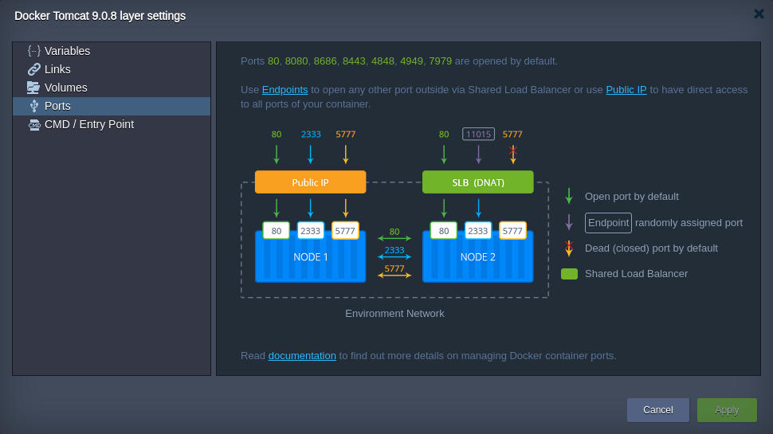
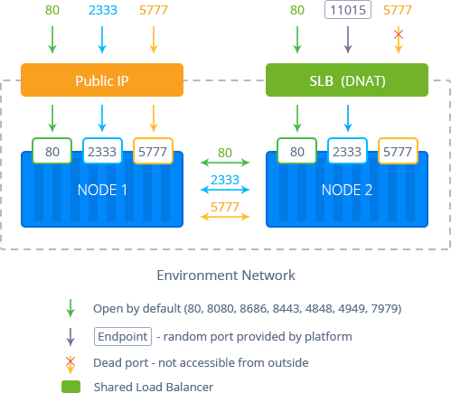

# Ports

The **Ports** tab provides you with a general information on managing container ports at the platform.

The following ports are opened by default:

* ***80***, ***8080***, ***8686*** - proxies **HTTP** traffic to **HTTP** (*80* port)
* ***4848***, ***8443***, ***4901-4910*** - proxies **SSL** (HTTPS) traffic is proxied to **SSL**
* ***443*** - proxies **SSL** traffic is proxied to **HTTP** (*80* port)
* ***4949***, ***7979*** - proxies **SSL** traffic to **HTTP**

{}**Tip:** Use the table below as a reference:

Port on SLB|Backend Port|Frontend SSL|Backend SSL
:---:|:---:|:---:|:---:
80, 8080, 8086|80|no|no
4848|4848|yes|yes
8443|8443|yes|yes
4901-4910|4901-4910|yes|yes
443|80|yes|no
4949|4949|yes|no
7979|7979|yes|no
{}

Additional ports can be opened using:

* ***[endpoints](/endpoints/)*** - maps the container internal port to random external via the platform [Shared LB](/shared-load-balancer/)
* ***[Public IP](/public-ip/)*** - provides a direct access to all ports of your container

Depending on the way chosen, just bind your service (application listener) to the received internal or external address.

## Ports Auto-Redirect

The platform automatically redirects incoming requests to the application hosted within a container.

During a node creation, the platform detects the ports which are listened on the TCP level. The commonly used for standard services (e.g. SSH, mail, databases, etc.) are automatically filtered. The first among the remaining ports becomes the container entry point so that all incoming requests are forwarded to it.

This process is performed on each container launch, so the corresponding application becomes available over the embedded [Shared Load Balancer](/shared-load-balancer/) just after being deployed, without any manual intervention required.

However, in case you need to disable or adjust this functionality (e.g. if it exposes application admin panel), you can manually change the auto-redirect settings during the container creation. For that, switch to the [Variables](/container-variables/) section, add the dedicated ***JELASTIC_EXPOSE*** parameter and set its value based on your needs:

* *0* or *DISABLED* or *FALSE* - to disable auto-redirect
* a number within the *1-65535* range - to define a container port, which will receive the incoming traffic (i.e. where it will be redirected to)
* if any other value is stated, the auto-redirect functionality will work as usual

Alternatively, a comma-separated list of ports can be provided via the ***JELASTIC_PRIORITY_PORTS*** variable. The platform checks them one by one, configuring the entry point redirect to the first active service discovered. This option can speed up container startup time compared to the all ports analysis during the default auto-redirect flow.
{}**Note:** 

* if the exact port is specified via the ***JELASTIC_EXPOSE*** variable, the ***JELASTIC_PRIORITY_PORTS*** is ignored
* if no services are discovered on the ***JELASTIC_PRIORITY_PORTS***, the default auto-redirect flow is called
* when working with the **NodeJS** application server, an additional ***REDIRECT_EXCLUDE_PORTS*** variable can be used to manually exclude ports from the auto-redirect algorithm (i.e. port *80* won't redirect to them){}

To get even greater flexibility over the node accessibility, you can customize your [container firewall](/custom-firewall/) settings.

## What's next?

* [Container Configuration](/container-configuration/)
* [Endpoints](/endpoints/)
* [Variables](/container-variables/)
* [Links](/container-links/)
* [Volumes](/container-volumes/)
* [Run Config](/container-run-configuration/)