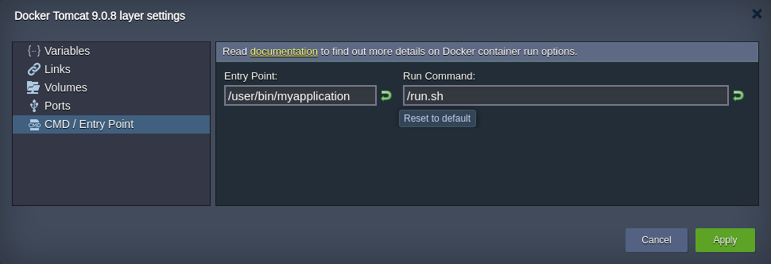

# Run Configuration
The last **CMD / Entry Point** tab contains two input fields, where you can set the run options for your container: 

* ***Entry Point*** - configures a command to be executed during container launch
* ***Run Command*** - sets defaults for container launch
    * *if no entry point is specified* - a command to be run
    * *if entry point is provided* - additional parameter(s) for the command

Using the reverse arrow button, which appears upon entering some custom string inside any of these fields, the specified run options can be easily **Reset to default** values.
{}**Note:** If neither run command is declared within the template settings by default, you have to set the appropriate option(s) using this frame. Otherwise, no application/service will be started at the container launch.{}

## What's next?

* [Container Configuration](/container-configuration/)
* [Variables](/container-variables/)
* [Links](/container-links/)
* [Volumes](/container-volumes/)
* [Ports](/container-ports/)