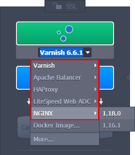
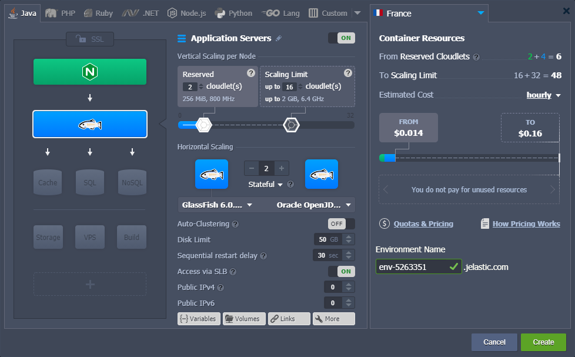

# Certified Containers Deployment

The platform offers the most popular [software stacks](/software-stacks-versions/) as pre-configured and managed solutions for quick deployment and comfortable management. All of these certified containers are thoroughly tested and optimized specifically for use within the platform. Customizations include regular updates to the latest software version and additional integrations (such as auto-optimization based on the assigned resources, automated SSL certificates installation and application deployment, built-in [auto-clustering](/auto-clustering/), etc.).

1\. The deployment of certified containers is performed via the [topology wizard](/setting-up-environment/), which can be opened by clicking the **New Environment** button.

2\. Within the opened window, switch to the tab with the preferred programming language (*Java*, *PHP*, *Ruby*, *.NET*, *Node.js*, or *Python*).

3\. Certified containers are added via the topology part on the left of the wizard. Here stacks are grouped by their purpose:

- **[Load Balancers](/load-balancing/)** - stacks that operate as an entry point for the environment to distribute incoming requests and create even load on other nodes
- **[Application Servers](/tomcat/)** (compute nodes) - web servers that run your application
- **[Databases](/database-hosting/)** (*SQL* & *NoSQL*) - database solutions to store and manage data
- **[Cache Node](/memcached/)** - a Memcached object caching system for speeding up web applications through alleviating database load
- **[Shared Storage](/shared-storage-container/)** - dedicated storage node with NFSv4 support, enlarged disk space, and optimized performance
- **[Elastic VPS](/vps/)** - virtual private servers on top of the *CentOS*, *Ubuntu*, *Debian*, and *Windows OS*
- **[Build Node](/java-vcs-deployment/)** - a build automation tool for Java projects
- **Extra** (custom layers) - some extra services or any of the stacks mentioned above

Use this section as a constructor that helps to visualize and easily adjust your topology.

{}**Tip:** The sequence of blocks displayed above is the default order. However, you can mix and match them in any preferable way to create your custom topologies.{}

4\. The platform offers multiple options of certified containers for each role within your environment topology. Just click on the required section to expand a list of the most popular solutions. For example, certified load balancers are represented via the following options:

If you cannot find the required stack, you can check other categories (e.g. application servers, databases) using the **More** option or just type the name to **Search** among all the platform certified templates.

{}**Tip:** If the required software is not available as a certified template, you can try installing it as a [custom container](/custom-containers-deployment/). Click the **Docker Image** option and search for the appropriate image on Docker Hub.{}

5\. You can [configure](/setting-up-environment/#configuring-nodes-resources-and-specifics) added nodes (*vertical* and *horizontal scaling*, *disk limit*, *public IPs*, etc.) via the central part of the wizard. Certified containers can have additional options, e.g. [Auto-Clustering](/auto-clustering/).

That's all! Click **Create** and wait a few minutes for the environment with certified containers to be deployed.

## What's next?

* [Container Types](/container-types/)
* [Setting Up Environment](/setting-up-environment/)
* [Custom Containers Deployment](/custom-containers-deployment/)
* [Docker Engine Deployment](/docker-engine-deployment/)
* [Container Redeploy](/container-redeploy/)