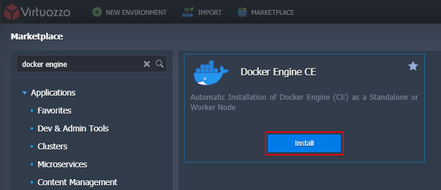
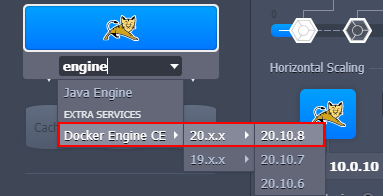
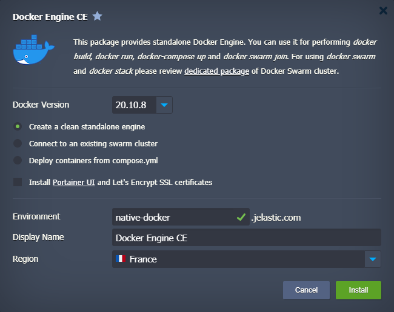

# Docker Engine Deployment

The platform provides support for the **Docker Engine Community Edition** with full compatibility to the native Docker ecosystem. Such integration makes it possible to work with the core tools of Docker container technology, namely:

- **Docker Engine** - processes Dockerfile manifests or runs pre-built container images
- **Docker Registry** - stores and provides access to numerous public and private images that are intended for deployment within Docker Engine
- **Docker Compose** - helps assemble applications consisting of multiple components with all the required configurations declared in a single compose file
- **Docker Swarm** - represents several independent Docker nodes interconnected into a cluster

1\. **Docker Engine CE** is delivered as the pre-packaged solution available through the [platform Marketplace](/marketplace/). Use the *search* field at the top or locate the package under the *Dev & Admin Tools* category:

{}**Tip:** You can also install **Docker Engine CE** via the topology wizard - search for the stack or locate manually in the *More > Extra Services* section.

{}

2\. In addition to the ***Docker Version*** selection, you can choose from several deployment options when installing from Marketplace:

- ***Create a clean standalone engine*** - sets up a bare node with just a Docker daemon inside. If needed, you can additionally install **Portainer UI** - a web-based management tool
- ***Connect to an existing swarm cluster*** - automatically includes this new Docker Engine into the existing [Docker Swarm](https://www.virtuozzo.com/company/blog/docker-swarm-auto-clustering-and-scaling-with-paas/) cluster (the appropriate cluster's *Join Token* and *Host IP* are required)
- ***Deploy containers from compose.yml*** - automatically deploys an application from the linked custom repository

Confirm installation by providing general info (*Environment*, *Display Name*, *Region*) and clicking the **Install** button.

{}Learn more about **Docker Engine CE** [installation](https://www.virtuozzo.com/company/blog/docker-engine-automatic-install-swarm-connect/) and [management](https://www.virtuozzo.com/company/blog/docker-engine-auto-install-connect-ssh-portainer/) via the relevant articles on our blog.{}

## What's next?

* [Container Types](/container-types/)
* [Setting Up Environment](/setting-up-environment/)
* [Certified Containers Deployment](/certified-containers-deployment/)
* [Custom Containers Deployment](/custom-containers-deployment/)
* [Container Redeploy](/container-redeploy/)
* [Docker Swarm](https://www.virtuozzo.com/company/blog/docker-swarm-auto-clustering-and-scaling-with-paas/)