# Container Redeploy

The majority of Docker-based solutions (including platform-managed [stacks](/software-stacks-versions/)) are continuously developed, delivering new product versions and fixes. Thus, it is recommended to regularly update your templates to their latest tags, i.e. releases.

Such an operation is called ***redeploy*** and has the following specifics when managed on the platform:

* the custom user data and sensitive system files are preserved during the update:
    * content of the ***[volumes](/container-volumes/)*** (default and custom ones)
    * files listed in ***[/etc/jelastic/redeploy.conf](#saving-custom-data-during-container-redeploy)*** (specific configs of the stacks), which are required to ensure container operability
    * ***AutoFS and NFS*** related configurations (*/etc/autofs.jelastic*, */etc/auto.master*, */etc/exports*)
    * ***firewall configurations*** (*/etc/sysconfig/iptables-custom*, */etc/sysconfig/iptables4-jelastic*, */etc/sysconfig/iptables6-jelastic*, */etc/iptables/rules.v4*)
    * ***SSH access data*** (*/root/.ssh/authorized_keys*, */root/.ssh/authorized_keys2*, */root/.ssh/id_rsa*)
* all the previously specified custom [configurations](/container-configuration/) (like *run commands*, *links*, *variables*, etc.) won't be affected
* if operating with [multiple](/horizontal-scaling/) (horizontally scaled) instances, the update can be performed on containers one by one, i.e. implicitly with no downtime

In such a way, you are able to update your Docker-based container to a new tag (version) without affecting the application inside. With the platform, container redeployment can be performed in just a few clicks via the [dashboard UI](#update-container-via-dashboard) or easily automated [via API](#update-container-via-platform-apicscli).

{}**Note:** When working with the *MySQL*, *MariaDB*, or *Percona* databases, [downgrading](https://dev.mysql.com/doc/refman/8.0/en/downgrading.html) (i.e. redeploying to the lower version) is not supported. In case the operation is necessary, we recommend [creating a backup](/database-backups/) and restoring a database after redeploy (or in a separate container altogether).{}

To learn about [saving or backing up custom data](#saving-custom-data-during-container-redeploy) during redeploy, refer to the appropriate section below.


## Update Container via Dashboard

The most straightforward and user-friendly way to redeploy a template tag is to use the platform dashboard. The instruction below will walk you through the required steps:

1\. The dedicated redeployment dialog frame can be accessed in two different ways:

* select the **Redeploy Container(s)** button next to the required node or layer (for updating all the comprised containers at once)
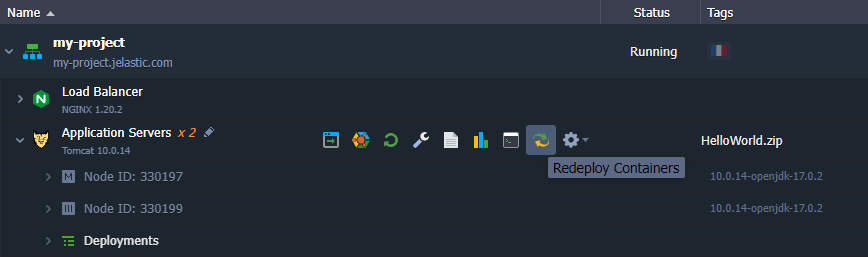

* click the pencil icon next to the layer tag version in the topology wizard (when **Changing Environment Topology** of the existing environment)
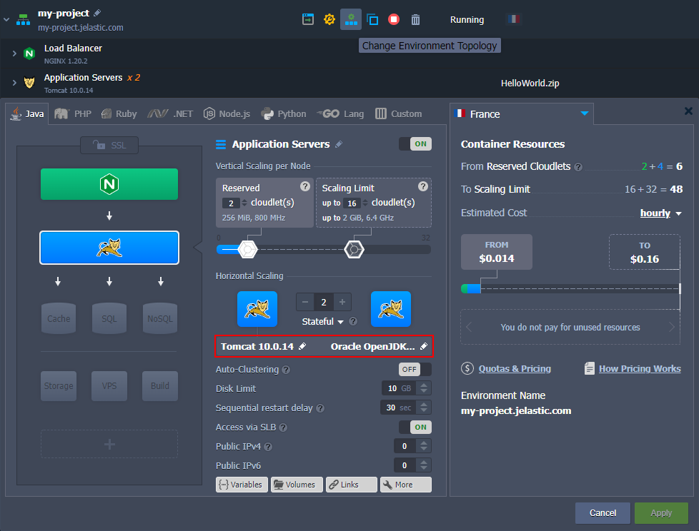

2\. As a result, the ***Redeploy containers*** frame will be opened, where you can select a new **Tag** for your container(s).

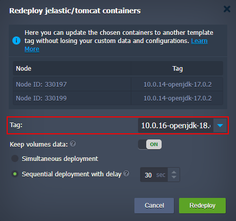

Also, you can adjust some additional options:

* **Keep volumes data** - if enabled, data in the [volumes](/container-volumes/) will be protected from erasing and will remain available after redeploy
* for [horizontally scaled](/horizontal-scaling/) containers, you can choose between two deployment options:
  * **Simultaneous deployment** - redeploys all nodes at once, which is comparatively quicker but causes a brief downtime of your application
  * **Sequential deployment with delay** - redeploys instances one-by-one with a specified *delay* between operations. This option ensures that there is always a running node to process incoming requests (i.e. no downtime)

After all the configurations are set, click the **Redeploy** button and confirm within the pop-up.

3\. Once the update is completed, you'll see the corresponding notification in the top right corner of the dashboard.

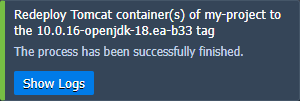

Click the **Show Logs** button to open the appropriate tab with information on the updated container - *Node ID*, *name:tag*, and *Duration*.

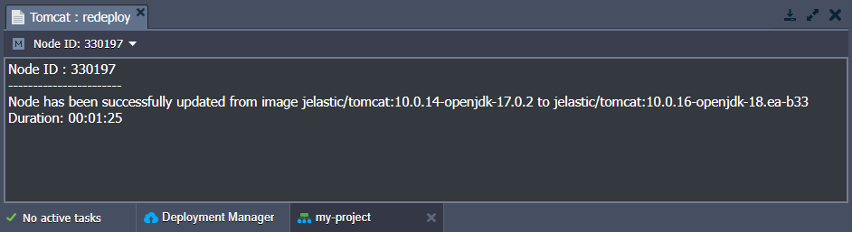

Now, you know how to redeploy a container via the platform dashboard.


## Update Container via Platform API/CS/CLI

The update process can be automated using [platform API](https://www.virtuozzo.com/application-platform-api-docs/), [Cloud Scripting](https://docs.cloudscripting.com/creating-manifest/actions/#api), and [CLI](/cli/) (command-line interface).

{}**Tip:** A detailed example on [container redeploy via CLI](/cli-container-redeploy/) is provided in the linked guide.{}

Container redeploy is performed with the ***[environment.Control.RedeployContainers](https://docs.jelastic.com/api/#!/api/environment.Control-method-RedeployContainers)*** method, which is managed with the following parameters:

* ***envName*** - name of the environment, where container(s) should be redeployed
* ***session*** - user session (or [token](/personal-access-tokens/)) identifier, used for authentication
* ***nodeGroup*** - identifier of the [environment layer](https://docs.cloudscripting.com/creating-manifest/selecting-containers/#all-containers-by-group) to update *(optional)*
* ***nodeId*** - identification number of the particular container to be redeployed *(optional)*
{}**Note:** You need to state either ***nodeGroup*** or ***nodeId*** parameter to define the operation target. The method ignores ***nodeGroup*** if both are provided and fails if neither is specified.{}

* ***tag*** - image version to be deployed
* ***useExistingVolumes*** - set it to *true* to keep data in the mounted volumes present within the updated container(s) *(optional)*
* ***login*** and ***password*** - credentials to access an image from the private registry *(optional)*

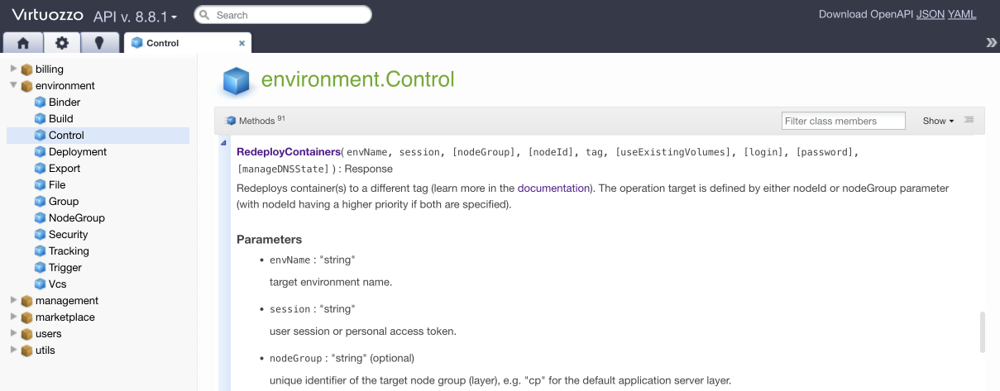

The following constructions can be used to define container update within your [automation scripts](https://docs.cloudscripting.com/creating-manifest/actions/#api):

1\. Redeploying the whole layer of containers.

```
api: environment.control.RedeployContainers
nodeGroup: {nodeGroup}
tag: {myImage}:{newTag}
```

Here:

* ***{nodeGroup}*** - [environment layer (or node group)](https://docs.cloudscripting.com/creating-manifest/selecting-containers/#all-containers-by-group) where all containers should be updated
* ***{myImage}*** - name of the image to be deployed
* ***{newTag}*** - the required version of the image above

2\. Updating a particular container.

```
api: environment.control.RedeployContainers
nodeId: {nodeId}
tag: {myImage}:{newTag}
```

Here, the ***{nodeId}*** value should be substituted with the ID number of the required node (other placeholders are the same as for the example above).


## Saving Custom Data during Container Redeploy

Each [platform-managed container](/software-stacks-versions/) is provided with a special ***/etc/jelastic/redeploy.conf*** file, storing a list of critical container configs. These settings are automatically preserved by the platform during the container redeploy. The file can be easily accessed via the [embedded file manager](/configuration-file-manager/) through the *Favorites* shortcut.

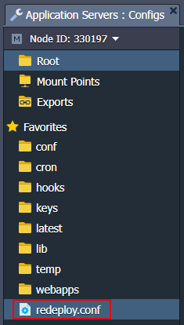

The ***redeploy.conf*** file is divided into two [system](#system-files-and-folders) and [custom](#custom-files-and-folders) sections and can be used to [backup system files](#creating-file-backup-copy-upon-image-redeployment).

#### System Files and Folders

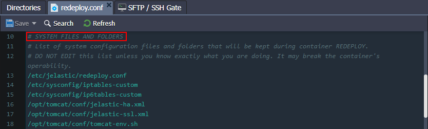 

{}**Note:** Do not edit the "***system files and folders***" list unless you know exactly what you are doing.{}

Here, container-specific configurations that are required for the correct redeploy operation are listed. Some of the common files are provided on all of the stacks:

* ***/etc/jelastic/redeploy.conf*** - the current redeployment config itself (to store the list of required for saving files and directories during each further container redeploy)
* ***${home}/.bash_profile*** - contains the default SSH shell settings (e.g. shell introduction message, the required configuration files to be fetched, etc.)
* ***/etc/sysconfig/iptables*** - keeps the default firewall rules
* ***/etc/sysconfig/iptables-custom*** - contains [custom firewall rules](/custom-firewall/)
* ***/var/lib/jelastic/keys*** - stores [uploaded SSH private keys](/ssh-generate-key/), which are necessary to access the container via SSH and for interaction with other containers

{}
Stack|Path
---|---
**Tomcat**|/opt/tomcat/conf/jelastic-ha.xml<br>/opt/tomcat/conf/jelastic-ssl.xml<br>/opt/tomcat/conf/tomcat-env.sh<br>/opt/tomcat/conf/variables.conf<br>/opt/tomcat/temp/<br>/var/spool/cron/tomcat
**TomEE**|/opt/tomcat/temp/<br>/var/spool/cron/tomcat
**GlassFish**|/home/jelastic/.ssh<br>/home/jelastic/.ssh2<br>/opt/glassfish/glassfish/domains/domain1/applications<br>/opt/glassfish/glassfish/domains/domain1/config/admin-keyfile<br>/opt/glassfish/glassfish/domains/domain1/config/domain.xml<br>/opt/glassfish/hazelcast.xml<br>/opt/glassfish/glassfish/domains/domain1/config/variables.conf<br>/opt/glassfish/glassfish/domains/domain1/docroot<br>/opt/glassfish/glassfish/nodes<br>/root/contexturl<br>/var/spool/cron/glassfish<br>/var/lib/jelastic/hooks
**Golang**|/home/jelastic<br>/var/lib/jelastic/app.info<br>/var/lib/jelastic/keys<br>/var/lib/jelastic/vcs<br>/var/spool/cron/golang
**Payara**|/home/jelastic/.ssh<br>/home/jelastic/.ssh2<br>/opt/payara/glassfish/domains/domain1/applications<br>/opt/payara/glassfish/domains/domain1/config/admin-keyfile<br>/opt/payara/glassfish/domains/domain1/config/domain.xml<br>/opt/payara/hazelcast.xml<br>/opt/payara/glassfish/domains/domain1/config/variables.conf<br>/opt/payara/glassfish/domains/domain1/docroot<br>/opt/payara/glassfish/nodes<br>/root/contexturl<br>/var/spool/cron/payara<br>/var/lib/jelastic/hooks
**Spring Boot**|/home/jelastic/conf<br>/home/jelastic/APP<br>/var/lib/jelastic/keys<br>/var/spool/cron/jvm
**Apache PHP**|backup:/etc/php.ini<br>/etc/php.d/<br>/var/spool/cron/apache<br>/var/www/.ssh/
**Apache Ruby**|/var/lib/jelastic/env<br>/var/spool/cron/apache
**Couchbase**|/opt//etc/
**MariaDB**|/etc/my.cnf<br>/etc/php.ini<br>/var/lib/mysql/.ssh/<br>/var/spool/cron/mysql
**Maven**|/opt/maven/.ssh/<br>/var/spool/cron
**Memcached**|/etc/sysconfig/memcached
**MySQL**|/etc/my.cnf<br>/etc/php.ini<br>/var/lib/mysql/.ssh/<br>/var/spool/cron/mysql
**NGINX (load balancer)**|/etc/dhcp/dhcpd.conf<br>/etc/nginx/conf.d<br>/etc/nginx/neighbors<br>/etc/nginx/nginx-jelastic.conf<br>/etc/nginx/tcpmaps/mappings.xml<br>/etc/nginx/upstreams<br>/var/lib/nginx/.ssh/<br>/var/spool/cron/nginx<br>/var/lib/jelastic/SSL
**NGINX PHP**|backup:/etc/php-fpm.conf<br>backup:/etc/php.ini<br>/etc/php.d/<br>/etc/sysconfig/php-fpm<br>/var/lib/nginx/.ssh/<br>/var/spool/cron/nginx
**NGINX Ruby**|/var/lib/jelastic/env<br>/var/spool/cron/nginx
**NodeJS**|/home/jelastic//.ssh/<br>home/jelastic//.ssh2/<br>var/spool/cron/nodejs<br>/home/jelastic/ROOT
**PerconaDB**|/etc/my.cnf<br>/etc/php.ini<br>/var/spool/cron/mysql
**PostgreSQL**|/etc/php.ini<br>/var/lib/pgsql/.ssh/<br>/var/spool/cron/postgres<br>${home}/lib/<br>${home}/share/
**Varnish**|/etc/nginx<br>/etc/varnish<br>/etc/sysconfig/varnish<br>/var/lib/varnish<br>/var/spool/cron/varnish
**WildFly**|/opt/contexturl<br>/home/jelastic/.ssh/<br>/var/spool/cron/wildfly<br>/opt/wildfly/domain<br>/opt/wildfly/standalone<br>/opt/wildfly/welcome-content/index.html<br>/var/lib/jelastic/hooks
{}

#### Custom Files and Folders

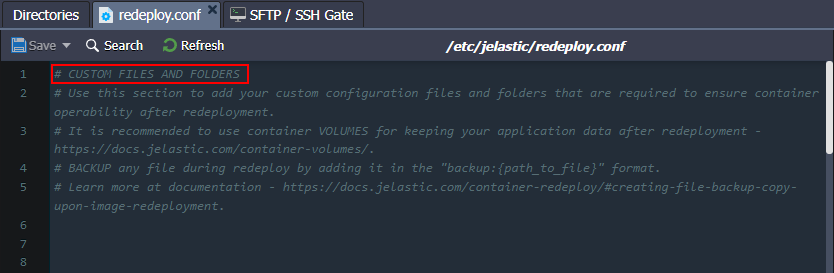

{}**Note:** When providing "***custom files and folder***", only add system configuration files that are required to ensure container operability during redeployment. Use [container volumes](/container-volumes/) for other cases (e.g. to keep your application data).{}

You can supplement the default list of "***system files and folders***" configurations with your custom files and folders (if needed). Open the ***redeploy.conf*** file and add an entry with a full path to the required item (each entry should be stated in a separate line).

#### Creating File Backup Copy Upon Image Redeployment

The platform provides a convenient and simple way of creating backups for configuration files during the container update. Namely, when replacing the specified config with its version from the new tag, a copy of the file from before the redeploy will be preserved.

To create a backup, you need to specify a path to the necessary file in ***redeploy.conf*** and add the "*backup:*" prefix to the record:

```
backup: {path_to_file}
```

{}**Note:** This operation is available for files only (not directories).{}

After redeploy, the config from the old container can be easily recognized by the appropriate "*backup*" or "*time stamp*" extensions. They can be used for an instant rollback upon incompatibility with the new configs or for analysis of the changes.

For example, all platform-managed PHP application servers create a backup for the ***/etc/php.ini*** config by default.

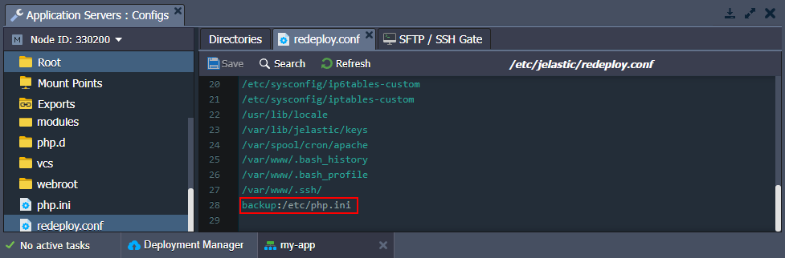

After the container update, you’ll see new and previous versions of the ***php.ini*** or any other backed up files:

- ***{file_name}*** - file from the redeployment target image (from the new tag)
- ***{file_name}.{time_stamp}*** - backup version of the file created just before the redeploy operation (a separate file for each redeployment to a different tag)
- ***{file_name}.backup*** - the latest backup of the file (automatically replaces the previous same-named backup)

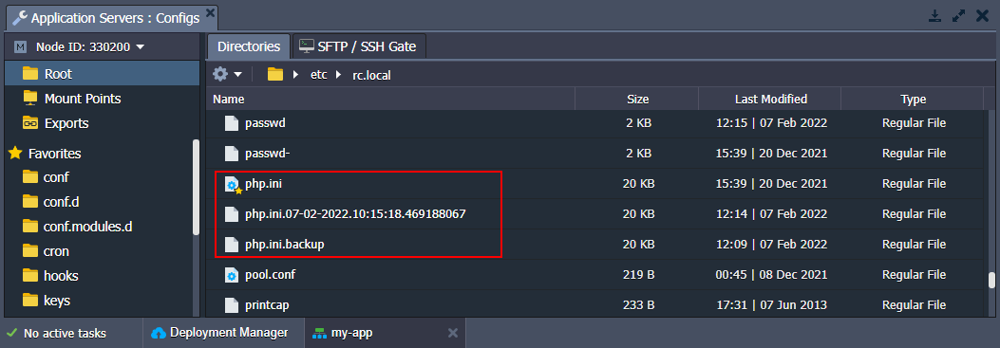

This way, you can easily switch to the previously used settings by substituting the ***php.ini*** file with its backup (e.g. through the renaming or content copying).

Now, you know how to manage template versions (Docker tags) of the containers inside the platform.


## What's next?

* [Container Types](/container-types/)
* [Container Configuration](/container-configuration/)
* [Connect to Custom Container](/connect-to-custom-container/)
* [Custom Container SSH Access](/custom-container-ssh-access/)
* [CLI Container Redeploy](/cli-container-redeploy/)