# Container Types and Use Cases

The PaaS combines two types of containers in a single platform. These containerization technologies are oriented to solve different problems, but platform orchestration inherits benefits of both implementations.

* ***[System Containers](/what-are-system-containers/)*** - one of the oldest container types, which is quite similar to virtual machines. It is a stateful, operating system centric solution that can run multiple processes. System containers are usually used for traditional or monolithic applications, as they allow to host architectures, tools, and configurations implemented for VMs. There are different implementations of system containers: LXC/LXD, OpenVZ/Virtuozzo, BSD jails, Linux vServer, and some others. The platform uses Virtuozzo solution.
* ***[Application Containers](/what-are-application-containers/)*** - a relatively new container type, which commonly runs a single process inside. It is a stateless microservice-centric solution that is easily scalable horizontally. Application containers are the most suitable for immutable and ephemeral infrastructures. Several application container implementations are available at the market: Docker, containerd, CRI-O, and some others. The platform utilizes Docker as the most widely adopted technology for application contains.

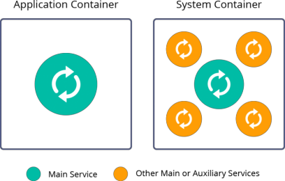

Talking about containers nowadays, people often think of Docker technology, as it was highly promoted and adopted during the last years. Most cloud vendors offer Docker application containers inside Virtual Machines. Each VM includes Guest OS with its own memory, CPU and disk footprint that increases the amount of required resources to run the application and thus make its hosting more expensive. In case with the platform, Docker technology is running inside system containers within the same kernel. Thus they share OS resources from the host operating system and reduce the consumption. And while being more lightweight than VMs, these nested containers are still highly isolated and secure.

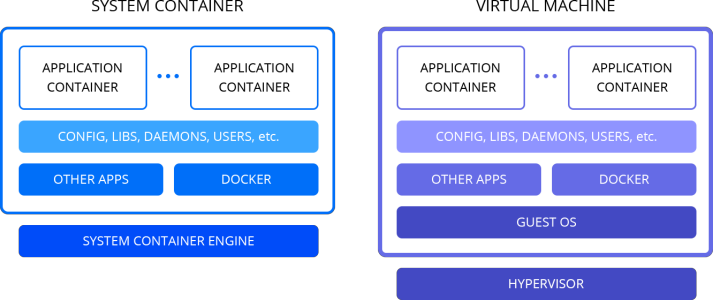

Within the platform, different container types can be used for various use cases:

- [Certified Managed Containers](#certified-managed-containers)
- [Virtual Private Servers (Elastic VPS)](#virtual-private-servers-elastic-vps)
- [Custom Docker Containers](#custom-docker-containers)
- [Docker Engine CE (Docker Native)](#docker-engine-ce-docker-native)
- [Kubernetes Cluster](#kubernetes-cluster)

Below we will review each case in detail, as well as provide some hints on what options can be more appropriate for your project.

## Certified Managed Containers

The most common and recommended choice for the platform customers is ***certified containers***. The platform offers multiple pre-configured and managed [software stacks](/software-stacks-versions/), that allow creation of flexible topologies with the required **application server** (*Java*, *PHP*, *Node.js*, *Ruby*, *Python*, or *Go*), **load balancer**, **databases**, etc.

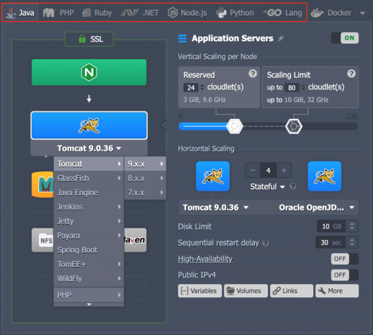

All of these certified containers are thoroughly tested and optimized specifically for the most common scenario within the platform. PaaS team regularly updates these software stacks to the newest available stable versions or apply security patches to already released container images.

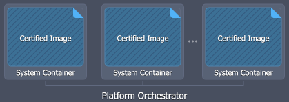

Usually, these containers also benefit from additional integrations, such as automated configuration based on the resource ([cloudlet](/cloudlet/)) scaling limits, automated SSL certificates installation, application deployment automation, built-in [auto-clustering](/auto-clustering/), managed delivery of security updates, and others.

## Virtual Private Servers (Elastic VPS)

The most straightforward example of a system container implementation is a ***virtual private server***. The platform offers **[Elastic VPS](/vps/)** containers with the following pre-installed operating systems: *CentOS*, *Ubuntu*, and *Debian*. It is a pure OS-based container without any additional customization or software installed. It can be considered as the most suitable option for containerizing legacy applications as it requires minimal to no changes while migration from VMs.

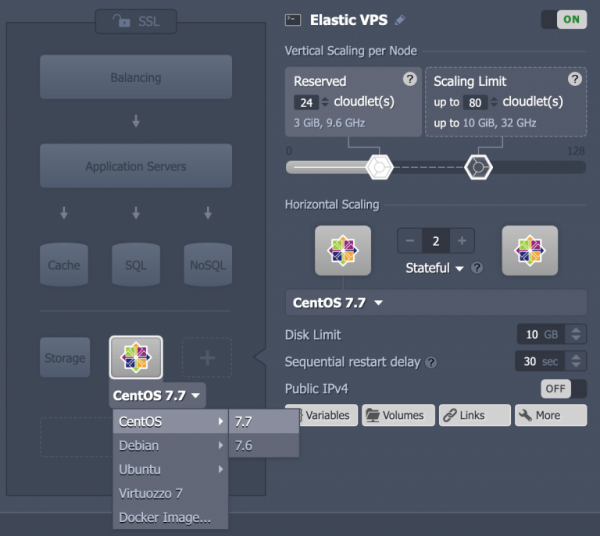

So, since it is practically “empty” after the installation, all the required configurations should be done by the end user. In order to help you with this task, *root* access is provided to Elastic VPS containers. It’s almost like a virtual machine but more lightweight and with the advantages of automatic vertical and horizontal scaling.

## Custom Docker Containers

The ***Custom Docker Container*** is a *Docker image* (based on the [supported OS and architecture](/container-image-requirements/)) deployed inside the platform system container, which makes it compatible with the most (but not all) platform-distinguishing features, such as built-in vertical and horizontal scaling. In other words, the filesystem of your custom Docker image is unpacked inside the system container runtime.

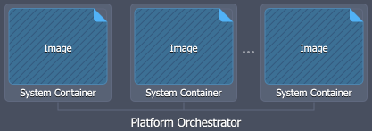

Compared to the certified managed containers, this option provides access to a wider choice of software stacks. You can select from a vast range of 3rd party Docker images available at the Docker Hub or any other compatible public or private container registry. However, software operability and compatibility within the platform cannot be guaranteed as it is managed by respective 3rd party image maintainers.

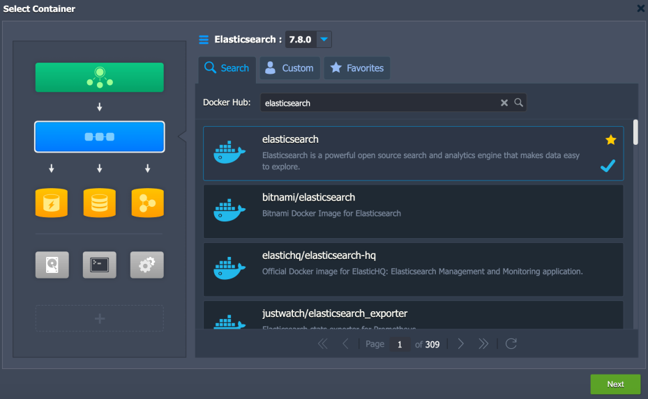

## Docker Engine CE (Docker Native)

The platform provides support for the ***Docker Engine Community Edition*** that is running inside system containers but at the same time has full compatibility to the native Docker ecosystem.

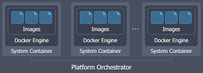

Such integration makes it possible to work with the core tools of Docker container technology, namely:

- ***Docker Engine*** - processes Dockerfile manifests or runs pre-built container images
- ***Docker Registry*** - stores and provides access to numerous public and private images, intended for deployment within Docker Engine
- ***Docker Compose*** - helps to assemble applications, that consist of multiple components where all the required configurations are declared within a single compose file
- ***Docker Swarm*** - represents several independent Docker nodes, interconnected into a cluster

The platform provides a pre-packaged version of the *Docker Engine CE* solution and *Docker Swarm Cluster* with integrated [auto-clustering](https://www.virtuozzo.com/company/blog/docker-swarm-auto-clustering-and-scaling-with-paas/).

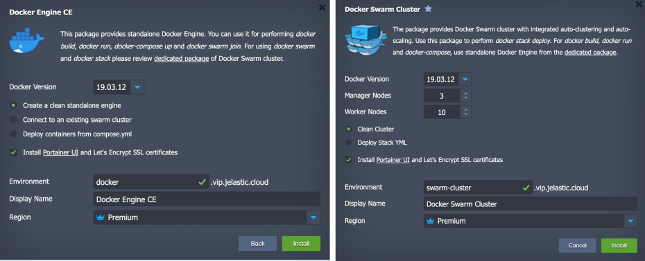

Read our dedicated blog post series for more details:

- [Auto-Install Docker Engine and Connect It to Swarm Cluster](https://www.virtuozzo.com/company/blog/docker-engine-automatic-install-swarm-connect/)
- [Docker Swarm Auto-Clustering and Scaling](https://www.virtuozzo.com/company/blog/docker-swarm-auto-clustering-and-scaling-with-paas/)
- [Connecting to Docker Engine and Its Management](https://www.virtuozzo.com/company/blog/docker-engine-auto-install-connect-ssh-portainer/)
- [Deploying Services to Docker Swarm Cluster](https://www.virtuozzo.com/company/blog/deploy-services-docker-swarm-cluster/)

## Kubernetes Cluster

Application containers can be run and managed with the help of Kubernetes orchestration tool. It is an open-source platform designed for deployment and management of fault-tolerant containerized applications. It can handle complex tasks of container orchestration, such as deployment, service discovery, rolling upgrades, self-healing, and security management.

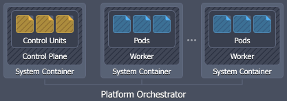

[PaaS Kubernetes](https://www.virtuozzo.com/company/blog/kubernetes-cluster-scaling-pay-per-use-hosting/) implementation automates cluster installation, configuration, updates, and supplies multiple pre-integrated services (e.g. Weave CNI, CoreDNS, Traefik, etc.).

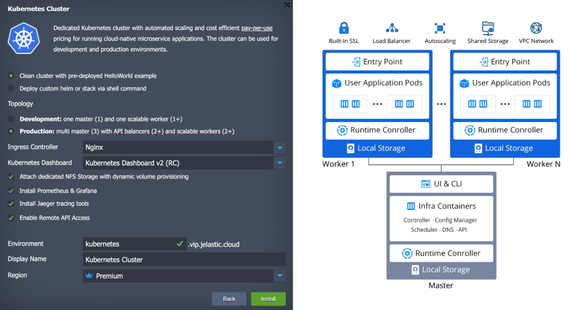

In other words, we run Kubernetes with the help of platform orchestration providing maximum interoperability for projects that were designed for Kubernetes from the beginning. The major benefit of Kubernetes implementation is the advanced [pay-per-use](https://jelastic.com/pay-per-use/) model that solves right-sizing problem and makes hosting of multiple containers more cost efficient.

Additional information on the Kubernetes Cluster can be viewed via the appropriate documentation sections:

- [Kubernetes Overview](/kubernetes-cluster/)
- [Kubernetes Cluster Access](/kubernetes-cluster-access/)
- [Scaling Kubernetes on Application and Infrastructure Levels](https://www.virtuozzo.com/company/blog/scaling-kubernetes/)
- [Kubernetes Helm Integration](/kubernetes-helm-integration/)
- [Kubernetes Volume Provisioner](/kubernetes-volume-provisioner/)

Now, you know about various container types available at the platform, as well as their specifics that can help to choose the most suitable option for your project needs.

## What's next?

* [System Containers](/what-are-system-containers/)
* [Application Containers](/what-are-application-containers/)
* [Certified Containers Deployment](/certified-containers-deployment/)
* [Custom Containers Deployment](/custom-containers-deployment/)
* [Container Redeploy](/container-redeploy/)