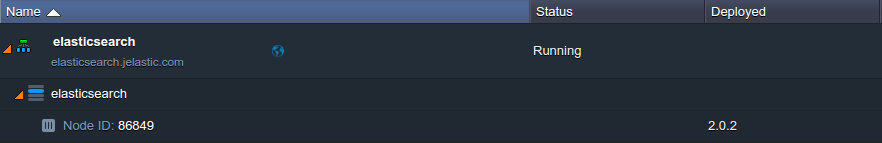

# Data Index inside PaaS: How to Deploy Elasticsearch

{}{}

[Elasticsearch](https://www.elastic.co/products/elasticsearch) is a powerful open source engine for search and analytics, that makes data easy to store and explore. Being focused on reliability, real-time analytics and simple management, it is based on high performance and full-featured Java-powered Apache Lucene library, which helps to implement the provided advanced search and analytics capabilities. Herewith, a special RESTful API allows to perform any action by means of a simple JSON over HTTP, making this solution truly developer-friendly.

Since Elasticsearch engine is rather popular and highly demanded among our users, this guide describes how it can be hosted in a matter of minutes at any of [our partner's Platforms](https://www.virtuozzo.com/application-platform-partners/), leveraging tight integration of Docker containers support at the platform. So, below we'll reveal how to:

* [deploy Elasticsearch Docker container](#deploy)
* [launch it](#launch)
* [update to the newest version](#update)

## Deploy Elasticsearch Docker Container
Being based on [Docker standard](/dockers-overview), the Elasticsearch image can be provisioned for production-ready use at the platform in a few clicks, just like it's described below:

1\. Log into your platform dashboard and click the **New environment** button at the top pane. In the opened wizard, switch to the ***Docker*** tab and click **Select Container** in the middle of the frame.

2\. At the **Search** tab, type *elasticsearch* into the corresponding field and press **Enter**. Choose the same-named image within the appeared list by simply clicking on it.

​Then, select the version you'd like to install by means of the drop-down menu at the top (as an example, we'll choose the *2.0.2* one) and click **Next** to proceed.

3\. Now, you can configure the general parameters of your environment - adjust the amount of allocated resources using cloudlet sliders, select the desired [region](/environment-regions) and type environment name.

{}**Note:** Elasticsearch requires either a [Public IP](/public-ipv4) address to be attached to a container (for that, use the switcher circled in the image above) or have the appropriate [endpoints](/endpoints) set in order to work properly. Herewith, the first option is paid but more efficient, whilst endpoints can be used free of charge (we'll show how to appoint them right down this article).{}

To submit the creation, click the same-named button when ready.

4\. That's all! In a minute, you'll get your ready-to-use Docker-based environment with Elasticsearch already deployed inside.

## Launch Elasticsearch
Now, let's ensure our Elasticsearch application is accessible and works fine - this can be confirmed though receiving a piece of JSON upon accessing its start page. As it was mentioned above, depending on your preferences you may connect via:

* <a href="#public-ip" id="public-ip">external IP address</a> - the common choice, which ensures simple instance handling and faster response time, whilst being a paid option
* [endpoints](#endpoints) - the free of charge alternative, provided by the platform

### Connection via Public IP
In case you've attached an [external IP](/public-ipv4) address to your *elasticsearch* container, simply click the **Open in browser** button next to your environment and add the default *9200* port at the end of the address within the opened tab:

This way is standard and, as you can see, is maximally optimized for convenient usage.

### Connection via Endpoints
If you'd like to leverage [endpoints](/endpoints) solution instead of spending the additional costs for external address utilization, you need to take into consideration that Elasticsearch requires the *http* and *transport.tcp* services to be accessible from outside. Here, the first service is used for the incoming HTTP requests' processing, and the second one - for communication between nodes. 

So, to make your deployed search engine to work properly, you'll need to manually expose the appropriate ports via the platform [Shared Load-Balancer](/shared-load-balancer) for the corresponding container.

1\. For that, click the **Settings** icon next to your environment, switch to the *Endpoints* section and select **Add**, like it is shown in the image below:

2\. Within the opened frame, define the required parameters for the first endpoint (i.e. the *http* service entry point), exposing the *9200* container port:

Click **Add** to create.

3\. Repeat the previous step for the transport service (*9300* port). As a result, you should receive two endpoints, similar to the shown below:

For now, you are able to operate with your *elasticsearch* instance using the links within the **Access URL** column. To ensure everything is fine, navigate to the *http* one:
  
That's it! Now you can start building your own index of the required document-oriented data.

## Update Elasticsearch to New Version

The platform provides an easy way to switch between the available Docker image tags, whilst saving all the inherent server configurations and data stored, with the distinctive [container redeploy](/docker-update) feature. So, in case of the necessity to upgrade your *elasticsearch* instance to the newly released version, just follow the next simple steps:

1\. Click **Redeploy container** next to the required Docker container (or, if operating with several nodes, select the same button for the corresponding image name to update all of them at once).

2\. Within the appeared frame, choose the desired **Tag** your application should be updated with (e.g. the *latest* one) and click **Redeploy**.

{}**Warning:** 
**Be aware** that the operation of redeployment will cause a temporary downtime of your application. However, this can be easily avoided with [Sequential deployment](/docker-update#sequential) of multiple image instances.
{}

3\. In a minute or so, you'll get your container updated. To check the exact Elasticsearch version that is currently run, just refer to its start page.

In such a way, you can move to the newest application version right after it is released without the mess of complex adjustments and special configurations.

{}Have met any problems with installation? Or would like to request the instruction for any other application? Feel free to appeal for our technical experts' assistance at [Stackoverflow](http://stackoverflow.com/questions/tagged/jelastic).
{}

## What's next?

* [Container Types](/container-types/)
* [Custom Containers Deployment](/custom-containers-deployment/)
* [Container Redeploy](/container-redeploy/)
* [Public IP](/public-ip/)
* [Endpoints](/endpoints/)