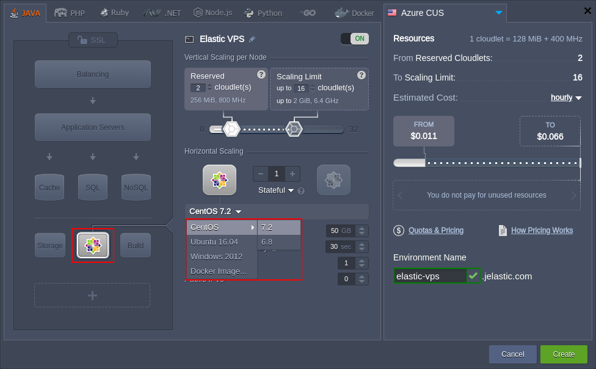
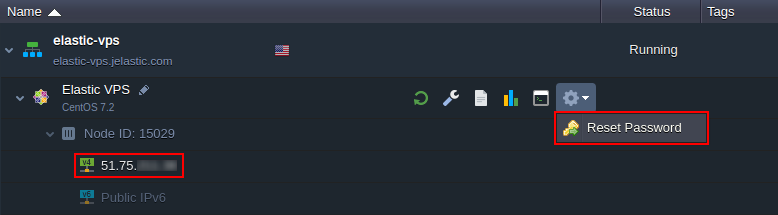
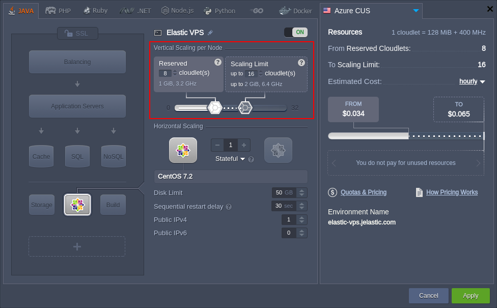
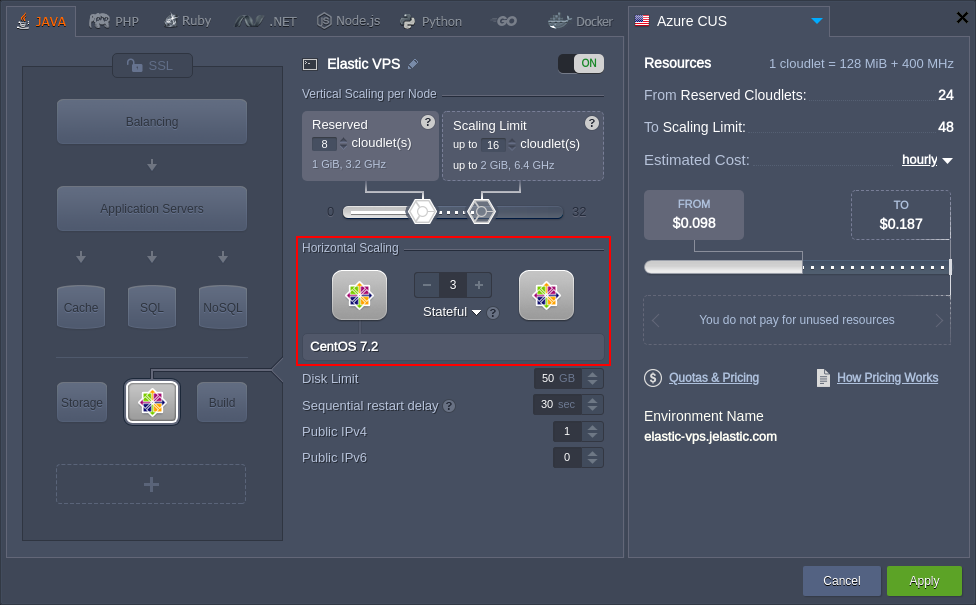
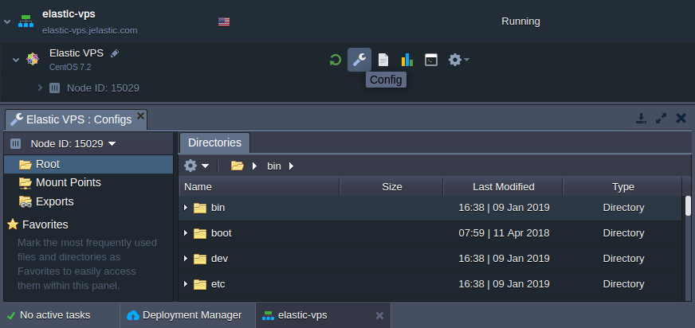
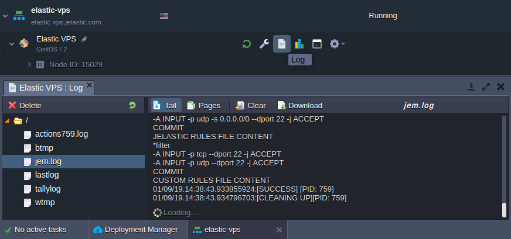

# Elastic VPS Configuration

All of the supported virtual private server types at the platform (i.e., based on *CentOS*, *Ubuntu*, and *Debian*) share the similar installation flow and the main management options. So, to get your Elastic VPS hosted and configured inside the platform, follow the next instructions on how to:

* [create VPS](#elastic-vps-installation)
* [scale server](#elastic-vps-scaling)
* [manage instance](#elastic-vps-inbuilt-tools)

## Elastic VPS Installation

To set up your VPS inside the platform, follow the next steps.

1\. Click the **New Environment** button at the top pane to access environment topology wizard.

2\. Herein, click on the **VPS** section at the bottom left corner and choose the needed VPS (*CentOS 7.2* in our example) from the expandable options list.

{}**Note:** When enabling **VPS** of any type, you'll automatically get the **[Public IP](/public-ip)** address(es) attached to the corresponding node (one per instance).

Nevertheless, in case of strict necessity, you can contact your hosting provider and request the option of running VPS with the internal IP only (e.g. when a special application infrastructure, which is partially inaccessible from outside, is required).{}

Specify cloudlet limits for this node, [scale](#elastic-vps-scaling) it out (if required), select the preferred [region](/environment-regions/) (if several of them are available), type the name of the environment and click on **Create**.

3\. In a couple of minutes, your new environment with the chosen virtual server will appear at the dashboard. You'll also receive an email notification with its administration data (i.e. login/password credentials, attached Public IP and access URL).

Also, you can view the Public IP address directly in the dashboard. If you've lost access to your VPS server or want to change the admin credentials for it, click the **Reset Password** button as it is shown in the image above.

## Elastic VPS Scaling

The flexibility of VPS hosting in the platform is achieved due to automatic scaling, both vertical and horizontal, that is easily tuned during environment topology creation and configuration.

**[Automatic vertical scaling](/automatic-vertical-scaling/)** is ensured by systems ability to provide the required resources due to load. You can choose the scalability limits for your server, which prevents outages during unexpected load spikes and at the optimize hosting costs.

To scale your environment, you need to increase/decrease the maximum number of available resources (cloudlets) by adjusting the cloudlet sliders in the *Vertical Scaling per Node* section.

The platform **[horizontal scaling](/horizontal-scaling/)** functionality allows to easily adjust the number of servers in your environment using the appropriate "**-**" and "**+**" buttons. Herewith, you can select the preferred scaling mode:

* ***Stateless*** - simultaneously creates all new nodes from the base image template
* ***Stateful*** - sequentially copies file system of the master container into the new nodes

Make sure to **Apply** changes you've made.

## Elastic VPS Inbuilt Tools

Most of the basic configurations on your VPS instance can be performed directly via dashboard UI with a set of inbuilt tools, provided by the platform.

{}**Note:** The configurations on the *Windows VPS* can be applied via the [RDP](/win-rdp-access/) connection only.{}

### File Manager

The in-built **[configuration file manager](/configuration-file-manager/)** is designed to manage (create/delete, upload/download, edit) files inside your container, as well as setup [mount points](/mount-points/) and manage [exported data](/storage-exports/).

The appropriate tab can be opened by clicking on the **Config** button next to the necessary VPS node (or the whole layer).

### Log Files

**[Logs](/view-log-files/)** tracking is a useful option for the efficient management of your VPS. Here, data on all aspects of your container(s) lifecycle is gathered, which may come in handy while troubleshooting and debugging your applications and services.

The appropriate section can be accessed by clicking on the **Log** button next to the necessary VPS node (or the whole layer).

For the complex configurations, you should connect to VPS server over [SSH Gate](/vps-ssh-gate/) (including an option to continue working via the dashboard using **Web SSH**) or establish a direct [SSH connection using Public IP](/vps-public-ip).

## What's next?

* [Elastic VPS Overview](/vps/)
* [Linux VPS Access via SSH Gate](/vps-ssh-gate/)
* [Linux VPS Access via Public IP](/vps-public-ip/)
* [Windows VPS Access via RDP](/win-rdp-access/)