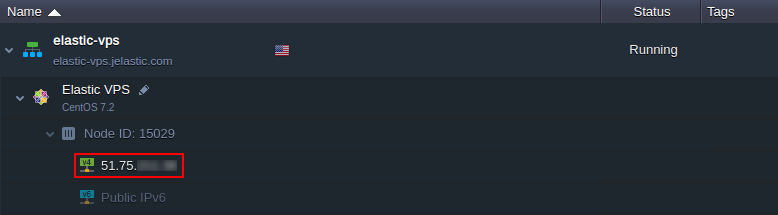
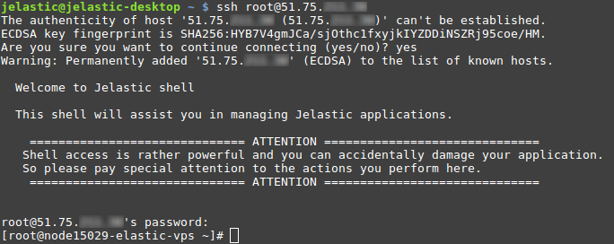
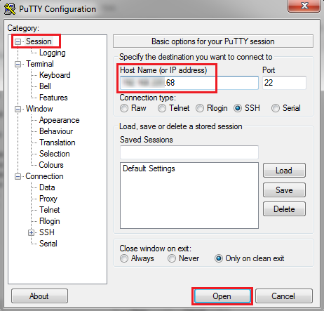
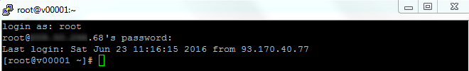

# Linux VPS Access via Public IP

It is possible to access your VPS container using any preferred third-party SSH software via the attached external IP address. Such connection provides the same full root access level as while working over [SSH Gate](/vps-ssh-gate/).

{}**Tip:** You can locate your Public IP by expanding the appropriate node in the platform dashboard or within the appropriate Elastic VPS creation email.

{}

Below, we've prepared examples of connection to Elastic VPS container over public IP from under different operating systems:

* [MacOS/Linux/BSD](#macos-linux-bsd)
* [Windows](#windows)

{}**Tip:** In confines of the [Windows-based](/win-vm/) VPS containers, the [remote desktop protocol](/win-rdp-access/) (RDP) is used to perform any required server configurations<a id="macos-linux-bsd"></a>.{}

## Public IP Access for MacOS/Linux/BSD

Run your preferred SSH tool and connect to your VPS server with the steps similar to the ones provided below.

As an example, we'll use the [OpenSSH](https://www.openssh.com/) software, open your terminal and run the following command:
```bash
ssh {userName}@{hostname}
```
where

* ***{userName}*** - login received via email upon environment setup (*root* by default)
* ***{hostname}*** - attached Public IP address


If connecting for the first time, you may be asked to confirm access by adding your VPS address to the list of known hosts (type &ldquo;*yes*&rdquo; to proceed). Next, authenticate on the server by providing a password (the one sent via email after node creation).

That's it! Start managing your VPS container and apply any required configurations<a id="windows"></a>. You can adapt the current procedure to establish a connection by means of any preferred third-party SSH tool.


## Public IP Access for Windows
In confines of Windows OS, choose a compatible tool to establish SSH connection via Public IP to your VPS container. For example, we'll use the [PuTTY](https://www.chiark.greenend.org.uk/~sgtatham/putty/) SSH client.

1\. Navigate to the **Configuration** tab and establish **Session** by specifying your Public IP address into the appropriate **Host Name** field.

Once the required data is specified, click the **Open** button.

2\. Within the appeared **Console** window, you need to provide your access credentials, i.e **Login** and **Password** from the VPS node after-creation email.

That's it! Now, as SSH connection via Public IP to remote VPS is established, you can start its management with full root permissions granted.


## What's next?
* [Elastic VPS Overview](/vps/)
* [VPS Configuration](/vps-configuration/)
* [VPS Access via SSH Gate](/vps-ssh-gate/)
* [Public IP](/public-ip/)