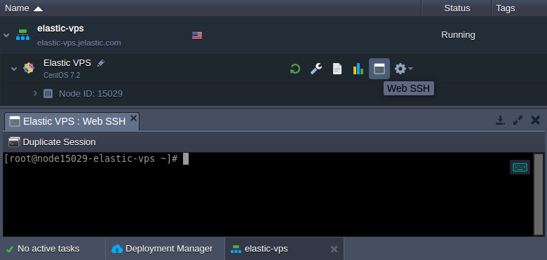
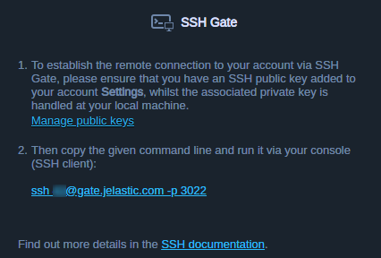

# Linux VPS Access via SSH Gate

In order to manage the required software inside your Elastic VPS container, you need to connect to it via SSH protocol. A connection can be performed through the dedicated [SSH Gate](/ssh-overview), which provides a single access point to configure all environments and servers within your account remotely.
{}**Note:** For the *Windows VPS* management, utilize the [remote desktop protocol](/win-rdp-access) (RDP) support.{}

The process of [SSH access](/ssh-access) to the Elastic VPS nodes is the same as for any other container on the platform but provides full root access.

* ***[Web SSH](/web-ssh-client)***

A one-click connection to your VPS container from the platform dashboard without any configuration required.

* ***[SSH Gate](/ssh-gate-access)***

An SSH connection to VPS from the console on your local machine. Access is based on your custom SSH key pair.
{}**Note:** If you haven't established a connection via SSH Gate before, you'll need to perform the following steps beforehand:

* [generate](/ssh-generate-key) an SSH key pair
* [add your public SSH key](/ssh-add-key) to the dashboard
{}

In case you prefer to operate your VPS container with the help of external SSH tools, consider establishing [access via Public IP](/vps-public-ip) address. Regardless of the chosen approach, the provided functionality and management capabilities are the same.

## What's next?
* [Elastic VPS Overview](/vps/)
* [VPS Configuration](/vps-configuration/)
* [Linux VPS Access via Public IP](/vps-public-ip/)
* [Windows VPS Access via RDP](/win-rdp-access/)