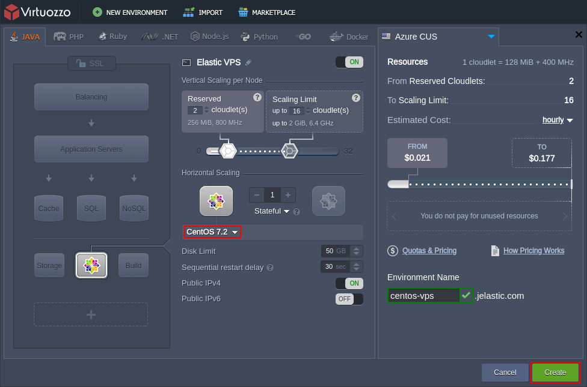

# Elastic CentOS VPS

{}{}

**[CentOS](https://www.centos.org/)** (Community ENTerprise Operating System) is a free community-driven project, with open source code delivered from RHEL Linux distribution.

Due to continuous community contribution, CentOS offers enterprise-level stability strengthened by robust performance and represents a reliable, low-maintenance, secure option for running virtual private servers.

## CentOS VPS Hosting

So, to effortlessly set up your own CentOS [Elastic VPS](/vps/) inside the platform, log in to your PaaS account and access environment topology wizard.

The appropriate instance (i.e., ***CentOS 6.8*** or ***CentOS 7.2***) can be found within the appropriate *VPS* section at the bottom left wizard corner (for the detailed installation guidance, refer to the [VPS Configuration](/vps-configuration/) page).

{}**Note:** By default, the **VPS** node is delivered with the automatically attached **[Public IP](/public-ip/)** address (one [per instance](/horizontal-scaling/)).{}

The platform provides a set of [inbuilt tools](/vps-configuration/#inbuilt-tools) for applying some basic settings to your VPS instance right via the dashboard UI. For more complicated configs, you'll need to access it via SSH - this can be accomplished through the [SSH Gate](/vps-ssh-gate/) or via any [3d-party software](/vps-public-ip/) (i.e., external SSH client) using Public IP address.

Once your virtual private server on top of CentOS is set up and properly configured, consider exploring the following example tutorials:

* [How to Run Java Console Application](/standalone-application/)
* [How to Set Up Mail Server Inside VPS](/adding-mail-server-vps/)

## What's next?

* [Elastic VPS Overview](/vps/)
* [Ubuntu VPS](/vps-ubuntu/)
* [Windows VM](/win-vm/)
* [VPS Access via SSH Gate](/vps-ssh-gate/)
* [VPS Access via Public IP](/vps-public-ip/)