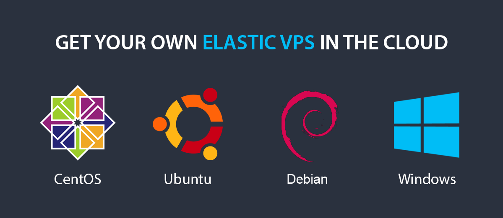

# Elastic VPS

**Virtual Private Server (VPS)** hosting is popular among developers due to strong security, reliable hosting resources, and expanded flexibility. However, it requires a manual configuration of the hosted application, which could be a difficult task for an average developer. Facing the necessity of scaling (e.g. due to your application success), makes it even harder to maintain a service operable and sufficiently supplied with resources to handle the load without overpaying extra capacities.

The platform solves such elasticity problems through the implementation of the so-called ***Elastic VPS*** stacks. They are offered on top the four different OS types - *[CentOS](/vps-centos/)*, *[Ubuntu](/vps-ubuntu/)*, *[Debian](/debian-vps/)*, and *[Windows](/win-vm/)* - allowing to choose the one, which suits your specific requirements the most.

The distinctive features of the Elastic VPS stacks are:

* **insulation** - each given VPS represents an entirely independent instance, which is accessible only via the dedicated [public IP](/public-ip/), so any other account on the hardware cannot influence it
* **full control** - it is possible to manage your virtual server in any preferred way due to the provided root permissions
* **scalability** - the server can be automatically scaled vertically and horizontally by setting the resource limits and specific triggers
* **cost-effectiveness** - VPS is a relatively cheap solution (comparing to the cost of purchase and maintenance of a real dedicated physical server) and due to the platform [usage-based pricing](/pricing-model/) model
* **management tools** - access to the platform [inbuilt tools](/vps-configuration/#elastic-vps-inbuilt-tools) for simplified configuration via the GUI dashboard
* **managed stack** - Elastic VPS software solution is maintained by PaaS team, ensuring regular updates and full compatibility with the platform

In such a way, you get an instance which is advanced enough to handle big applications with high load and simultaneously ensures their simple administration.

To unveil all the performance capabilities provided by Elastic VPS, refer to the appropriate guides and use cases:

* [VPS Configuration](/vps-configuration/)
* [Linux VPS Access via SSH Gate](/vps-ssh-gate/)
* [Linux VPS Access via Public IP](/vps-public-ip/)
* [Windows VPS Access via RDP](/win-rdp-access/)
* [Run Java Console Application](/standalone-application/)
* [Setting Mail Server Inside VPS](/adding-mail-server-vps/)
* [Managing Windows Server Roles & Features](/win-vps-roles-features/)

## What's next?

* [CentOS VPS](/vps-centos/)
* [Ubuntu VPS](/vps-ubuntu/)
* [Debian VPS](/debian-vps/)
* [Windows VM](/win-vm/)
* [VPS Configuration](/vps-configuration/)