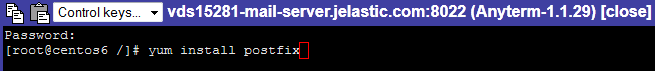
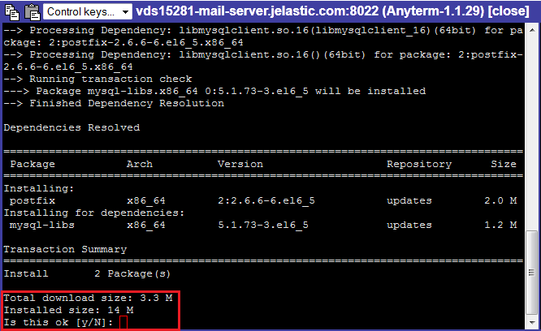
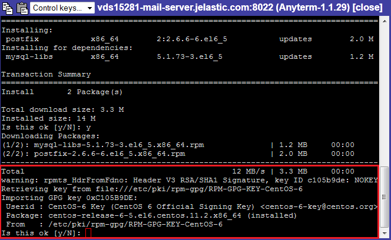
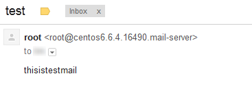

# Setting Mail Server Inside CentOS VPS

With the platform it is possible to integrate mail server to your virtual private machine. Below, we'll guide you through the steps required to get one on within the [CentOS VPS](/vps-centos/). For that, you need to access the required container over SSH protocol using the preferable connection flow (e.g. [web-based client for CentOS](/vps-centos/#ssh-client) in our case) and carry out the following steps:

* [Install and Test Mail Server](#set-up-and-test-mail-server)
* [Configure Authorized Networks](#configure-postfix-authorized-networks)


## Set Up and Test Mail Server

In the current guide we are going to leverage the [Postfix](http://www.postfix.org/) mail server, so follow the next steps to install it within your VPS container and verify if it works as intended.

1\. Run the Postfix installer with the following *yum* command:



2\. During the installation process, you'll need to confirm (i.e. press and submit the &lsquo;***y***' response) the following points:

* total download size

* importing GPG key


3\. When the installation is finished, you can test mail server operability with the following command:

```bash
echo thisistestmail | mail -s test {your_email}
```

Here, the ***{your_email}*** placeholder is an email address, the test email will be sent to.

4\. Now, check the specified email inbox to ensure a letter was sent.



Great! Email server is installed and we can proceed to applying the appropriate configurations.


## Configure Postfix Authorized Networks

For the proper workflow of the recently installed Postfix mail server, you may need to apply some settings within its main configuration file. For example, you can manually specify the list of "trusted" clients, that will be able to relay emails through the Postfix:

1\. Edit the ***main.cf*** file, located in the **etc/postfix** directory with the following content:

* when Postfix should forward emails only from the local machine, uncomment (remove # at the start of the string) the following line:
```bash
mynetworks_style = host
```
* alternatively, you can adjust the list of "trusted" clients manually using the next parameter (in this case the previous setting will be ignored):
```bash
mynetworks = {server1 IP address}, {server2 IP address}
```

2\. After editing configuration files, you need to reload Postfix in order to apply changes you've made.

```bash
/etc/init.d/postfix restart
```

3\. Now you can send messages from the previously specified client (the local machine or the stated servers).

However, you also need to adjust your application to work properly with the newly installed mail server. For that, add the code of the following type to your applicatication configuration file deployed to VPS container.

```
package com.mkyong.common;
import java.util.Properties;
import javax.mail.Message;
import javax.mail.MessagingException;
import javax.mail.PasswordAuthentication;
import javax.mail.Session;
import javax.mail.Transport;
import javax.mail.internet.InternetAddress;
import javax.mail.internet.MimeMessage;

public class SendMailTLS {
   public static void main(String[] args) {
       Properties props = new Properties();
       props.put("mail.smtp.auth", "false");
       props.put("mail.smtp.starttls.enable", "false");
       props.put("mail.smtp.host", "host");
       props.put("mail.smtp.port", "25");
           try {
           Session session = Session.getInstance(props);
           Message message = new MimeMessage(session);
           message.setFrom(new InternetAddress("from-email@jelastic.com"));
           message.setRecipients(Message.RecipientType.TO,
               InternetAddress.parse("to-email@jelastic.com"));
           message.setSubject("Testing Subject");
           message.setText("Text of the message");
           Transport.send(message);
           System.out.println("Done");
       } catch (MessagingException e) {
           throw new RuntimeException(e);
       }
   }
}
```

That's all. The mail server has been successfully adjusted to work with application deployed to VPS container.

{}**Note:** Some settings may differ depending on the currently used [PaaS installation](https://www.virtuozzo.com/application-platform-partners/) (i.e., hosting provider platform). Refer to the Postfix [official documentation](http://www.postfix.org/documentation.html) to reveal more details considering required mail server configurations.{}


## What's next?

* [Elastic VPS Overview](/vps/)
* [VPS Configurations](/vps-configuration/)
* [Java Console Application](/standalone-application/)
* [Windows VPS Use Cases](/win-vps-roles-and-features/)