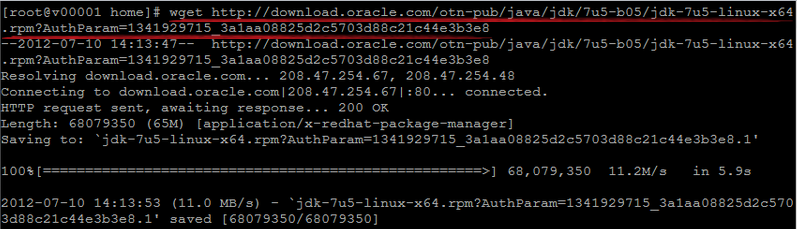
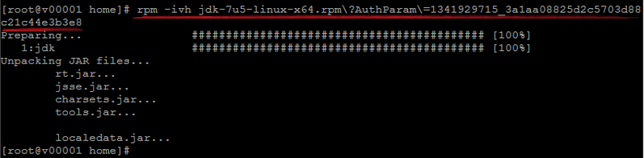
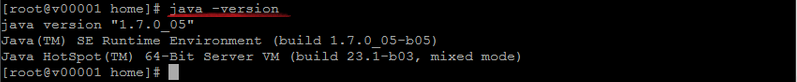
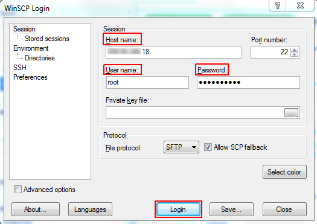
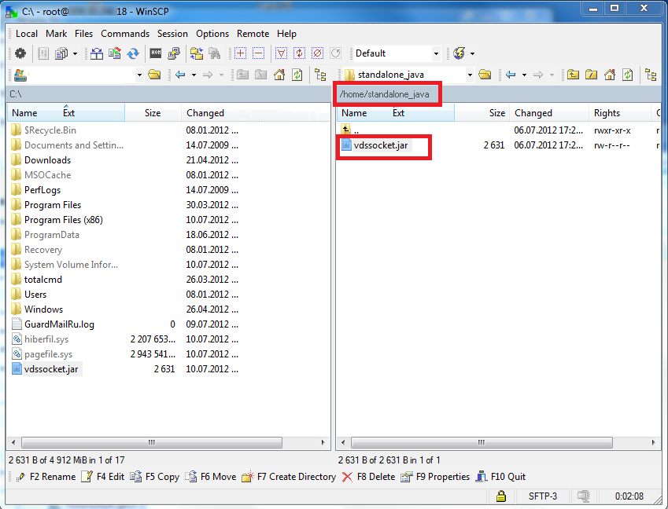
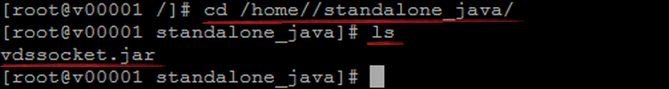
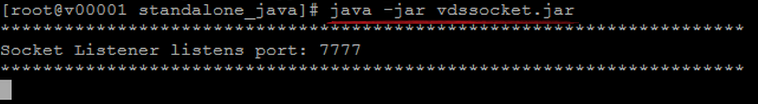
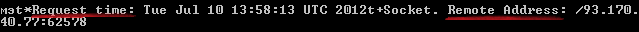
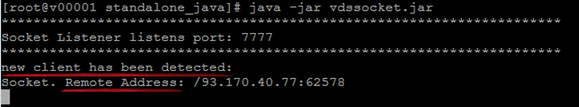

# Java Console Application with CentOS VPS

In the current tutorial we'll overview how to install a sample of Java console application to your [СentOS](/vps-centos/) virtual private server and check its operability. For that, you'll need to execute the following operations:

* [install Java](#install-java)
* [upload application](#upload)
* [access application via SSH](#access-via-ssh)
* [check app operability](#operability)<a id="install-java"></a>


## Install Java to VPS

In order to install Java to your VPS container, carry out the next steps, while being connected over SSH protocol by means of [SSH Gate](/vps-ssh-gate/) or [public IP](/vps-public-ip/).

1\. Enter the following command to initiate *Java* package download.
```bash
wget {utility_address}
```
Where ***{utility_address}*** is a link to the required Java download source.

{}**Note:** The appropriate *AuthParam* parameter should be specified in the URL, which indicates that you've accepted the Oracle licence agreement and can freely download software.{}



2\. Next, execute the command below to unpack the previously downloaded <i>Java **rpm**</i> package.
```bash
rpm -ivh {java_rpm_package}
```
Where ***{java_rpm_package}*** is downloaded *Java* package with *AuthParam* parameter indicated.



3\. And now let's check, whether everything is properly set up by inquiring the installed Java version.
```bash
java -version
```



Great! Java is successfully installed, so let's move further <a id="upload"></a>to the application uploading.


## Upload Application to VPS

Prepare your Java application to be uploaded to VPS container. You may use the following example, that will listen the specified port for connections:  
```java
import java.io.IOException;  
import java.io.ObjectOutputStream;  
import java.net.InetAddress;  
import java.net.ServerSocket;  
import java.net.Socket;  
import java.util.Date;  
import java.util.logging.Level;  
import java.util.logging.Logger;  
    
public class VdsSocket {  
     
   public static void main(String[] args) {  
      try {  
           int port = 7777;  
           InetAddress thisIp = null;  
           ServerSocket ss = new ServerSocket(port);  
    
           System.out.println  ("**********************************************************************");  
           System.out.println("Socket Listener listens port: " + port);  
           System.out.println("**********************************************************************");  
    
           while (true) {  
               Socket s = ss.accept();  
               String address = s.getRemoteSocketAddress().toString();  
               System.out.println("new client has been detected:");  
               System.out.println("Socket. Remote Address: " + address);  
    
               ObjectOutputStream oos = new ObjectOutputStream(s.getOutputStream());  
                   
               oos.writeObject("Request time: "+ new Date());  
               oos.writeObject("Socket. Remote Address: " + address);  
           }  
       } catch (IOException ex) {  
       }  
   }  
}
```

Once your application is ready, you need to pack it into a ***.jar*** archive and upload it to VPS container via preferred file transfer client. In our example, we'll upload [vdssocket.jar](vdssocket.jar) file by means of [WinSCP](https://winscp.net/eng/index.php) tool. For that, let's perform the following steps.

1\. Access WinSCP client and connect to your VPS container using credentials received via email upon server installation:

* **Host name** - attached Public IP address
* **User name** - login (i.e. *root*)
* **Password** - received password



Click on the **Login** button to initiate connection setup.

2\. Once connected to your VPS node, navigate to the ***home*** directory and create a new ***standalone_java*** context inside. Then drag the required ***.jar*** file with your application and drop it into the newly created folder.



Within the appeared transfer settings dialog, click **Copy** to start uploading. Once it is finished, you'll see file in directory on the <a id="access-via-ssh"></a>remote VPS.


## Aссess Application via SSH

Access your VPS container via [SSH protocol](/ssh-access/) to locate the recently uploaded application.

1\. Move to the directory you've created in the previous section and inspect its content to ensure application archive is present.
```bash
cd /home//standalone_java/
ls
```



2\. In order to run the uploaded app, execute the next command from inside of the ***standalone_java*** directory.
```bash
java -jar vdssocket.jar
```



That's it! Now, as you can see, the specified port is listened to.<a id="operability"></a>


## Check Application Operability

To check the application proper workflow, we'll connect to VPS container over the [Telnet](https://en.wikipedia.org/wiki/Telnet) protocol. For that, [install](https://technet.microsoft.com/en-us/library/cc771275(v=ws.10).aspx#bkmk_installcmd) a Telnet client and run it.

1\. Establish connection to your VPS container by executing the following command:
```bash
o {public_IP_address} {port_number}
```
where

* ***public_IP_address*** - attached external IP
* ***port_number*** - port your app listens to


2\. If everything works properly, you'll be displayed a message with data about the **Request time** and **Remote address**.



3\. Now, upon switching back to your SSH tool, you'll see a notification about new client connected to your server and its **Remote Address**.



That's all. Your Java console application is setup and works properly!


## What's next?

* [Elastic VPS Overview](/vps/)
* [VPS Configuration](/vps-configuration/)
* [Setting Mail Server Inside VPS](/adding-mail-server-vps/)
* [Windows VPS Use Cases](/win-vps-roles-and-features/)