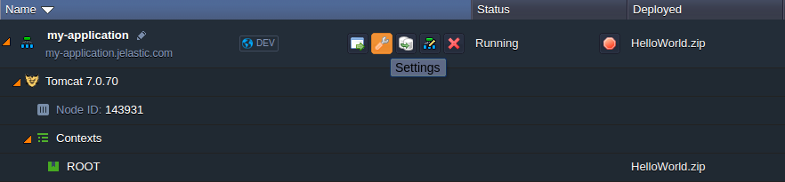
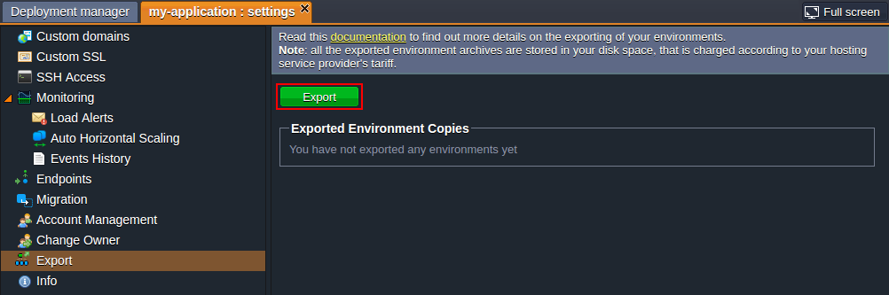
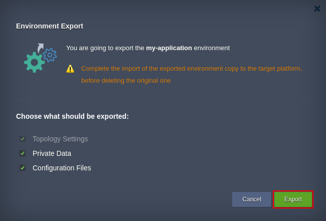
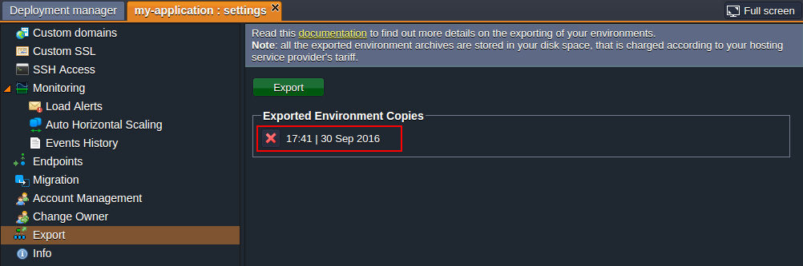

# Environment Export

Proving the appellation of Cloud Platform with-no-constraints, the platform allows to easily [move environments between Clouds](/environment-export-import/) in order to find out which one meets your requirements the best. This procedure consists of 2 main stages - *export* of the already existing environment (we'll consider this operation in details below) and its subsequent [import](/environment-import/) to the target PaaS installation. Both of these operations will take just a few minutes. As a result, you'll receive an identical ready-to-work copy of your environment being run at another PaaS installation.

{}**Note:** For the *Environment Export / Import* feature to work properly, the initial hosting provider platform (i.e. you are exporting the environment from) should have the *7979* port opened, which is intended to be used for downloading source files of the moved environment during the subsequent import operation. Thus, depending on a particular provider's configurations, exported environments from some of our partners' platforms (*Elastx* and*Everdata* in particular) can't be imported to other PaaS installations.{}

## How to Get Environment Copy

During the export, all information about environment (i.e. its topology settings, deployed applications, links to the archives with configurations and private data it contains, etc.) is packed into a single *.json* file. This compact JSON package can be simply downloaded to your local computer for being stored and/or deployed at another platform.

So in order to export a copy of your environment, log into your PaaS account and follow the instruction below:

1\. Select **Settings** button for the environment you would like to export (named *my-application* in our case).

{}**Note:** The environment should have the *Running* status for being exported.{}

2\. In the opened **Settings** tab, navigate to the ***Export*** section and click on the same-named button.

3\. Within the appeared **Environment Export** dialog, you can choose which data should be exported (tick all options to get the fully identical environment copy): 

* ***Topology Settings*** - environment configurations you've set through the Environment topology wizard (this point is obligatory and enabled by default)
* ***Private Data*** - files in directories of your deployed application(s) and private data stored within your database server(s)
* ***Configuration Files*** - all files, accessible via Configuration Manager at your dashboard, and settings of the deployed GIT/SVN projects (e.g. repositories links, access credentials, attached private SSH keys, etc.)  

{}**Note:** For ensuring your application and data safety, it is highly recommended not to delete original of the exported environment until its copy is successfully imported to another platform.{}

Once the required for export data is defined, click the **Export** button to proceed.

{}Depending on the type of containers your environment contains, you should take into account the following points:

* Data from *[Elastic VPS](/vps/)*, *[Maven](/java-vcs-deployment/)*, *[Docker](/container-types/)* and *Windows*-based containers won't be exported, though they will be still included to the topology of your imported environment (i.e. created from scratch), so you'll be able to reconfigure these servers manually afterwards.
* When exporting an *NGINX* server (of both load balancer or application server node types), the appropriate node will be briefly stopped and automatically started again to fetch a server dump.
* [Private SSH key](/git-ssh/), exported alongside with the rest of GIT repository settings, can't be deleted from the imported environment and is not shown at the dashboard, though it will still be used for connection. Nevertheless, it will be substituted if choosing a new one within the GIT project's settings window.{}

4\. Once the export is successfully finished, a new clickable string (named due to the export time/date) will appear in the **Exported Environment Copies** list. Select it to download the compiled ***.json*** file with exported environment data to your local machine, or just right click on it to copy direct URL to this manifest (which can be also used during import).

In addition, you'll receive the appropriate email notification with link to the list of your exported environments.

{}You can create as many exported environments' archives as you need, but **note** that all of them will be stored in your disc space, which is charged according to your hosting service provider's tariffs. If a particular file is no longer needed, you can delete it by means of clicking the red cross button right before the corresponding string.{}

That's all! You have successfully exported your environment copy. Now, you can proceed to its [importing](/environment-import/) to the target platform in order to complete the migration.

## What's next?

* [Import Environment](/environment-import/)
* [Environment Transferring](/environment-transferred/)
* [Account Collaboration](/account-collaboration/)
* [Share Environment](/share-environment/)