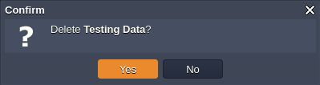

# Environment Groups Management: How to Assign, Edit & Remove
The guide below contains information on the basic management options the platform provides for operating with [environment groups](/environment-groups). Namely, we'll get deeper insights on how to:

* [Assign Group to Environment](#assign-group)
* [Add Subgroup](#add-subgroup)
* [Edit Group](#edit-group)
* [Remove Group](#remove-group)

## Assign Group to Environment

While working on a project, you may need to create more related environments and, obviously, to include them into the group the rest of application components already belongs to.

{}**Note:** You cannot add shared environments to your personal groups.{}

In order to specify labels for your environment, hover over the **Tags** column and click the button that appears:

* **Add to Env Group** - in case no tags were assigned to an environment yet

* **Edit Env Groups** - if some tags are already attached

In the opened dialog box, you can define group(s) for this environment (through choosing them via the automatically fetched list of the existing ones), [create](/environment-groups-creation) and assign new tags (just type in the desired name and press **Enter**) or detach the unrequired ones.

Upon clicking on **Apply**, all the specified tags will be instantly displayed within the **Tags** column for the corresponding environment.{}**Tip:**

* you can assign as many tags to a single environment as you need
* use slash separator to assign and/or create nested groups right via input field{}

Also, if the process of environment creation is called from inside a particular environment group (i.e. when the corresponding tag is displayed within the *Env Groups* panel at the top), all newly created entities will be automatically included to this group.

## Add Subgroups

Leveraging subgroup allows to divide top-level environment groups into smaller partitions (e.g. to separate computing and data components of a single project or differentiate development stages).

Within the **Tags** dashboard column, subgroups are displayed in a view of path, where each child item is separated with a slash &ldquo;/&rdquo; from the preceding parent one.

Such nesting can include the unlimited number of levels and can be set in the following ways:

* right during new [group creation](/environment-groups-creation), through either typing the full group path in the *Name* field (using slash as a separator) or choosing *Parent Group* within the appropriate list (so this new group will be included to the selected parent)

* while inside the group, through expanding the list of actions for it and clicking on **Add Child**

* via the common ***Environment Groups*** management frame (opened with **Env Groups &gt; Manage**), by selecting string with the required group and clicking on the **Add &gt; Add Child** option

In the latter two cases, the ***Add Group*** frame will be opened, with the appropriate group being automatically set as a parent.

## Edit Group
It is possible to adjust any environment group at your account to make it matching new demands at any time. The appropriate option can be accessed in one of the following ways:

* switch to the required group, expand the action list for it and click on **Edit**

* go to the general group management frame (opened with **Env Groups &gt; Manage**), select string with the appropriate group and choose **Edit** in the tools pane above

Through both options, the **Edit Group** dialog box will be opened.

Here, you can adjust all the data you've initially specified during this group creation, i.e.:

* **Name** - type a new name for your group (color association can be changed as well)
* **Parent Group** - set or change nesting for the current group
* **Environments** - add or remove environments from the group

Click **Apply** to save the settings.

{}**Note:** When performing edits via the management **Environment Groups** dialog box, you need to **Refresh** the group list for the new settings to be instantly displayed in this frame.

{}

## Remove Group

When the previously created group is no longer needed, you can easily delete it from the dashboard.
{}**Note:** The group removal makes no impact on included environments (obviously, except of the corresponding tag detachment). In the same way, upon deleting all environments from a group, the corresponding tag will be still available at the dashboard for choosing.{}

To remove a group, perform one of the following operations:

* navigate inside a group that is no longer needed, expand the list of actions for it within the top panel and click on **Remove**

* or, go to **Env Groups &gt; Manage**, select the unrequired group within the shown list and click the **Remove** button

To proceed with group removal, confirm this action by selecting **Yes** in the appeared frame.

In such a way, you can implement all the essential environment group configurations and enhance their divisioning at your dashboard.

## What's next?
* [Environment Groups Overview](/environment-groups/)
* [Environment Groups Navigation](/environment-groups-navigation/)
* [Environment Collaboration](/share-environment/)
* [Environment Regions](/environment-regions/)