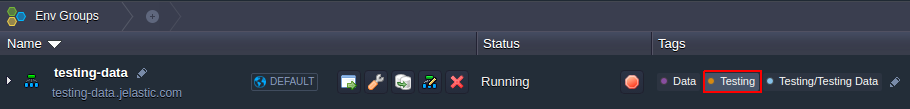
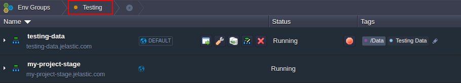
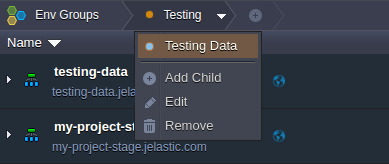
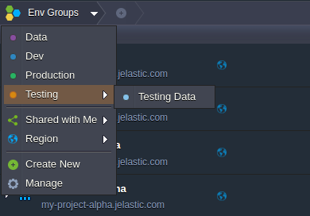
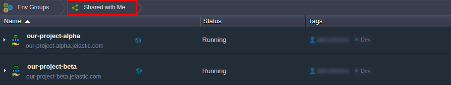
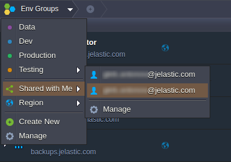
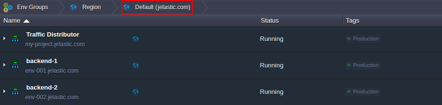

# Navigation Across Environment Groups

Organizing applications into [environment groups](/environment-groups) allows to make your working process much more comfortable. This is achieved through setting special **Tags**, which are used for environment filtering and are displayed within the same-named column in the main user dashboard screen.

You can switch and navigate between your environment groups with the following UI elements:

* [via the Tags column](#via-tags)
* <a href="#via-env-groups" id="via-tags">via the Env Groups menu</a>

## Navigation via Tags

The **Tags** column lists all of the groups an environment belongs to - click on a particular tag in order to refer to the appropriate group.

The required filtering will be applied automatically, whilst the selected group label will be displayed as a nesting element in the **Env Groups** navigation panel at the top.

Herewith, the appropriate group name will be temporarily hidden within the **Tags** column (as you are inside already).

{}**Note:** In case the currently selected group contains further child items (i.e. [subgroups](/environment-groups-management#add-subgroup)), their list can viewed at the chosen group's [management menu](/environment-groups-management) within the top navigation panel.

Just click on the string with such child group to open it.{}

In order to cancel filtering and return back to the overall list of available environments, click on **Env Groups**.

## Navigation via Env Groups Panel

Upon expanding the main **Env Groups** menu at the top, you'll be shown the list of all environment groups within your account, including the comprised [subgroups](/environment-groups-management#add-subgroup) (if are any).

Clicking on a particular one will apply the corresponding filtering to your environment list.  
Additionally, here you are provided with two predefined sorting options which are based on the following parameters:

* **Shared with Me** - select this option to access the list of environments [shared](/share-environment) with your account

{}**Note:** When hovering over **Shared with Me**, you'll see the list of collaboration owners you belong to; choosing a particular record here will display the environments that were shared to you by this person.

And if selecting **Manage** at this submenu bottom, the **Account settings &gt; [Shared with Me](/share-environment#mng)** tab will be opened.{}

* **Region** - use this option to filter environments based on the list of [environment regions](/environment-regions), available for your account

Now, when you know how to easily navigate between different environment groups, check some additional possibilities provided for [group management](/environment-groups-management) at the platform dashboard.

## What's next?
* [Environment Groups Overview](/environment-groups/)
* [Environment Groups Managemen](/environment-groups-management/)
* [Environment Collaboration](/share-environment/)
* [Environment Regions](/environment-regions/)
