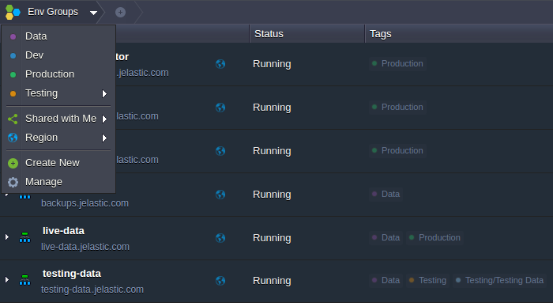
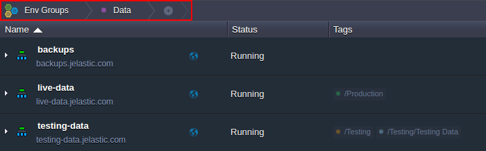
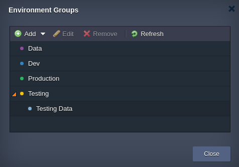

# Organizing Environments Into Groups: How to Smartly Structure Your Projects

{}{}
**Environment Groups** are designed to categorize environments within your platform dashboard. This functionality is aimed to facilitate administration of multiple created and shared with an account environments, allowing to get a clear-cut view on your project components and landscape.

Such grouping can be implemented through creating special user-defined tags and attaching them to the appropriate environments. Here, tags represent words or phrases that are displayed within the separate dedicated column in your dashboard. Through simple clicking on the required tag, you can quickly filter your environments by one or more attributes that you've used for differentiation (e.g. stack type, project relation, development stage, etc.).

The main environment group management functionality is provided via the dedicated **Env Groups** menu within the main dashboard screen (right above the environment list). Here you can find the list of all of your already created groups and a set of options for their convenient [management](/environment-groups-management) and [access](/environment-groups-navigation). 

When a particular group is chosen, it's name appears within the top groups panel as a nesting element. 

To cancel filtering and return back to the overall list of available environments, just click on the main ***Env Groups*** button.

The overall structure of your environment groups, with all inclusions and nesting levels, can be conveniently viewed via the dedicated *Environment Groups* box (opened with the **Manage** string in the ***Env Groups*** menu). Here you can also perform all necessary [group adjustments](/environment-groups-management) using a set of dedicated tools above.

You can create unlimited number of groups based on any naming scheme that makes logic to you (using any letters, numerals, special characters and spaces within their names). Moreover, each group can be parted further into smaller [subgroups](/environment-groups-management#add-subgroup) if needed, as well as each environment can belong to multiple groups, which makes this approach truly flexible and versatile.
To get a hands-on experience with environment groups, follow the next guides and find out how to:

* [Create Environment Group](/environment-groups-creation)
* [Navigate Across Environment Groups](/environment-groups-navigation)
* [Manage Environment Groups](/environment-groups-management)

## What's next?
* [Environment Sharing](/share-environment/)
* [Environment Transferring](/environment-transferred/)
* [Environment Regions](/environment-regions/)