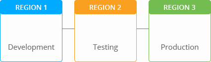
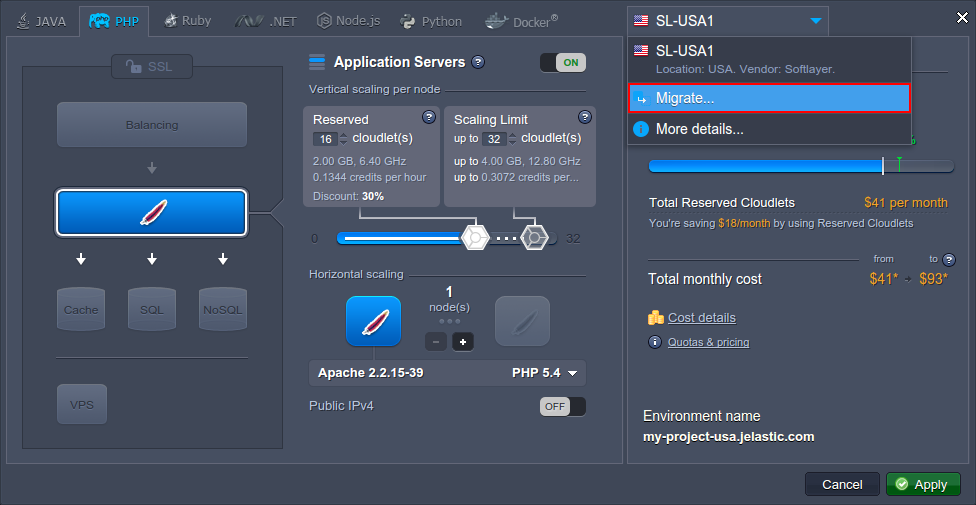
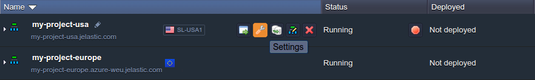
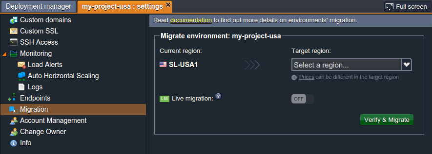
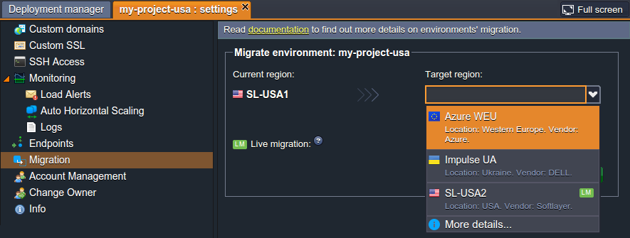
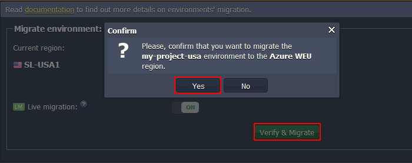
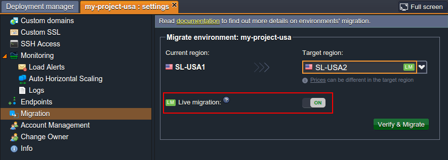
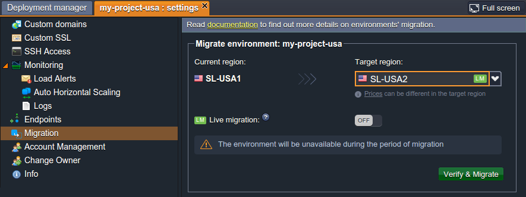
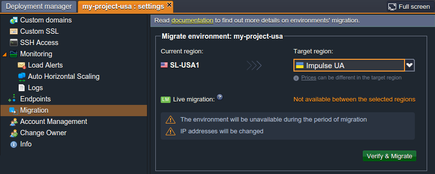

# Environment Migration between Regions

Within the confines of the multiple **[environment regions](/environment-regions/)** approach, the initially chosen location of the project can be easily changed using the migration option (obviously, if you have an access to several environment regions). It represents an extremely powerful tool, that can help you to benefit in both cost and productivity - as an example, you can choose cheaper hardware for the development/testing stages and subsequently migrate your production-ready application to the hardware with the best parameters, just before the release.

{}**Note:** Availability of the migration option, as well as its availability for each particular environment region, depends on your hosting provider's settings.{}

So, in order to migrate the existing environment to another region, perform one of the following:

* click on the **Change environment topology** button and choose the ***Migrate*** option within the regions' list above

* select the **Settings** button next to the desired environment and switch to the ***Migration*** menu option

In both cases, you'll see the same frame opened with a **Current region** of the chosen environment stated and an option for choosing the **Target region**, i.e. the hardware it should be migrated to.

{}**Note:** Pricing policy in different environment regions can vary based on their parameters and is applied automatically after the relocation is done, thus it's recommended to get acquainted with the appropriate costs in advance - the actual information can be discovered using the corresponding link, provided within the tip under the *Target region* selector.{}

Just lower down the tab the ***Live migration*** section is placed, either with the special switcher shown or providing some additional info, depending on the chosen target region. Here you can define which migration type (among the two provided ones) should be used: 

* **[live migration](#live-migration)** - available only between the environment regions, marked with the special ***LM*** label within the list (usually, only for regions within the same datacenter)
* **[offline migration](#offline-migration)** - can be used for any environment regions

State all the necessary conditions and click on **Verify & Migrate** at the bottom of the section to initiate the relocation. Confirm your decision within the appeared pop-up frame.

Once the migration is completed, the appropriate information message will appear at the dashboard and the region label next to the environment will be changed. In addition, you'll receive the notification email with the migration details (like its duration for every container and any changes that happened with their parameters due to this process).

And below we'll consider both migration modes in more details.

## Live Migration

Within the **Target region** list you can see a special ***LM*** label shown next to particular regions - it is used to mark the **Live migration** option's availability. 

Upon selecting such a region as a target one, the *Live migration* switcher will appear beneath (in the enabled state by default).

If choosing this type of migration, the environment relocation will be performed implicitly, i.e. without a restart of containers and any extra configurations needed, so your app's users won't face any interruptions.

{}**Note:** Although the benefits of [live (online) migration](https://www.virtuozzo.com/company/blog/revolution-in-cloud-hosting-containers-live-migration/) are evident, keep in mind that it is not suitable for all cases. We strongly recommend that you avoid using containers live migration for:

- *environments/containers under high load* - unexpected downtime with the "*502 - environment stopped*" error (usually brief, under 10 seconds)
- *active database containers, [Big Data](https://en.wikipedia.org/wiki/Big_data)* - possible corruption or loss of the currently processed data due to the nature of online migration and freezes of network connections/disk IO related operations during the migration process{}

If the [offline mode](#offline-migration) is needed - just turn off the corresponding switcher.

In such a case, an environment with all of the containers in it will become unavailable for the whole relocation process and resume its normal work, after this operation completes, with no additional manual adjustments required.

## Offline Migration

When the *live migration* option is unavailable (due to moving an environment to another data center) or in case it was disabled manually, the offline mode is used. In contrast to the online one, during such a relocation, an environment will be shut down until the end of this process. 

In addition, if this migration type is the only available one, some environment settings, like IP addresses of nodes and, optionally, the domain name assigned, will be changed. Thus, after the migration is completed, some manual configurations may be required to restore the normal operability of the moved application - all of the necessary information will be additionally sent to you via email. 

Obviously, based on the above-mentioned pros and cons, *live migration* is a much more preferable option (if suitable for your use case).

## What's next?

* [Multiple Environment Regions](/environment-regions/)
* [Environment Export and Import](/environment-export-import/)
* [Environment Transferring](/environment-transferred/)
* [CLI Environment Migration](/cli-environment-migration/)