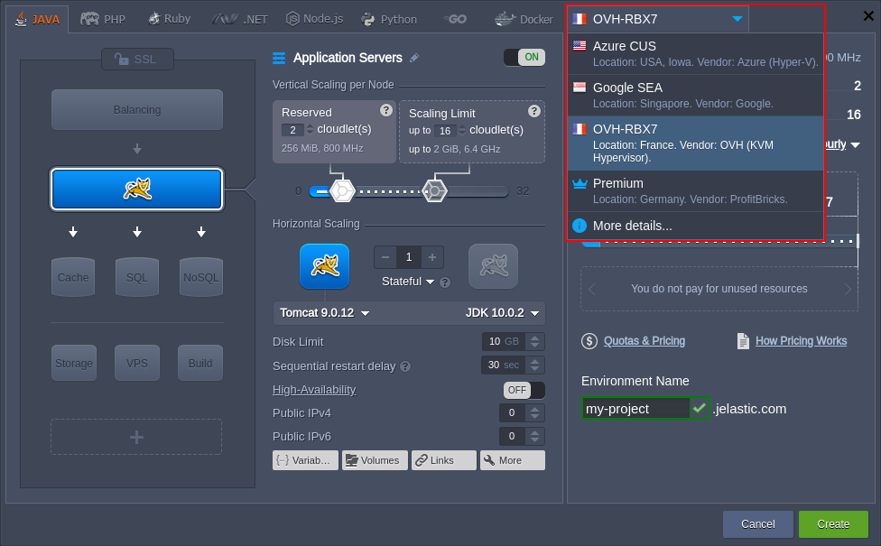
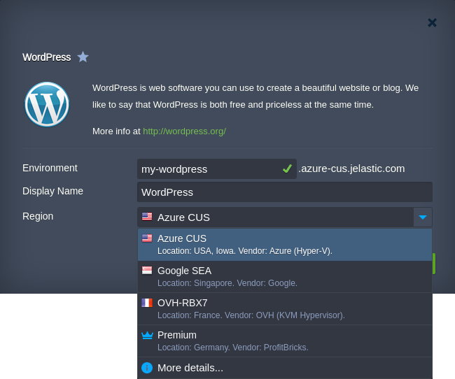
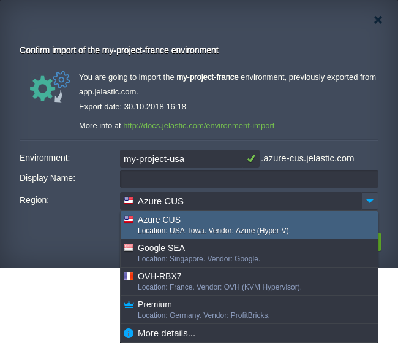
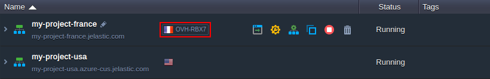
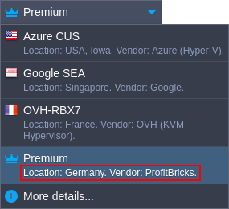
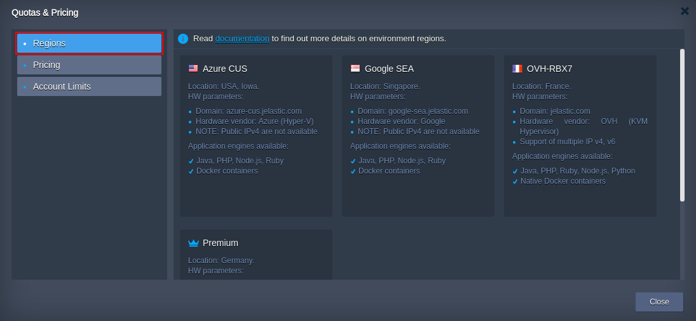
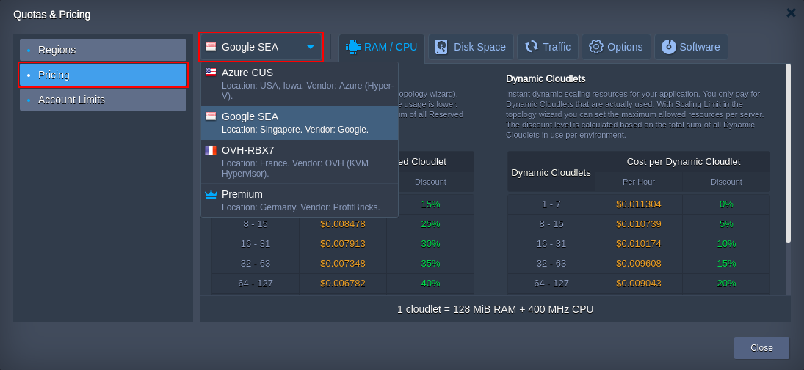

# Environment Regions
Providing significant flexibility, PaaS gives hosting service providers the possibility to group various types of hardware within the confines of a single platform, which allows them to build versatile and complex cloud solutions. Being named **environment regions**, each of such hardware sets may have a different capacity, pricing, and location, but is still orchestrated via a single infrastructure.

Despite the pretty simple concept, such an approach can bring a variety of advantages, allowing you to choose the most suitable hardware for your app's hosting, based on:

* *geographical location* - for getting a better response time and broader services' distribution
* *quality & capacity* - for adjusting the hosting conditions up to the current needs, e.g. cheaper hardware - for development and testing, a more superior one - for production
* *cost* - for choosing the most affordable pricing policy based on the budget available

Herewith, alongside selecting the desired hardware set during a new environment creation, the already running project can be subsequently moved to another location. If needed, this can be done in a few clicks - see more details in the [Migration between Environment Regions](/environment-regions-migration) document.

In such a way, you receive impressive flexibility for the organization of your application's lifecycle and its dissemination policy.

So, read the complete guidance on managing environment regions for your applications below and get the maximum efficiency of this significant feature - find out how to:

* [select an environment region](#select-environment-region)
* [view details about regions](#view-details-about-regions)

## Select Environment Region

In case your service hosting provider offers multiple environment regions, you can see the appropriate drop-down list on all of the frames, which are intended to initiate the creation of a new environment:

* ***topology wizard***

* ***[platform Marketplace](/marketplace)***

* ***environment [import](/environment-export-import#import)*** 

The only exception is the operation of [cloning](/clone-environment) - in this case, a new environment is created in the same hardware region automatically. However, it can be easily moved to the desired location manually, with the help of the [migration](/environment-regions-migration) option.
{}**Note:** 

* the amount/names/descriptions/parameters of provided regions are defined by each particular hosting provider individually; thus they can vary at different PaaS installations
* upon selecting particular hardware, the environment domain (shown next to the field with its name) may also be changed, depending on the region's settings{}

Choose any of the provided regions (it is recommended to [find out the details](#view-details) on each of them beforehand) to place your environment there automatically. After creation, you'll see your new environment appeared at the dashboard being supplied with a special tiny icon assigned for the region:

Upon hovering over it, the appropriate region name is displayed. In such a way, your environments can be quickly differentiated by the region/location.

## View Details about Regions

We recommend to getting acquainted with the specifics of each available region in advance to make a choice according to your needs. This information can be viewed in the following ways:

* every region is supplied with a short description right within the list

* clicking on the **More details** point of the list above redirects you to the **Regions** tab inside the ***Quotas & Pricing*** information window

Here, the detailed info on the provided regions can be found, e.g. a general description with the list of supplied parameters and included features. However, depending on your hosting provider's settings, this link can lead to a separate site or document page.

* Pricing section of the same frame, the details on the [charged resources](/chargeable-resources) (*RAM/CPU*, *Disk Space*, *Traffic* and *Options* tabs) and licensing costs (the *Software* tab) for every region can be viewed - use the drop-down list at the top to switch between them

If more information on a particular region is required, please contact your hosting provider to get the appropriate assistance. Also, in case you've discovered some other location suits your application more, you can easily [migrate](/environment-regions-migration) it and benefit from the new conditions.

## What's next?
* [Migration between Regions](/environment-regions-migration/)
* [Charged Resources](/chargeable-resources/)
* [Application Lifecycle Management](/how-to-manage-application-lifecycle/)