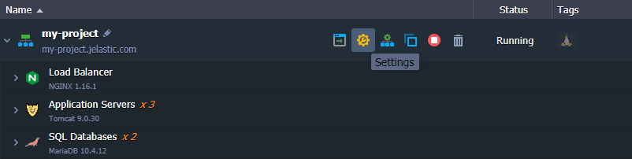
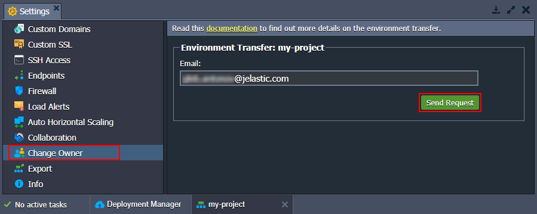
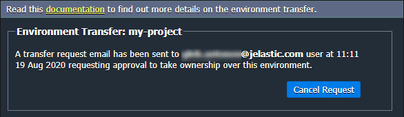
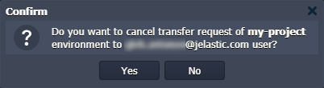
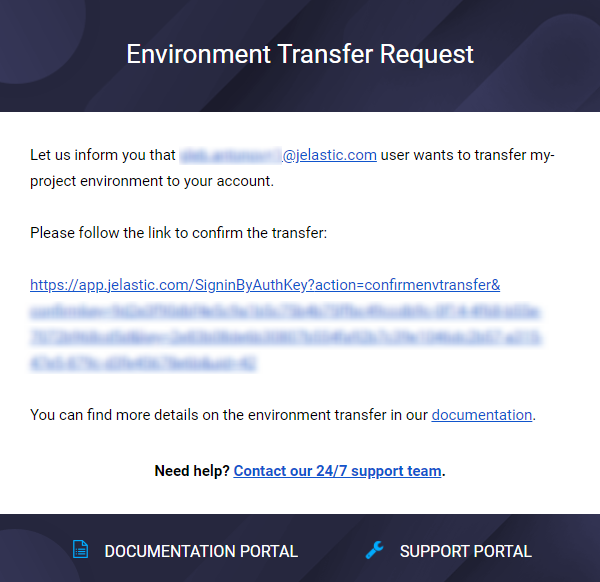

# Environment Transferring

Environment transferring allows you to move any environment to another PaaS account within the same platform (confirmation on both sides is required).

### Reasons

The feature can be beneficial in many cases. For example, if you need to:
 
- move all your projects to a new account, registered with a different email address
- transfer your work projects to another developer's account in case of an employee leaving the company
- move a production-ready environment to the main company account from the personal testing one
- restore environments at the old deactivated account without its reactivation

{}**Tip:** Also, service hosting providers can offer a service of creating the required application for you. After configuration and testing, the production-ready environment will be transferred to your account.{}

### Conditions

**Any environment** (stopped/running) can be transferred **from any account** (including deactivated ones). However, a target account should meet the following requirements:

- **type** - can be of any [type](/types-of-accounts/) (beta, billing), <u>*except trial accounts*</u>
- **status** - should be *[active](/account-statuses/)* (i.e. not suspended or deactivated)
- **quotas** - should have sufficient [quotas](/quotas-system/) (limitations) to add the environment

{}**Note:** <u>*On the platforms before the 5.9.3 version,*</u> environments can be transferred to the billing accounts only.{}

For example, some quotas checked during the transfer: *cloudlets per container*, *nodes per environment*, *environments on account*, *public IP* / *VPS* / *high-availability* features (if they are enabled in the transferred environment), etc.

Also, in case of an error, you'll see the corresponding notification directly at the dashboard:

{}**Note:** Environment transferring feature is currently not available between accounts at different PaaS installations, including main platform - sub-platform (reseller) interactions.{}

### Result

No changes are applied to the environment after transferring. The new owner receives it in the same state, with the same applications deployed, and with the same custom configurations. All the consequent charges for the environment will be applied to the new owner as well.

Also, the transferred environment becomes [unshared](/share-environment/) from all the users that had access to it.

## Transferring Steps

Let's see the process of transferring an environment.

1\. Click the **Settings** button next to the required environment.

2\. In the opened tab, navigate to the ***Change Owner*** section and enter the email address of a target user (potential new owner).

Click the **Send Request** button to proceed.

3\. If the target account exists and meets all the requirements, you will see a notification that the request has been sent.

{}**Tip:** You can Cancel Request with the same-named button at any point (unless it is already confirmed).

{}

4\. The specified user will receive a request for an environment transfer with a confirmation URL via email.

{}**Note:** While awaiting confirmation, the environment is marked with a custom icon {}{} at the initial owner's dashboard.{}

5\. When the target user confirms the transfer request (clicks a link from the email), the environment is removed from the initial user's dashboard and appears for a new owner. Email notification about successful transfer will be sent to the initial owner.

{}**Note:** During this step, the target account is validated (to have sufficient limits) for the last time. If it doesn't meet requirements, the transferring process will be stopped. The appropriate error message will be displayed at the target user dashboard and sent to the initial owner via email.{}

It's that simple! Using this feature, you can easily move environments from one account to another.

## What's next?

* [Setting Up Environment](/setting-up-environment/)
* [Share Environment](/share-environment/)
* [Clone Environment](/clone-environment/)
* [Export Environment](/environment-export/)
* [Accounts Collaboration](/account-collaboration/)