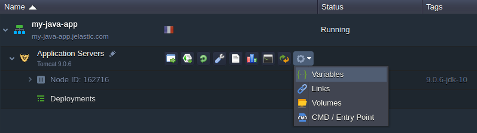
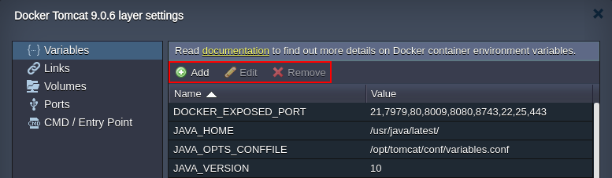
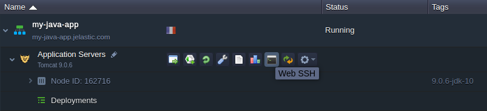
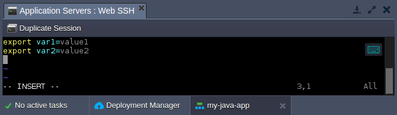
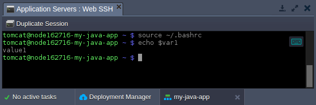
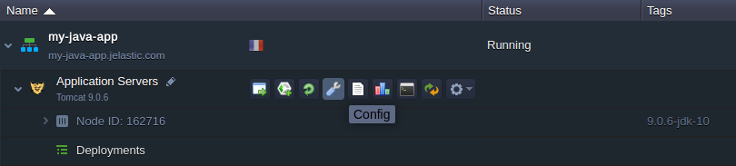
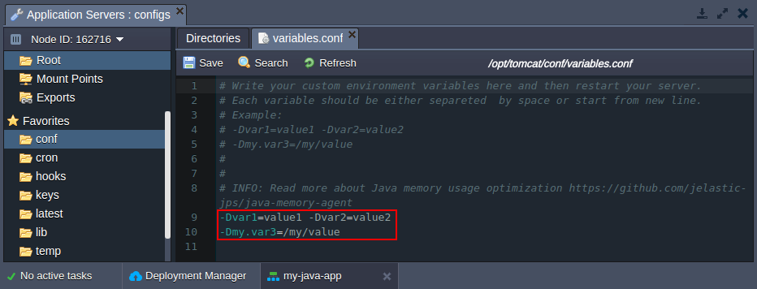
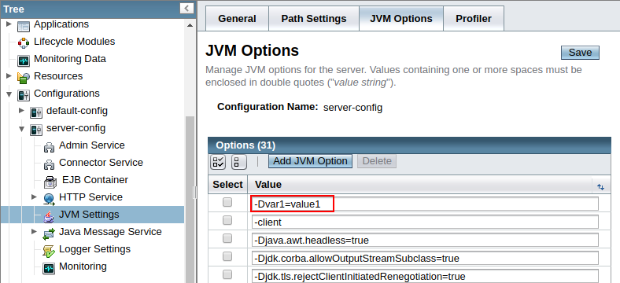
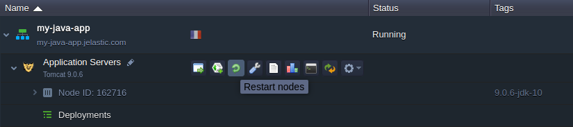

# Custom Environment Variables
Environment variables represent a kind of placeholders, where you can store the frequently used parameters values or strings in order not to specify them manually in the code each time they are needed. There is a number of [default environment variables](/environment-variables) which are preconfigured and can be used in your application code or even adjusted before node creation to apply some customization, making your work with the platform even more convenient.

In this guide, we'll describe the most common ways of adding your custom variables for any node within the platform:

* [via a dedicated *variables* section of the dashboard](#dashboard)
* [using the *shell configuration* files](#shell)
* [through the *variables.conf* file (for Java only)](#java)

## Customize Environment Variables via UI

1\. Hover over the node group in dashboard, expand the **Additionally** list and select the ***Variables*** options.


2\. Within the opened frame, you can adjust a list of environment variables up to your needs (using the buttons at the tools pane).
{}**Note:** The platform implementation of the Docker containers allows usage of the existing environment variables to define others. For example, the ***MY$HOME*** value will be automatically converted to __**MY\\**__ one (or similar based on the *HOME* variable value).{}
 

<a id="shell"></a>  
Don't forget to **Apply** the changes you've made.

## Set Up Environment Variables via Shell Configs

You are able to provide your custom variables using the shell config files:

* ***~/.bash_profile*** is executed only upon login via console
* ***~/.bashrc*** is executed for each new bash instance
  
In order to help you with maintaining these files, the platform automatically include the sources of the .***bashrc*** config within ***.bash_profile***. In such a way, you can provide custom variables through the former file only:

1\. Establish [SSH connection](/ssh-access) to your container. For example, we'll use the embedded **Web SSH** client:



2\. Create or adjust the ***.bashrc*** file within the home directory by adding your custom variables in the following format:
```bash
export  {var_name}= {var_value}
```
where

* ***{var_name}*** - name of the variable you would like to specify  
* ***{var_value}*** - value of your variable



3\. Now, each new bash instance will be provided with your custom variables. To force new settings appliance for the current session, just refresh the sources with the command shown below. Next, verify new variables availability:
```bash
source ~/.bashrc  
echo $ {var_name}
```


<a id="java"></a>
As you can see, the changes were successfully applied.

## Adjust Java Environment Variables via Configuration Manager

The following simple workflow is identical for all of the platform-managed Java application servers.

1\. Click the **Config** button for your application server to access container [file manager](/configuration-file-manager).


2\. In the opened tab, navigate to the ***variables.conf*** file within one of the following locations:

* **Tomcat**, **TomEE** - */opt/tomcat/conf/variables.conf*
* **Jetty** - */opt/jetty/etc/variables.conf*
* **Spring Boot** - */opt/shared/conf/variables.conf*
* **GlassFish** - */opt/glassfish/glassfish/domains/domain1/config/variables.conf*
* **Payara** - */opt/payara/glassfish/domains/domain1/config/variables.conf*
* **WildFly** - */opt/wildfly/conf/variables.conf*

3\. Here, you can provide your custom variables (each one should be separated by space or start from a new line) or [adjust Java options](/java-options-arguments) for your application. For example:  
***-Dvar1=value1 -Dvar2=value2***  
***-Dmy.var3=/my/value***



{}**Tip:** Alternatively, some of the application servers (i.e. *GlassFish*, *Payara*, *WildFly*) are provided with admin panel, which also allows to add JVM options and custom variables:
{}

Do not forget to **Save** the configurations you've made.

4\. **Restart nodes** of your application server to apply changes.


5\. The new variables can be called through your Java code with the help of the *System.getProperty("your_variable")* method to appoint the specified values to the needed arguments. For example:

* String **var1** = System.getProperty("**var1**");
* String **var2** = System.getProperty("**var2**");
* String **var3** = System.getProperty("**my.var3**")

Now, you can adjust your application code using these new variables.

## What's next?
* [Environment Variables](/environment-variables/)
* [Java Options and Arguments](/java-options-arguments/)
* [SSH Access](/ssh-access/)
* [Configuration File Manager](/configuration-file-manager/)