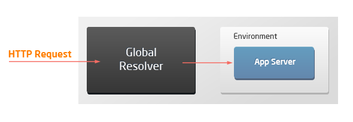
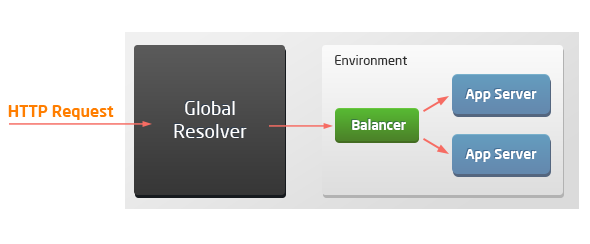
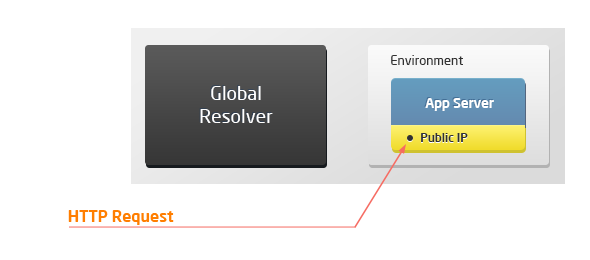
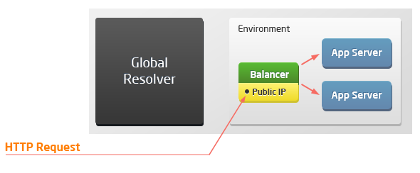

# HTTP Headers

**[HTTP headers](https://developer.mozilla.org/en-US/docs/Web/HTTP/Headers)** are the core part of the HTTP requests and responses. They pass additional information with an HTTP request or response (e.g. the client browser, requested page, server, and more).

The main headers used with environments for deploying your applications:

Header|Description|Value
---|---|---
**[host](https://developer.mozilla.org/en-US/docs/Web/HTTP/Headers/Host)**|Specifies the host and port number of the resource (server) being requested.|*{envName}.{platformDomain}*
**[x-forwarded-proto](https://developer.mozilla.org/en-US/docs/Web/HTTP/Headers/X-Forwarded-Proto)**|Identifies the protocol (HTTP or HTTPS)  that connects to your proxy or load balancer.|*http/https*
**[x-forwarded-for](https://developer.mozilla.org/en-US/docs/Web/HTTP/Headers/X-Forwarded-For)**|Identifies the originating IP addresses of a client connecting to a web server through an HTTP proxy or load balancer.|*xx.xx.xx.xx, xx.xx.xx.xx* IP or IPs chain (if a request goes through multiple proxies)
**x-real-ip**|The ending IP address in the **x-forwarded-for** chain, i.e. the most recent proxy of a client connecting to a web server.|*xx.xx.xx.xx* the right-most IP address in **x-forwarded-for**
**x-host**|The originating domain name of the server (for virtual hosting) and optionally the TCP port number.|*{envName}.{platformDomain}*
**x-uri**|Identifies a name or a web resource.|*/*

{}**Tip:** Additional [security headers](#security-headers) are used for some specific stacks.{}

The list of supported HTTP headers can vary based on the topology of the connected environment. Due to external access specifics (via [resolver/SLB](/shared-load-balancer/) or [public IP](/public-ip/)), there are four possible scenarios when working with the platform:

Topology|Scheme|Supported Headers
---|---|---
Single application server||*host x-forwarded-proto x-real-ip x-forwarded-for x-host*
Load balancer with application servers||*host x-real-ip x-host x-forwarded-for x-uri x-forwarded-proto*
Application server with public IP||*host*
Load balancer with public IP and application servers||*host x-real-ip x-host x-forwarded-for x-uri x-forwarded-proto*

## Security Headers

You can easily manage security headers by managing the appropriate configuration file. The path is different for different servers:

- *Apache* (*PHP*, *Ruby*, *Python*), *MySQL*, *MariaDB*:  ***/etc/httpd/conf.d/10-shared_headers.conf***
- *NGINX* (*PHP*, *Ruby*) and *LEMP*:  ***/etc/nginx/conf.d/headers/10-shared_headers.conf***
- *LiteSpeed*, *LLSMP*: ***/var/www/conf/vhconf.xml*** (adjust via the admin panel only)
- *Tomcat*, *TomEE*: ***/opt/tomcat/conf/web.xml***

{}**Notes:** 

- The headers processing for the *Node.js*, *Golang*, *.NET*, *JavaEngine*, and *Springboot* servers must be implemented manually in the user application.
- For the *Tomcat* and *TomEE* stacks, only the following headers are enabled by default: ***X-Content-Type-Options***, ***X-Frame-Options***, ***X-XSS-Protection***, and ***Strict-Transport-Security*** (for SSL). Other headers can be enabled manually, if needed.
{}

Don't forget to <u>*restart*</u> your server to apply any changes made to the configuration file.

The following additional HTTP headers are used on the above-listed stacks by default:

Header|Description|Value
---|---|---
**[Cross-Origin-Embedder-Policy](https://developer.mozilla.org/en-US/docs/Web/HTTP/Headers/Cross-Origin-Embedder-Policy)**|Allows the server to declare an embedded policy for the given document.|*unsafe-none;*
**[Cross-Origin-Opener-Policy](https://developer.mozilla.org/en-US/docs/Web/HTTP/Headers/Cross-Origin-Opener-Policy)**|Prevents other domains from opening/controlling a window.|*same-origin-allow-popups*
**[Cross-Origin-Resource-Policy](https://developer.mozilla.org/en-US/docs/Web/HTTP/Headers/Cross-Origin-Resource-Policy)**|Prevents other domains from reading the response of the resources to which this header is applied.|*same-origin*
**[Content-Security-Policy](https://developer.mozilla.org/en-US/docs/Web/HTTP/Headers/Content-Security-Policy)**|Controls resources the user agent is allowed to load for a given page. Disabled by default.|*frame-ancestors 'self';frame-src 'self';*
**[Expect-CT](https://developer.mozilla.org/en-US/docs/Web/HTTP/Headers/Expect-CT)** (only with SSL enabled)|Allows sites to enforce the *Certificate Transparency* requirements, which prevents the use of miss issued certificates for the site (i.e requires that any certificate for that site appears in public CT logs).|*max-age=3600, enforce*
**[Permissions-Policy](https://developer.mozilla.org/en-US/docs/Web/HTTP/Headers/Feature-Policy)**|Provides a mechanism to allow and deny the use of browser features in its frames and embedded iframes.|*payment=(self) geolocation=(self)*
**[Strict-Transport-Security](https://developer.mozilla.org/en-US/docs/Web/HTTP/Headers/Strict-Transport-Security)** (only with SSL enabled)|Forces communication using HTTPS instead of HTTP.|*max-age=5; includeSubDomains*
**[X-Content-Type-Options](https://developer.mozilla.org/en-US/docs/Web/HTTP/Headers/X-Content-Type-Options)**|Disables MIME sniffing and forces the browser to use the type given in Content-Type.|*nosniff*
**[X-Frame-Options](https://developer.mozilla.org/en-US/docs/Web/HTTP/Headers/X-Frame-Options)**|Indicates whether a browser should be allowed to render a page in a *\<frame\>*, *\<iframe\>*, *\<embed\>*, or *\<object\>*.|*SAMEORIGIN*
**[X-Permitted-Cross-Domain-Policies](https://developer.mozilla.org/en-US/docs/Web/HTTP/Headers#security)**|Specifies if a [cross-domain policy file](https://www.adobe.com/devnet-docs/acrobatetk/tools/AppSec/CrossDomain_PolicyFile_Specification.pdf) (***crossdomain.xml***) is allowed. The file may define a policy to permit clients to handle data across domains that would otherwise be restricted due to the *Same-Origin Policy*.|*none*
**[Referrer-Policy](https://developer.mozilla.org/en-US/docs/Web/HTTP/Headers/Referrer-Policy)**|Controls how much referrer information (sent via the **Referer** header) should be included with requests.|*strict-origin-when-cross-origin (default)*
**[X-XSS-Protection](https://developer.mozilla.org/en-US/docs/Web/HTTP/Headers#security)**|Enables cross-site scripting filtering.|*1; mode=block*

## What's next?

* [Setting Up Environment](/setting-up-environment/)
* [Shared Load Balancer](/shared-load-balancer/)
* [Public IP](/public-ip/)
* [Environment Variables](/environment-variables/)