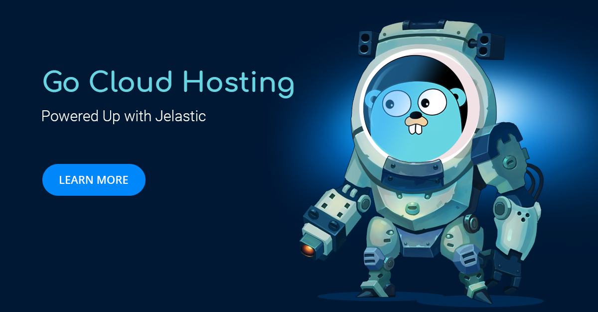
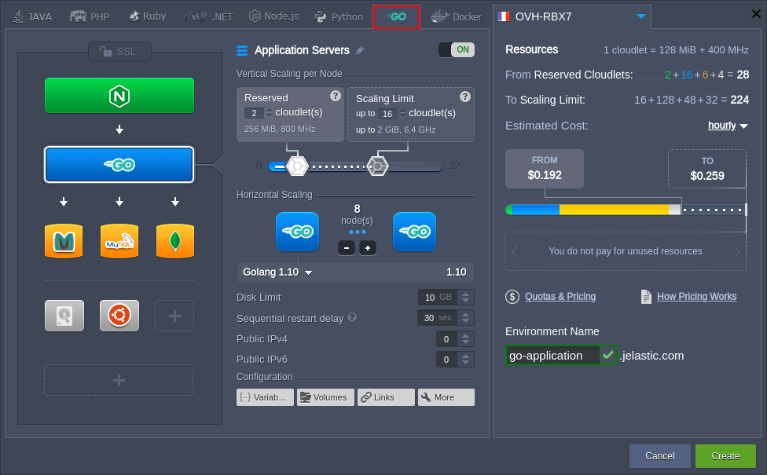
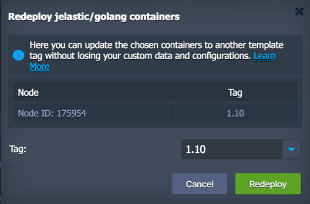
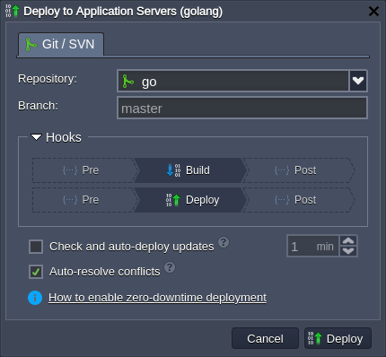
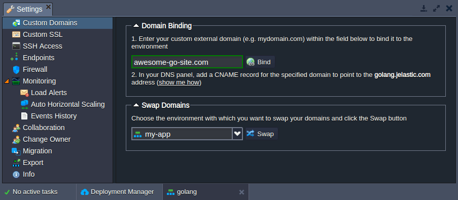
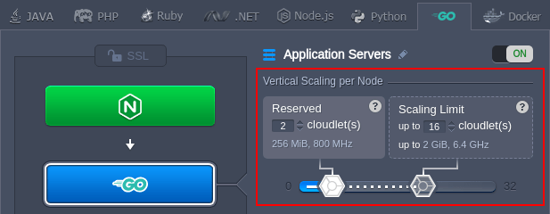
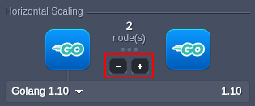
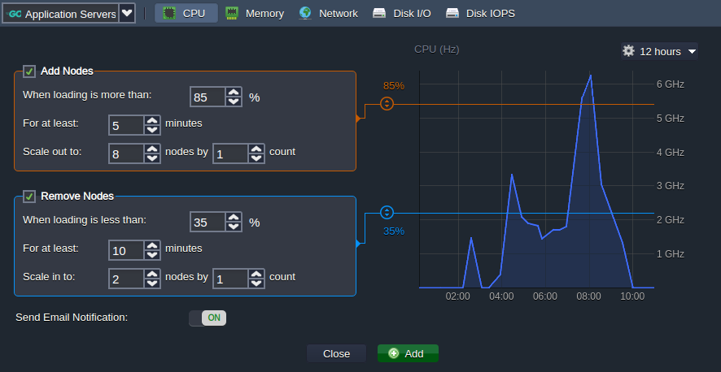

# Golang Hosting

The PaaS is a truly multilingual cloud platform, which currently provides Java, PHP, Python, Ruby, Node.js, .NET, and from now on, Go environments for running projects of all sizes and various nature.

In this guide, you’ll get acquainted with the distinctive features of the Go hosting and will be introduced to the Go-related possibilities within the platform. Use the table of content below to find required information within the guide quicker:

- [Go Environment Hosting](#go-environment-hosting)
- [Golang Versioning](#golang-versioning)
- [Go Application Deployment](#go-application-deployment)
- [Domains Management](#domains-management)
- [Automatic Vertical Scaling](#automatic-vertical-scaling)
- [Manual Horizontal Scaling](#manual-horizontal-scaling)
- [Automatic Horizontal Scaling](#automatic-horizontal-scaling)

## Go Environment Hosting

In order to host your Go application, you need to [create](/setting-up-environment/) the appropriate environment using the **Topology Wizard**.

Switch to the **Go** engine tab, add *Golang* as your application server and any other software stack required for your project (e.g. load balancers, databases or shared storage). If needed, adjust your environment nodes count, cloudlet limits for RAM and CPU, attach public IPs, etc.

{}**Note:** This template utilizes a modern ***systemd*** initialization daemon.{}

{}**Note:** All instances on the platform are completely [isolated containers](/isolated-containers/), which are evenly distributed across the available hosts (physical servers or VMs) using automatic anti-affinity rules. This eliminates a risk of your application downtime, i.e. ensure [high availability](/isolated-containers/#high-availability-for-applications).{}

For more information about setting up the environment, see the [Create Environment](/setting-up-environment/) document.

## Golang Versioning

Currently (at the time of this writing), the following versions of the *Golang* stack template are supported by the platform:

- 1.17.12
- 1.18.10
- 1.19.12
- 1.20.14
- 1.21.13
- 1.22.7
- 1.23.1

{}The up-to-date list of the releases available on the platform is provided via the dedicated, regularly (weekly) updated [Software Stack Versions](/software-stacks-versions/#engines) document.{}

You can choose the preferred version during environment creation and change it later through [container redeploy](/container-redeploy/). Herewith, all the custom data inside the node(s) will be saved, which, for example, allows to easily upgrade your software version upon the new stack template release.

## Go Application Deployment

After environment creation, you can [deploy](/deployment-guide/) your Go project from the Git repository (the deployment from application archive will be implemented in the upcoming platform release).

It is possible to customize the deployment process by providing or adjusting the following container [variables](/environment-variables/#go-golang):

- ***GO_RUN*** - sets a name of the executable binary file (if not specified, the deployment script will try to locate one based on the Git project name)
- ***GOPATH*** - defines the deployment folder (*/home/jelastic/webapp*, by default)
- ***GO_BUILD_OPTIONS*** - provides additional [options for the build operation](https://golang.org/cmd/go/#hdr-Compile_packages_and_dependencies) (*-a*, by default, to force rebuilding of packages that are already up-to-date)
- ***GO_RUN_OPTIONS*** - provides additional [options for the run operation](https://golang.org/cmd/go/#hdr-Compile_and_run_Go_program)

During deployment, the platform automatically performs the following steps:

- parses the provided Git URL to get a link to the Go project
- downloads the package with all the dependencies using the ***[go get](https://golang.org/cmd/go/#hdr-Add_dependencies_to_current_module_and_install_them)*** command
  - in case of error, performs download as for the common Git project and retries getting the Go dependencies
- builds the project with the ***go build*** command (using the additional options specified in the **GO_BUILD_OPTIONS** variable)
- runs the binary defined by the **GO_RUN** variable with the ***go run*** command (using the additional options specified in **GO_RUN_OPTIONS**)

After successful deployment, the Go project is located in the directory set with the ***GOPATH*** variable. Herewith, the [workspace hierarchy](https://golang.org/doc/gopath_code.html#Organization) inside is based on the requirements in the official documentation.

You can learn more about Go applications deployment via the appropriate documents:

- [Deployment Manager](/deployment-manager/)
- [Deployment Guide](/deployment-guide/)
- [Auto-Deploy Overview](/git-svn-auto-deploy/)
- [Deployment Hooks](/deployment-hooks/)

## Domains Management

With the platform you can easily bind an [external (custom) domain](/custom-domains/) name to your Go application to be used instead of the default environment domain. Depending on the used entry point, there are two options:

* **CNAME redirect** if using *Shared Load Balancer*; is recommended for ***dev*** and ***test*** environments
* **DNS A Record** if using *public IP*; can handle high traffic load and is suitable for ***production*** environments

Additionally, you can easily [swap domains](/swap-domains/) to redirect traffic from one environment to another (e.g. to switch to the newer application version without downtime).

{}**Tip:** For the access via public IP, the traffic can be redirected to another environment with the help of the ***[SwapExtIps](https://docs.jelastic.com/api/#!/api/environment.Binder-method-SwapExtIps)*** API method (also, available via [CLI](/cli-ip-swap/)).{}

## Automatic Vertical Scaling

Automatic vertical scaling is ensured by the platform's ability to dynamically provide the resources (RAM and CPU) for a server within predefined limits according to its current demands, with no manual intervention required. This feature guarantees you [never overpay for unused resources](https://www.virtuozzo.com/company/blog/deceptive-cloud-efficiency-do-you-really-pay-as-you-use/) and saves your time due to eliminating the necessity of handling the load-related adjustments or architectural changes.

The scaling process is handled by platform automatically, you just need to specify the lower and upper [cloudlets](/cloudlet/) limit (each one equals to *128 MiB* of RAM and *400 MHz* of CPU) for your Go server through the topology wizard:

Your application will work within these limits reducing resource consumption when the load is down or increasing them when the load is up. Thus, you only pay for the resources that are actually consumed. For more information, please refer to the [automatic vertical scaling](/automatic-vertical-scaling/) documentation.

## Manual Horizontal Scaling

Extra Golang servers can be easily added via the topology wizard during environment creation or adjustment. Just click the "**+**" button within the *Horizontal Scaling* section and add the required number of instances.

The maximum number of the same-type servers within a single environment layer depends on a particular hosting provider settings (usually this limit stands for 16 nodes and can be enlarged by sending the appropriate request to support).

Also, you can notice that upon Golang server scaling, the [load balancing](/load-balancing/) node is automatically added to environment topology (required for the proper requests distribution). Find more details about manual [horizontal scaling](/horizontal-scaling/) in the documentation.

## Automatic Horizontal Scaling

Automatic horizontal scaling is implemented through tunable triggers, which allow to increase or decrease the number of nodes due to the application load. To configure automatic scaling open the environment **Settings > Monitoring > Auto Horizontal Scaling** section and click the **Add** button.

Here, you can configure the triggers for specific stacks and resources (*CPU*, *RAM*, *Network*, *Disk*) by adjusting the conditions of scaling.

Learn more about [automatic horizontal scaling](/automatic-horizontal-scaling/) in the corresponding document.

In addition, there is a set of other features and functionality provided by the platform Go hosting, among them:

- Custom or Built-In SSL
- Public IPv4 and IPv6
- Wide choice of managed databases
- Container firewalls, endpoints and environment isolation
- User-friendly UI and direct SSH access for management
- Open API and Cloud Scripting for automation
- Pay-as-you-use pricing model
- Collaboration functionality for teamwork
- Multi-cloud distribution

The Go cloud hosting is ready for running your dev, test, and production environments.

## What's next?

* [Setting Up Environment](/setting-up-environment/)
* [Dashboard Guide](/dashboard-guide/)
* [Deployment Guide](/deployment-guide/)
* [SSH Access](/ssh-access/)