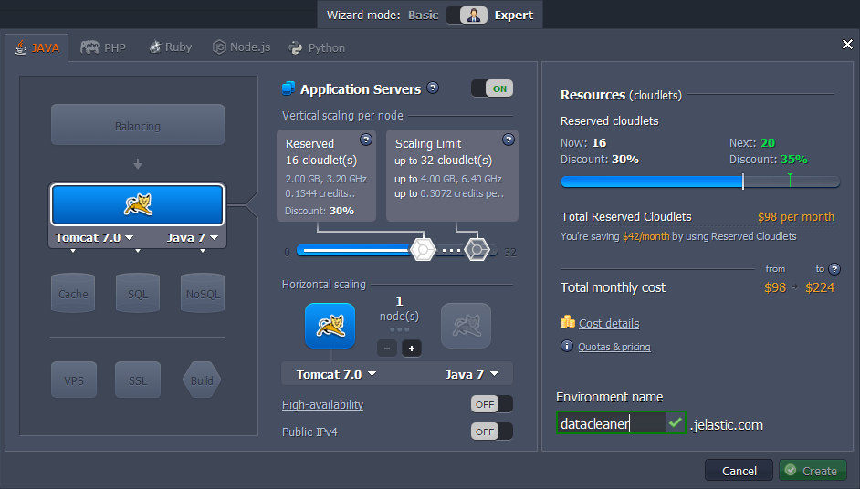
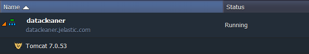
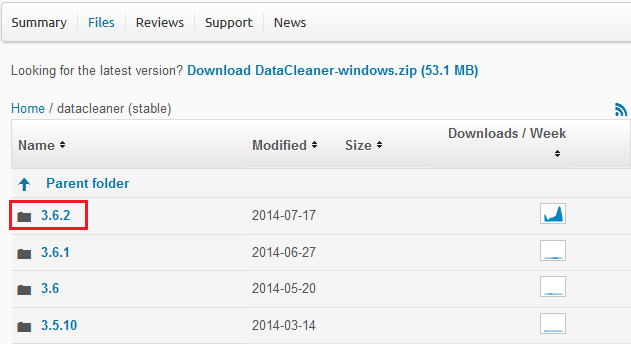
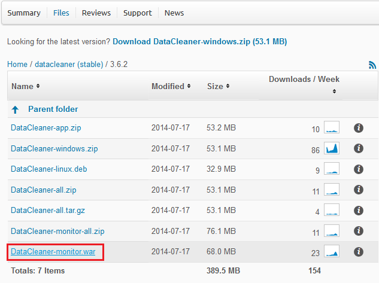
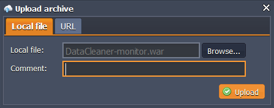
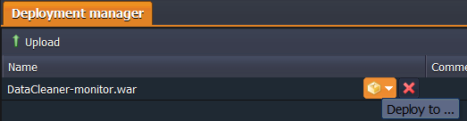
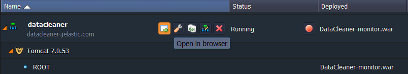
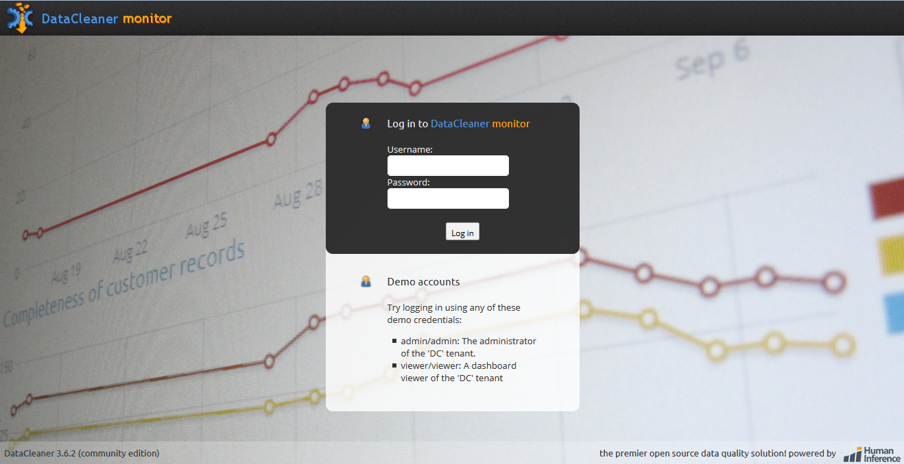

# How to Install DataCleaner

**DataCleaner** is a data quality analysis application and a platform for data quality solutions. It has flexible and powerful data profiling engine for: 

* *analysis of data quality*: determining if data is fit for it intended uses;
* *datastore*: capability to retrieve and update data from a very wide range of datastores;
* *data profiling*: creation of a datastore 'profile' for a convenient usage and further enhancements;
* *data monitoring*: a set of solutions for monitoring of data and web applications. 

So, let's examine how to host DataCleaner application with the help of the platform.

## Create an Environment

1\. Log in to your PaaS account and click **Create environment** button in the top panel of the dashboard.

2\. Choose **Tomcat 7** instance at the **Java** tab of the opened frame. Define the required amount of resources within cloudlets sliders, name your environment, for example *datacleaner*, and click **Create** button.

3\. Just in a minute your environment will appear at the dashboard.

## Upload and Deploy the Application

1\. Go to the <a href="http://sourceforge.net/projects/datacleaner/files/datacleaner%20%28stable%29/" rel="nofollow">Sourceforge Project</a> page with the list of DataCleaner releases available. Choose the folder with the latest application version.

2\. In the opened tab locate the **DataCleaner-monitor.war** file and download it.

3\. Then switch back to your platform dashboard and click **Upload** button at the **Deployment Manager** tab. In the opened frame **Browse** to the file you've just downloaded and upload it.

4\. Once Datacleaner ***.war*** file is successfully uploaded, press **Deploy to** icon next to it and choose the environment you've created before. Confirm the deployment in the opened window.

5\. Wait until deployment is successfully finished and launch your application. For that press **Open in browser** button next to your environment.

Congratulations! For now you can start working with your DataCleaner app and use all its functions.

Enjoy!