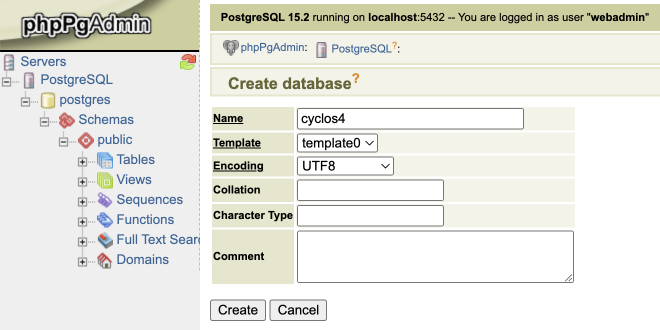
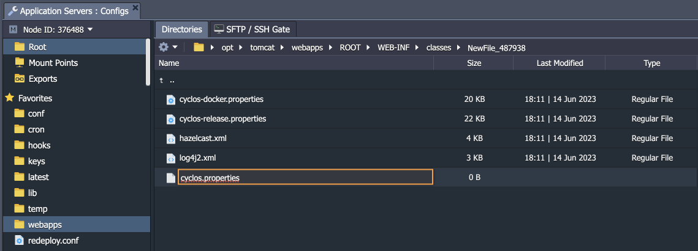

# How to Deploy Cyclos 4

You can have a **Cyclos** instance up and running within minutes using the one-click install options for both free and PRO **Cyclos 4** versions correspondingly:

<div data-manifest="http://www.cyclos.org/jelastic/cyclos4.json" data-width="280" data-theme="flat-orange" data-text="Get it hosted now!" data-tx-empty="Type your email and click the button" data-tx-invalid-email="Invalid email, please check the spelling" data-tx-error="An error has occurred, please try again later" data-tx-success="Check your email" class="je-app">
</div>

{}**Note:** For using the PRO version (widget below), you must buy a valid Cyclos license, while a free license can be obtained after registration at [license.cyclos.org](https://license.cyclos.org/).{}

<div data-app="cyclos4" data-width="280" data-theme="flat-orange" data-text="Get it hosted now!" data-tx-empty="Type your email and click the button" data-tx-invalid-email="Invalid email, please check the spelling" data-tx-error="An error has occurred, please try again later" data-tx-success="Check your email" class="je-app">
</div>

The process is simple - just click **Get it hosted now**, type your email and install Cyclos in a minute skipping the manual installation steps.

{}**Tip:** Also, the automated installation package for ***Cyclos 4 PRO*** is available directly in the dashboard via the [Marketplace](/marketplace/):


{}

Alternatively, follow the instructions below on manual deployment.


## Create Environment

1\. Log into the platform dashboard and click the **New Environment** button.


2\. In the *environment topology* window, select **Tomcat** as your application server and **PostgreSQL** as a database.

{}**Note:** Ensure that your topology satisfies the [Cyclos 4 requirements](https://documentation.cyclos.org/4.16/cyclos-reference/#setup-installation-tomcat-requirements).{}


When ready, provide your environment name (e.g., *cyclos*) and click **Create**.

3\. It will take just a minute for your environment to be created.


## Upload Cyclos Package

1\. To download the Cyclos package, navigate to [license.cyclos.org](https://license.cyclos.org/) and login (register).


Click the **Download Cyclos 4.x** button to download the latest package.

2\. Extract the files from the downloaded **.zip** archive and go to the **cyclos-4.x/web** folder inside.


3\. Add the content of this **web** directory to a separate archive (e.g., *Cyclos4.zip*) and upload it to the **[Deployment Manager](/deployment-manager/)**.


4\. Once the package is on the platform, deploy it to the environment you have just created.


## Database Configuration

1\. Click the **Open in Browser** button next to your PostgreSQL database to open the *phpPgAdmin* panel.


2\. Login with the credentials you’ve received via email after the environment creation and create a new PostgreSQL database.


3\. In the opened window, specify the database **Name** (e.g., *cyclos4*), **Template** (*template0*), and **Encoding** (*UTF8*).



Click **Create** to proceed.

4\. Enter your database by clicking its name and switch to the **SQL** tab. Execute the following simple SQL code to create the required extensions:

```
create extension cube;
create extension earthdistance;
create extension postgis;
create extension unaccent;
create extension pgcrypto;
```


Uncheck the *Paginate results* property and click the **Execute** button.


## Cyclos Configuration

1\. Switch back to the platform dashboard and click the **Config** button for your *Tomcat* server.


2\. Navigate to the **/opt/tomcat/webapps/ROOT/WEB-INF/classes** folder and [create](/configuration-file-manager/#working-with-file-manager) a new ***cyclos.properties*** file.



3\. Copy content of the ***cyclos-release.properties*** file from the same folder. Paste it to the newly created ***cyclos.properties*** file and make the following additional adjustments to connect to your PostgreSQL:

- **cyclos.datasource.dataSourceClassName** - JDBS class for PostgreSQL (it is specified by default - *org.postgresql.ds.PGSimpleDataSource*)
- **cyclos.datasource.dataSource.portNumber** - database connection port (*5432*)
- **cyclos.datasource.dataSource.serverName** - host to access database (from the email)
- **cyclos.datasource.dataSource.databaseName** - database name (created in the previous section, *cyclos4*)
- **cyclos.datasource.dataSource.user** - database user (from the email)
- **cyclos.datasource.dataSource.password** - database password (from the email)


4\. **Save** the changes and **Restart** Tomcat to apply them.


5\. When Tomcat is started, open your environment in the browser.

{}**Note:** Starting up Cyclos for the first time might take some time due to the database initialization.{}


Congratulations! Now, you have your Cyclos application up and just need to complete authentication to start working!


## What's next?

* [Cyclos 3](/cyclos-deploy/)
* [Cyclos SMS Module with Mobile Gateway](https://www.virtuozzo.com/company/blog/mobile-banking-in-the-cloud-part-ii-cyclos-sms-module-with-a-mobile-phone-gateway/)


<script>
    (function(d, s, id) {
        var js, fjs = d.getElementsByTagName(s)[0];
        if (d.getElementById(id)) return;
        js = d.createElement(s); js.id = id;
        js.async = true;
        js.src = "//go.jelastic.com/widgets.js";
        fjs.parentNode.insertBefore(js, fjs);
    }(document, 'script', 'jelastic-jssdk'));
</script>
