# How to Deploy Cyclos

You can have a **Cyclos** instance up and running within minutes using one-click install option.

The process is simple - just click **Get it hosted now**, type your email and install Cyclos in a minute skipping the steps of manual installation.

Find out even more solutions at our [platform Marketplace](/marketplace/).

## Instruction on manual Cyclos installation

[Cyclos](http://cyclos.org/) is a complete on-line banking system with additional modules such as e-commerce and communication tools.

It's pretty easy to deploy it, just follow the steps below:

### Create Environment

1\. Log into the platform dashboard.

2\. While in the platform dashboard, click the **Create environment** button:

3\. In the **Environment topology** window select [Tomcat](/tomcat/) as your application server. Pick **MySQL** as the database you want to use and then choose your environment name, for example, *Cyclos*, and click **Create**.

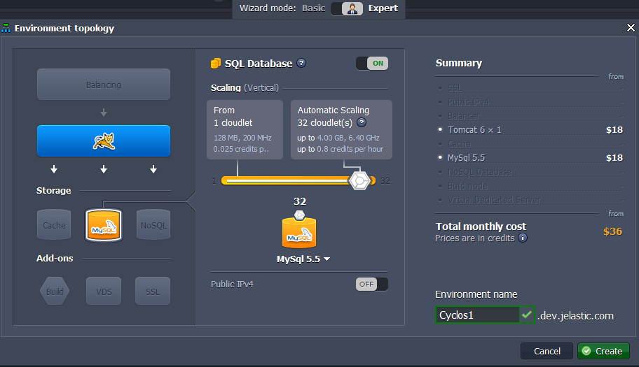

It will take just a minute for your environment to be created.

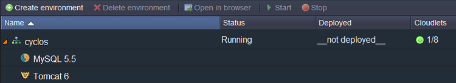

### Upload Java Package

1\. Navigate to the [Cyclos web site](https://www.cyclos.org/) and download the basic installation package.

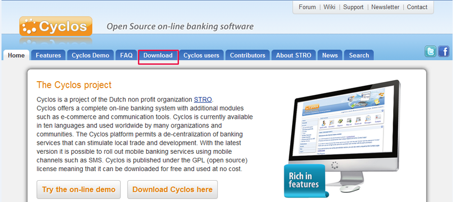

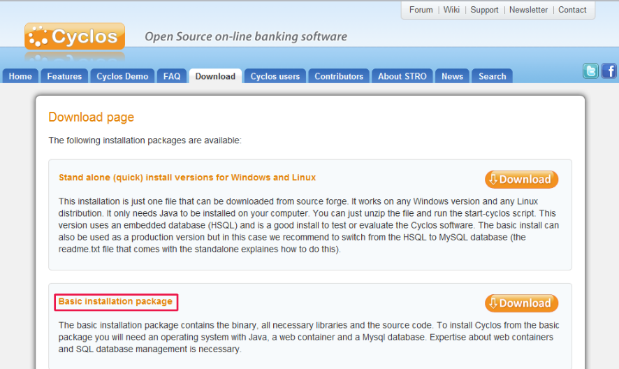

2\. Extract the files from zip package you have just downloaded and create a **.WAR file** from **web** folder contents.

3\. Upload your Java package to the **Deployment manager**.

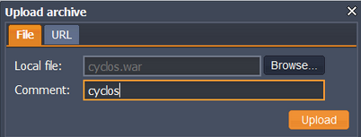

4\. Once the package is in the platform, deploy it to the environment you have just created.

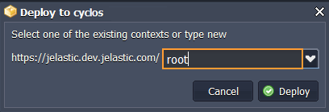

### Configure Database

1\. Click **Open in Browser** button for **MySQL**.

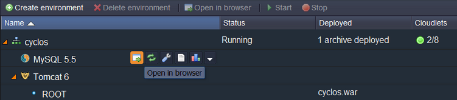

2\. When you created the environment, the platform sent you an email with credentials to the database. Use these credentials to create a user account and the database with the application.

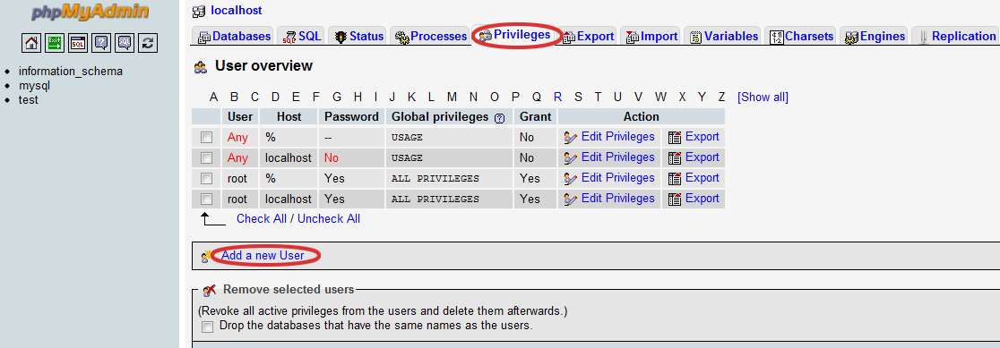

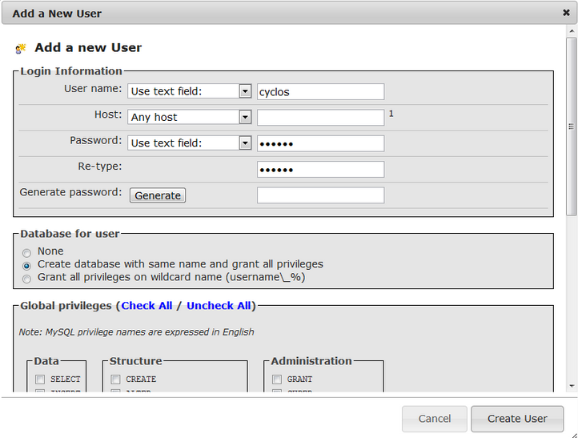

### Configure Cyclos

1\. Switch back to the platform dashboard and click **Config** button for **Tomcat**.

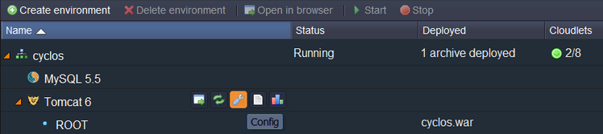

2\. Open the Cyclos configuration file (***home/webapps/ROOT/WEB-INF/classes/cyclos.properties***) and type the host URL.

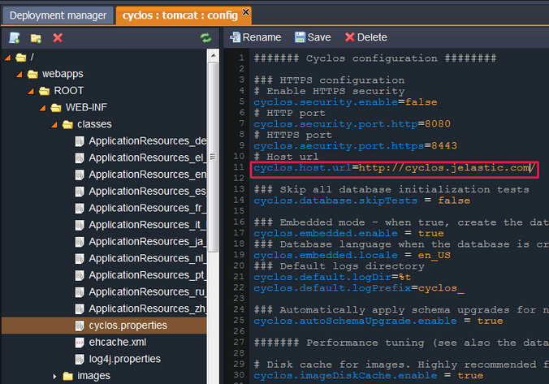

3\. In the same file you will have to set the database configuration (database URL, username and password).

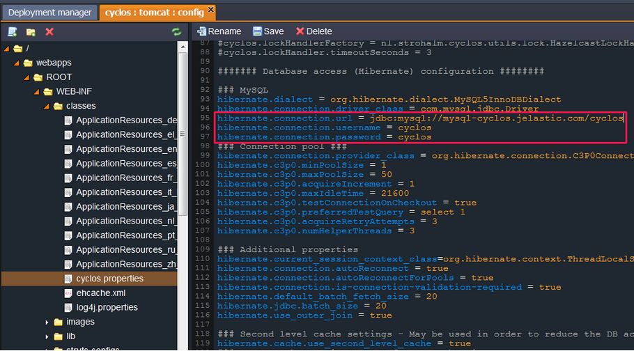

Don't forget to **Save** your changes and **Restart** Tomcat.

### Start Cyclos

Finally, you can launch Cyclos and use all of its functions!

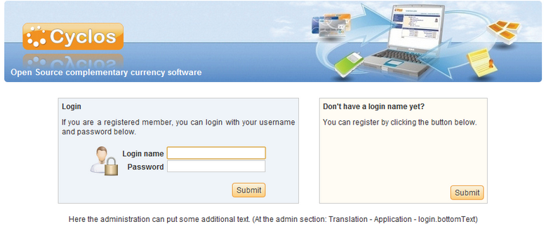

The default credentials are *admin/1234*.

## What's next?

* [Java Tutorials](/java-tutorials/)
* [Cyclos 4](/cyclos-4/)
* [Cyclos SMS Module with Mobile Gateway](https://www.virtuozzo.com/company/blog/mobile-banking-in-the-cloud-part-ii-cyclos-sms-module-with-a-mobile-phone-gateway/)

