# How to Install Apache Roller Weblogger

**[Apache Roller](http://roller.apache.org/)** is a very popular group-blog server suitable for blogs both large and small.Just like with any other Java application, it is very easy to deploy Roller to the platform. 


## Create Environment

1\. Log into the platform dashboard.

2\. Click **Create environment** to set up a new environment.


3\. In the **Environment topology** dialog pick **GlassFish** as your application server, **MySQL** as the database you want to use  and type your environment name, for example, *webroller*. Then click **Create**.

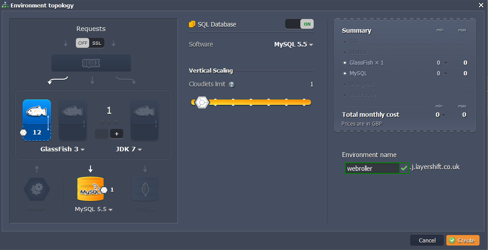

Wait just a minute for your environment to be created.


## Upload Java Package

1\. Go to [Apache Roller website](http://roller.apache.org/) and download **roller-weblogger-5.0.0-for-javaee.zip** file.

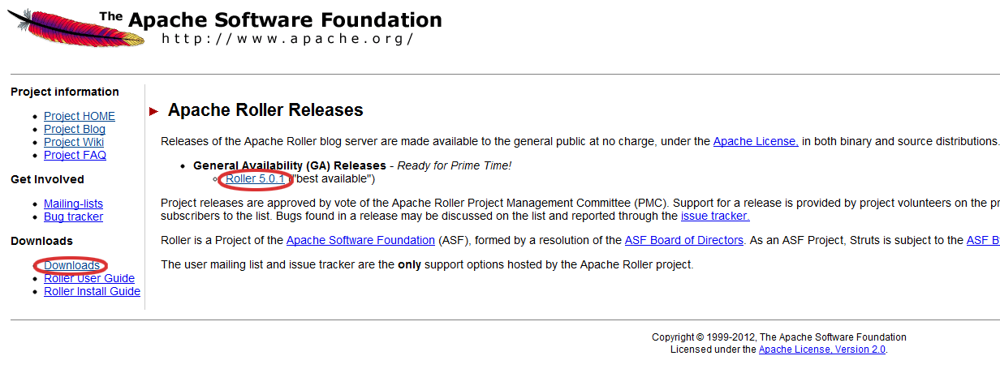

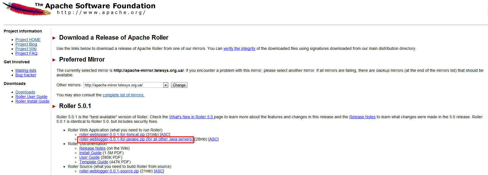

2\. Extract the files from the package you have just downloaded.

3\. Switch back to the platform dashboard and upload **roller-5.0.0-javaee.war** package (*roller-weblogger-5.0.0-for-javaee/webapp/roller-5.0.0-javaee.war*) to the **Deployment manager**.

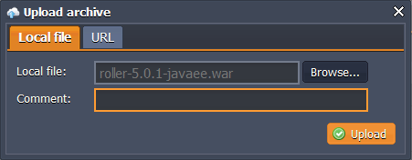


## Configure Database

1\. Click **Open in Browser** button for **MySQL**.

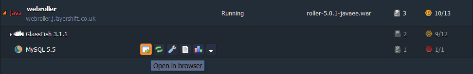

2\. While you were creating the environment, the platform sent you the email with credentials to the database. Create an account and the database with the application using these credentials.

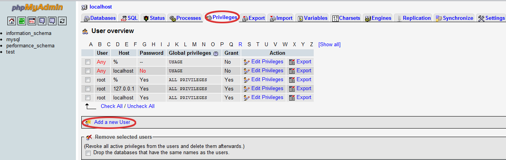

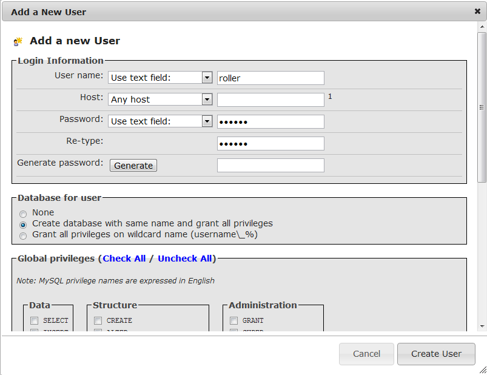


## Configure Apache Roller

1\. Click the **Config** button for GlassFish and upload **MySQL connector** to the **lib** folder.

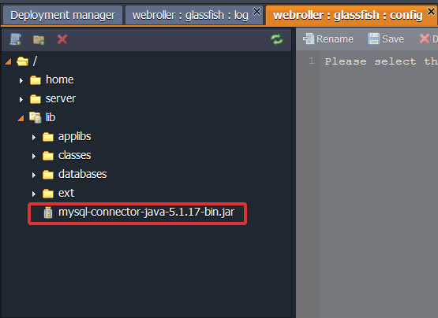

2\. Create a file named **roller-custom.properties** with the following content:
```
installation.type=auto   
mediafiles.storage.dir=/home/rollerdata/mediafiles   
search.index.dir=/home/rollerdata/searchindex   
log4j.appender.roller.File=/home/rollerdata/roller.log
```

3\. Upload the **roller-custom.properties** file to the **classes** directory (*lib/classes*).

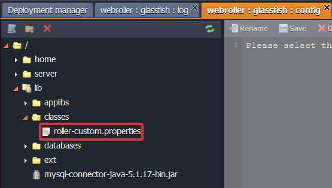

4\. Create  **rollerdata** directory in the **home** folder. Then select the rollerdata directory and create **mediafiles** and **searchindex** directories in there.

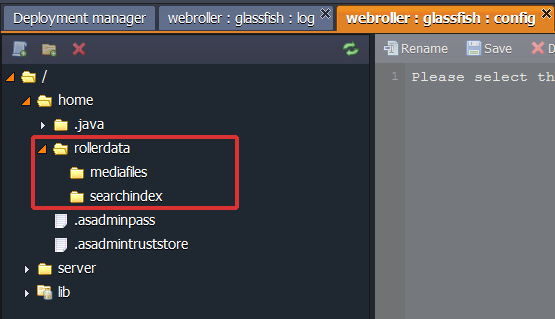

5\. While you were creating the environment, the platform sent you the email with credentials to your **GlassFish DAS node**. Go to **GlassFish admin panel** and log in using these credentials.

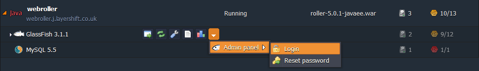

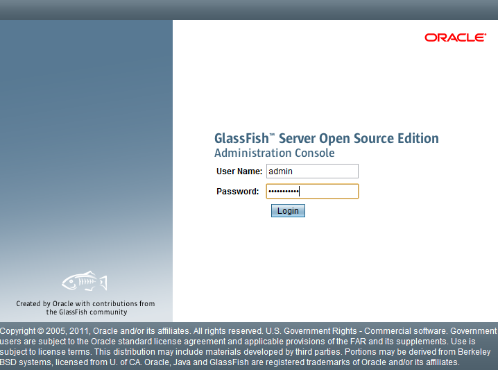

6\. Create **connection pool** with the name *WebRollerPool*. Choose *java.sql.Driver* as the resource type and MySQL as the database driver vendor. Click **Next**.

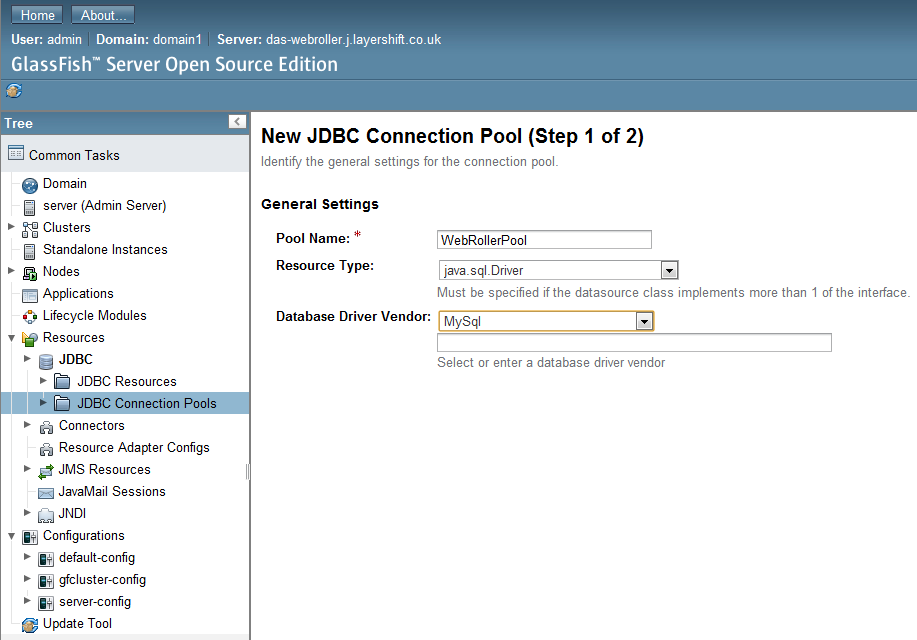

Navigate to **additional properties** and enter your database URL, username and password.

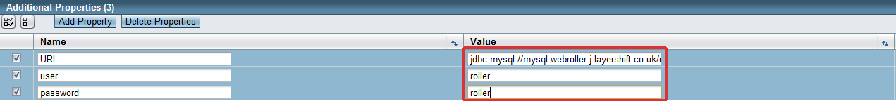

7\. Create **JDBC resource** named *jdbc/rollerdb* and select the created **WebRollerPool** as the pool to be used by this resource.

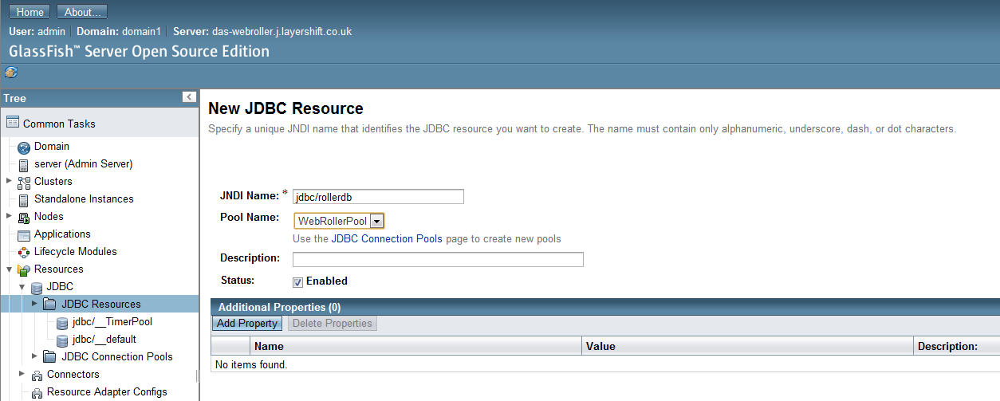

8\. Create a **mail session** with the name *mail/Sessions* (we use Gmail as an example).

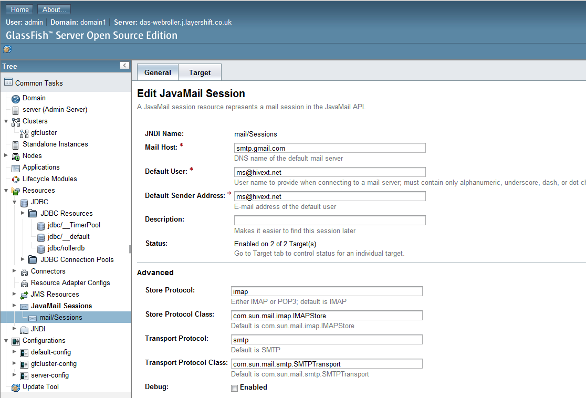

9\. Go back to the platform dashboard and deploy your Java package to the environment you have created earlier.

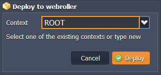

Now open you can open **Apache Roller** in a web browser, complete the installation process and start using it!

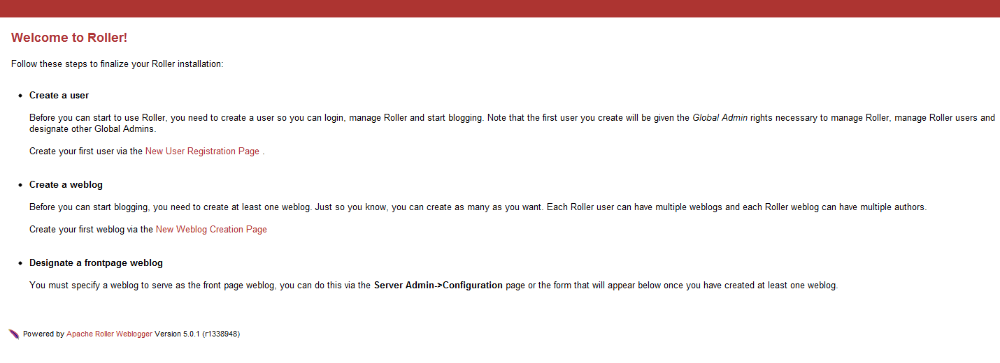

## What's next?

* [Tutorials by Category](/tutorials-by-category/)
* [Java Tutorials](/java-tutorials/)
* [Setting Up Environment](/setting-up-environment/)