# How to Install Yabe

[Play!](https://www.playframework.com/) is an open-source framework for web applications, which is written in Scala and Java and implements the principles of Model-view-controller architecture. Since it is one of the most popular frameworks among the developers, we've decided to show how to deploy Play! projects to the platform on the example of Yabe application.

**Yabe** is a lightweight ASP.NET-based blog engine, which emphasizes on simplicity in design of MVC based web apps. It provides simple management for your posts, articles, submitted comments, attached tags and users' permissions.

So, let's find out how to easily get the personal Yabe-based blog installed within the platform.


## Create Environment

1\. Log into the platform dashboard with your credentials.

2\. Click **New environment** to set up an environment for your project.

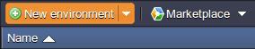

3\. Once the Environment Wizard frame is opened, pick your application server and database you want to use (for example, **Tomcat** and **MySQL**). Then specify the resources limits for both instances and type your environment name, for example, *yabe-blog*. 

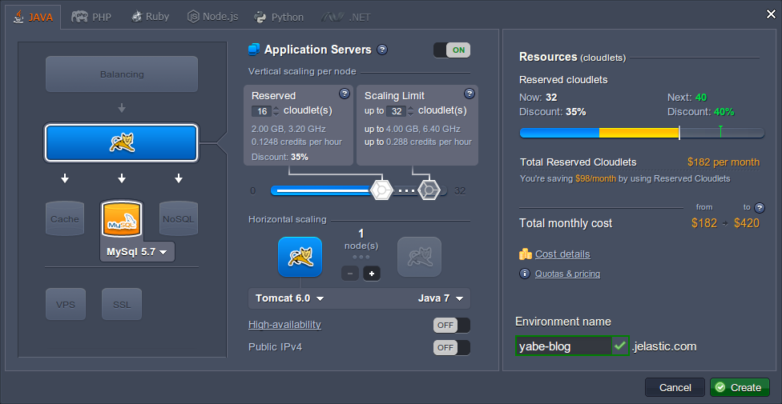

4\. It will take just a minute for your environment to be created.

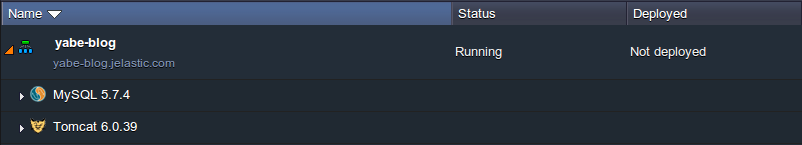


## Database Configuration

After the process of new environment creation has been successfully finished, you can proceed to configuring your database server.

1\. Click the **Open in Browser** button for MySQL node. 

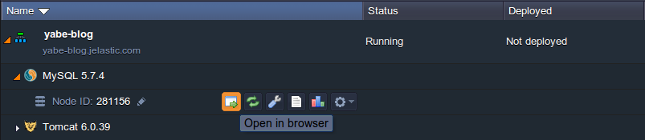

2\. Login to the opened **phpMyAdmin** panel using DB credentials that the platform has sent you via email after environment creation.

3\. Now you need to create a new user account and separate database for it. To do this switch to the **Users** tab and press the **Add user** link.

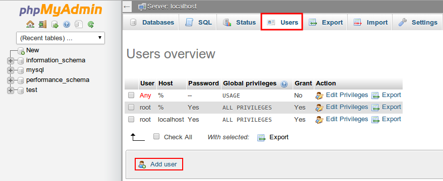

4\. In the opened window type **User name** (e.g. *yabe*), **Password** (as example we'll use the short one, while you'll need much more secure password to protect your DB from the unauthorized access) and confirm it in the **Re-type** field.

{}**Note:** Do not forget to put a tick to the *Create database with same name and grant all privileges* check-box as it is shown at the image below.{}

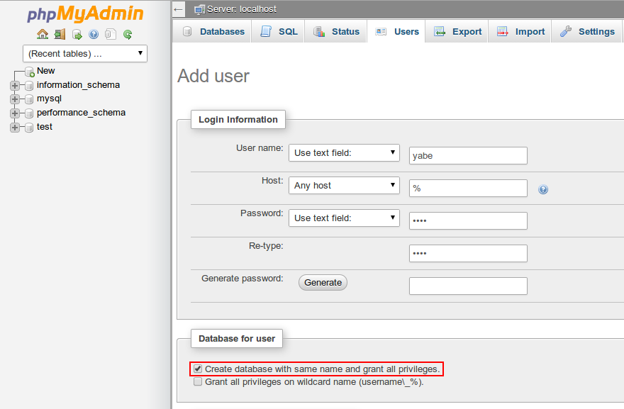

Press **Go** under the form when ready.


## Upload and Deploy Application

Now, once the database is configured, you can upload and deploy your Yabe application.

1\. Go to the [Play framework](https://www.playframework.com/download) download page and find the package with its latest **1.x** version (it should be named like ***play-1.x.x.x.zip***).

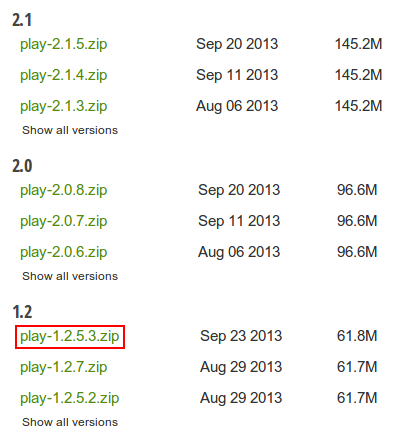

2\. Unzip the package you have just downloaded.

3\. Run the *Play!* framework via your console using the appropriate command line: 

* ***C:\path-to-play-folder\play*** for Windows
* ***/path-to-play-folder/play*** for Linux

This path should lead to the folder with the extracted **play-1.x.x.x** archive.

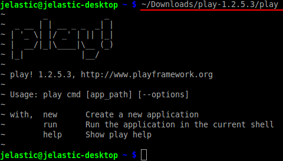

4\. Now we can create the ***yabe.war*** file. Execute the following command:

```bash
/path-to-play-folder/play war /path-to-play-folder/samples-and-tests/yabe -o /path-to-yabe/yabe_name --zip
```

where you should substitute the following strings:

* ***path-to-play-folder*** - location of the extracted **play-1.x.x.x** archive at your local machine
* ***path-to-yabe*** - location you'd like your Yabe application to be created at
* ***yabe_name*** - name of the Yabe **.war** file that will be created (*yabe* in our case)

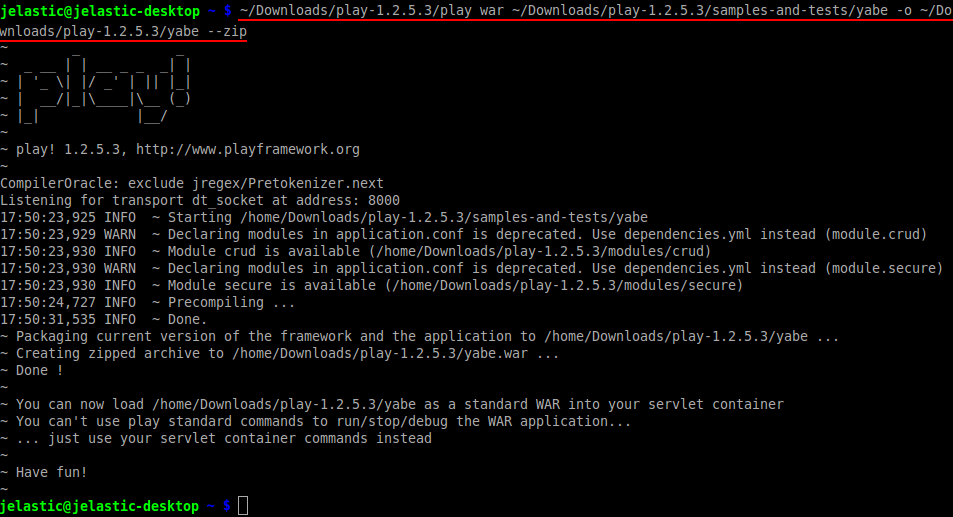

5\. Return to the platform dashboard and upload the **.war** file you have just generated using the **Deployment manager**.

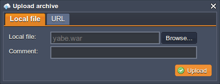

6\. Once the package is in the platform, deploy it to the environment you've created earlier.

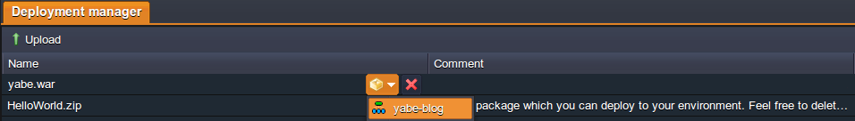


## Server Configuration

The last thing you need to do is to configure your application server.

1\. Click the **Config** button for Tomcat to access the server files.

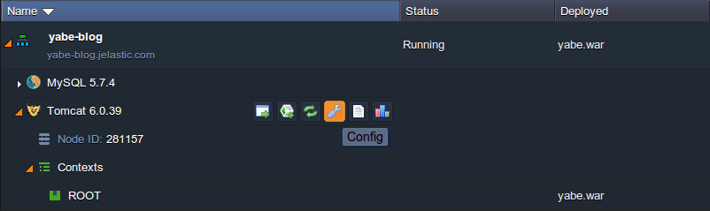

2\. **Upload** the MySQL *.jar* connector to the **lib** folder within the opened tab. It can be downloaded [here](http://dev.mysql.com/downloads/connector/j/).

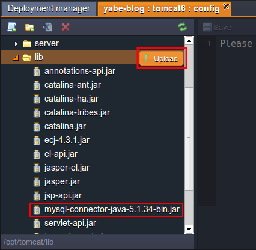

3\. Next, find the ***application.conf*** file inside the **webapps/ROOT/WEB-INF/application/conf** folder. Uncomment strings in the *full JDBC configuration* section (starting approximately at the *83d* code line) and specify database URL, driver, user and password according to the parameters of your DB:

```text
db.url=jdbc:mysql://mysql{node_id}-{your_env_name}.{hoster_domain}/{DB_name}
db.driver=com.mysql.jdbc.Driver
db.user={DB_user_name}
db.pass={DB_user_password}
```

{}**Note:** The ***{node_id}*** value implies the ID of the MySQL container you want to receive the access to. It can be seen at the dashboard:

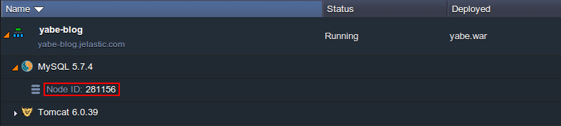{}

As a result your configuration strings will look like following:

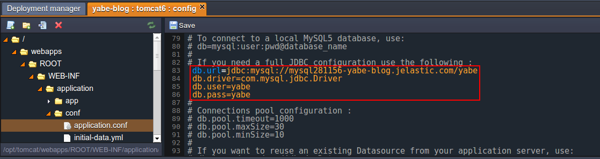

4\. Scroll a few lines below, uncomment the **db.pool.timeout** parameter inside the *Connections pool configuration* section and increase its value to *10000* ms:

```
db.pool.timeout=10000
```

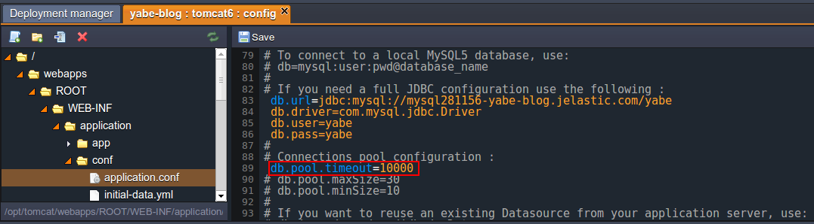

**Save** the changes you've made using the appropriate button above the editor.

5\. Finally, **Restart** your Tomcat application server in order to apply the stated configurations.

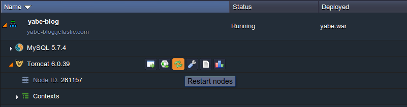

6\. Now you can open your Yabe application by means of pressing the **Open in Browser** button next to your environment.

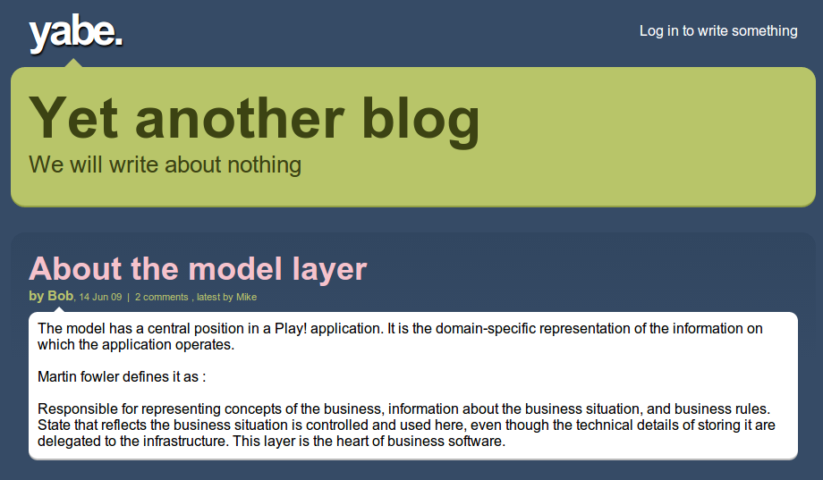

Awesome, you did it! Enjoy your blog engine, run inside the cloud.


## What's next?

* [Tutorials by Category](/tutorials-by-category/)
* [Java Tutorials](/java-tutorials/)
* [Setting Up Environment](/setting-up-environment/)