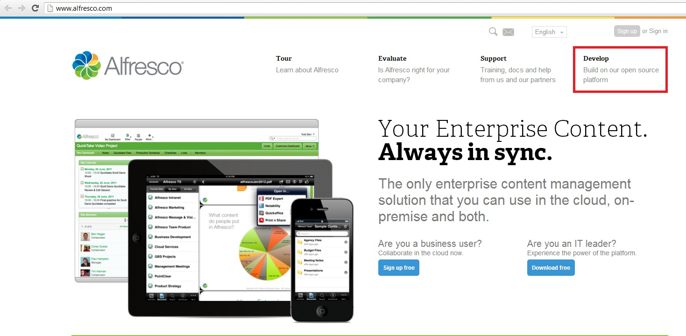
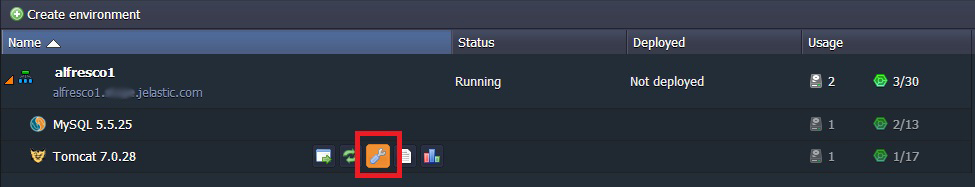
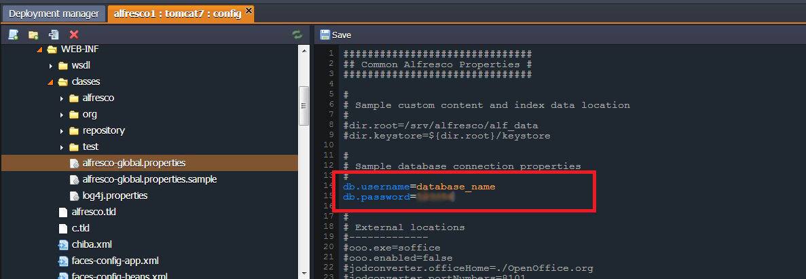

# How to Deploy Alfresco

You can have a **Alfresco** instance up and running within minutes using one-click install option.

<div data-app="alfresco" data-width="280" data-theme="modern" data-text="Get it hosted now!" data-tx-empty="Type your email and click the button" data-tx-invalid-email="Invalid email, please check the spelling" data-tx-error="An error has occurred, please try again later" data-tx-success="Check your email" class="je-app"></div>

The process is simple - just click **Get it hosted now**, type your email and install **Alfresco** in a minute, skipping the steps of manual installation.


## Instruction on Manual Alfresco Installation

This is a step-by-step instruction on deploying [Alfresco](https://www.alfresco.com/), enterprise content management system, into the platform so you can use it as an inexpensive hosted CMS. The platform can natively run any Java application with no code changes required so the procedure below is applicable to most Java applications.

### Create the environment

1\. Log into the platform dashboard.

2\. Click **Create environment** to set up a new environment.


3\. In the **Environment topology** window, select **Tomcat** as your application server, **MySQL** as the database you want to use and type your environment name, for example, *Alfresco*, and click **Create**.


In a minute your environment with both [Tomcat](/tomcat/) and **MySQL** will be created and appears in the environments list.

### Upload Java Package

1\. Go to [Alfresco web-site](https://www.alfresco.com/) and click **Build on our open source platform**.



2\. In the opened window click **Download Community Edition** in **On premise** section.


3\. Click **Custom Installs and optional modules**.


4\. Download the latest version of ZIP archive of Alfresco community edition.


5\. Extract files from this archive and navigate to alfresco.war file at *\alfresco-community-4.2.c\web-server\webapps*.

6\. Upload your alfresco.war package to the **Deployment manager**.


7\. After the upload is complete deploy this package to the environment you have created earlier.


### Configure Database

1\. Click **Config** button for your Tomcat server.



2\. Upload **MySQL connector** to the **lib** folder and restart Tomcat.


3\. Click **Open in Browser** button for **MySQL**.


4\. When you've created the environment, the platform sent you an email with credentials to the database. Create an account and the database with the application using these credentials.


 


### Configure Alfresco

1\. Once the deployment is finished, click **Config** button for **Tomcat**.


2\. Navigate to *webapps/ROOT/WEB-INF/classes/* and create new file named **alfresco-global.properties**.

3\. Copy content of **alfresco-global.properties.sample** to **alfresco-global.properties**.


4\. Edit this file as it is shown below:

* Uncomment a part of file which sets database credentials. Enter database name and password which you've used while creating database


* Make the database driver and URL point to your database server. Enter:
  ```db.driver=org.gjt.mm.mysql.Driver  
  db.url=jdbc:mysql://localhost/you_database_name?useUnicode=yes&characterEncoding=UTF-8
  ```
  
  {}**Note:** To get your IP address (which you should enter instead of "localhost" in the second line) click **Info** button next to MySQL node.


{}

5\. Save the changes.


### Run Alfresco

1\. Click on **Restart node** button next to Tomcat node.


2\. Finally, click **Open in Browser** button for Tomcat in your environment. Now you have your own Alfresco in the platform!


And here is a video version of the same procedure:
 
<iframe width="640" height="360" src="https://www.youtube.com/embed/KUGErAtiaFI" frameborder="0" allowfullscreen=""></iframe>

Hope this instruction will be useful for you.


## What's next?

* [Tutorials by Category](/tutorials-by-category/)
* [Java Tutorials](/java-tutorials/)
* [Setting Up Environment](/setting-up-environment/)

<script>
    (function(d, s, id) {
        var js, fjs = d.getElementsByTagName(s)[0];
        if (d.getElementById(id)) return;
        js = d.createElement(s); js.id = id;
        js.async = true;
        js.src = "//go.jelastic.com/widgets.js";
        fjs.parentNode.insertBefore(js, fjs);
    }(document, 'script', 'jelastic-jssdk'));
</script>
