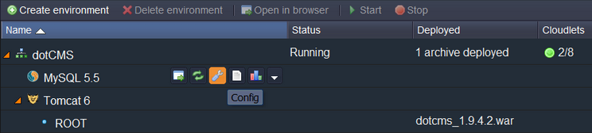

# How to Deploy DotCMS

**[DotCMS](https://dotcms.com/)** is an open source enterprise class content management system that integrates the best features of content management with built in personalization. It allows you to create data structures and create relationships between them. It also allows you to create containers included in templates that generate pages.

Here is a step by step tutorial on deploying dotCMS to the PaaS. All you need is just go through these simple steps:

## Create Environment

1\. Log into the platform dashboard.

2\. Create a new environment.

3\. In the **Environment topology** window, select **Tomcat**  as your application server, pick **MySQL** as the database you want to use and type your environment name, for example, *dotcms*, and click **Create**.

In a minute your environment with [Tomcat](/tomcat/) and **MySQL** will be created.

## Upload Java Package

1\. Navigate to [dotcms.com](https://dotcms.com/), select **Download** and copy the URL of the latest dotCMS version.

2\. Go back to the platform, click **Upload** and paste the URL you have just copied.

3\. Once the package is in the platform, deploy it to the environment you have just created.

## Configure Database

1\. Click **Config** button for **MySQL.**

2\. In **my.cnf** file, type the following: *lower_case_table_names=1*. It makes your database case-insensitive. Click **Save** and **Restart** the database node after that.

3\. Click **Open in Browser** button for **MySQL.**

4\. When you created your environment, the platform sent you an email with credentials to the database. Create a user account and the database using these credentials.

## Configure DotCMS

1\. Pick **Config** for **Tomcat**.

2\. You have to upload to  the **lib** folder all required JAR files: [MySQL connector](http://dev.mysql.com/downloads/mirror.php?id=404191), [mail.jar](http://www.oracle.com/technetwork/java/javasebusiness/downloads/java-archive-downloads-eeplat-419426.html#javamail-1.4.4-oth-JPR), and dependence library [log4j-1.2.16.jar](http://logging.apache.org/log4j/index.html).

3\. Upload **dotcms_1.9.4.2.jar** (it is in <a href="http://dotcms.com/physical_downloads/release_builds/dotcms_1.9.4.2.zip">dotcms_1.9.4.2.zip</a>) to **webapps/ROOT/WEB-INF/lib**.

4\. Go to **Server** folder and in the **context.xml** file, write up the database connection properties and mail settings.

Now you can open **dotCMS** in a browser and use all its functions!

## What's next?

* [Tutorials by Category](/tutorials-by-category/)
* [Java Tutorials](/java-tutorials/)
* [Setting Up Environment](/setting-up-environment/)