# LampCMS Deployment Tutorial

**LampCMS** is an open source Q&A (Question&Answer) PHP web program, deeply integrated with all widely spread social networks and blogger APIs - Google, LinkedIn, Tumblr, Facebook, Twitter, etc. In this tutorial we'll find out how to deploy and run it inside the platform.
 
Our environment for LampCMS will contain two databases, **NoSQL** and **SQL** (MongoDB and MySQL respectively). The first one will be used as a **main DB storage**, which can work with the huge amount of data records and can be scaled greatly. The second one will be used just as an **embedded search engine**.  
So, let's get started.

## Create Environment

1\. Log in to the platform dashboard.

2\. Open the environment topology wizard (click **Create Environment** button) and navigate to the **PHP** tab.
 
3\. Choose **Apache** application server and two database servers - **MongoDB** (it will be used as a main storage) and **MySQL** (the additional one). Select the **PHP 5.3** version and set the cloudlet limits for each of nodes. Then type the name for you environment and press **Create** button.

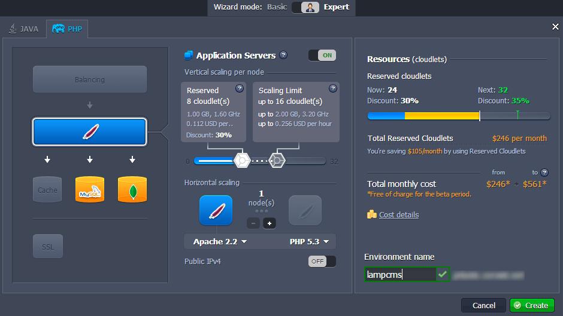

In just a minute your PHP environment will appear in the dashboard.

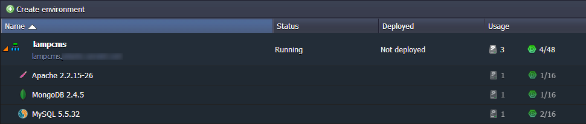


## Database Servers Configuration

1\. Press the **Open in browser** button for the MySQL node to open the phpMyAdmin panel. Log in with credentials you've received via email while environment creation.

2\. Add a new MySQL **user** and **database** with the same name.

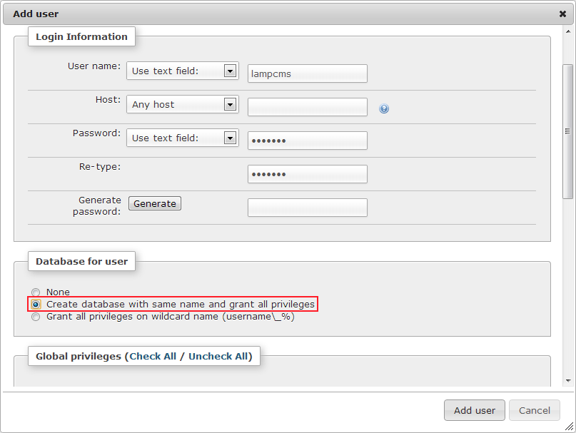

3\. Then open MongoDB admin panel in a new browser tab (click **Open in browser** button next to DB in the environment) and log in with credentials you've also received. 

4\. Create a new Mongo database and new **Collection** named *C_Cache*.

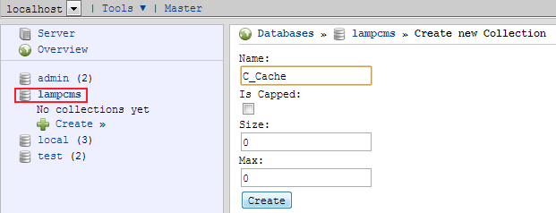

## Application Deployment

1\. Open the LampCMS official [web-site](http://www.lampcms.com/), navigate to the **Download** tab and get the **.zip** package with its latest release.

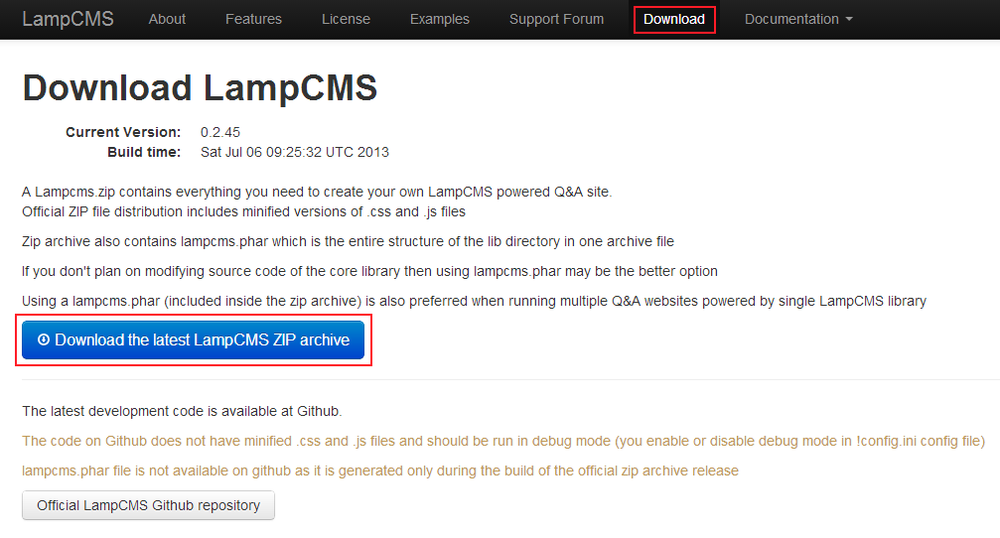

2\. Navigate back to the platform and use **Deployment Manager** in order to upload the downloaded **.zip** archive to dashboard.

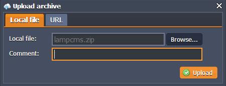

3\. When the uploading is completed, deploy the LampCMS archive to the environment you've created in the first step of this instruction.

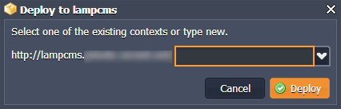

## LampCMS Configuration

1\. Open the **Configuration Manager** for Apache server (click **Config** button next to it) and navigate to the *webroot/root/config/* folder. Find the ***!config.ini.dist*** file in this folder and rename it to the ***!config.ini***.

2\. This file (***!config.ini***) contains a lot of settings you can specify accordingly to the requirements of your application. Read the comments for the options - they will help. Pay attention to the database connection strings - make sure you've entered the credentials to both MongoDB and MySQL servers correctly.

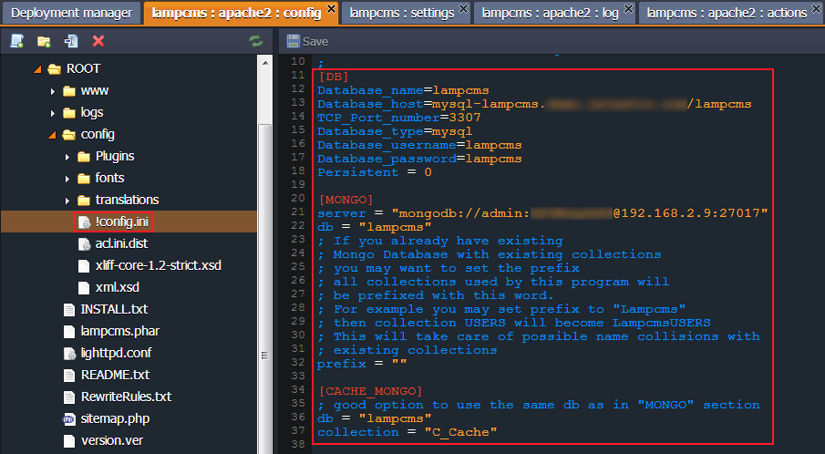

3\. Here is a list of site settings that are obligatory to set up:  
    
```
SITE_NAME, SITE_TITLE  
SERVER_TIMEZONE  
SITE_URL, EMAIL_DEVELOPER  
EMAIL_ADMIN  
EMAIL_DOMAIN  
SALT  
COOKIE_SALT
```

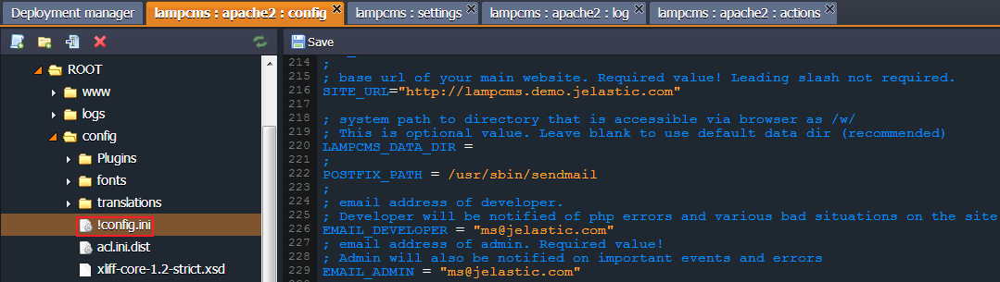

{}**Note:** Pay attention to the **[EMAIL_SERVER]** section - it contains an important option on defining your email transport.{}

4\. After that go to the *webroot/root/config/* folder and rename the ***acl.ini.dist*** file to ***acl.ini***.

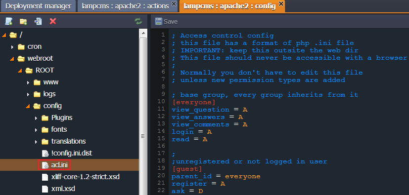

5\. Rename one more file - change ***bootstrap.dist.php*** (located in the *webroot/ROOT/www/* directory) file's name to the ***bootstrap.php***.

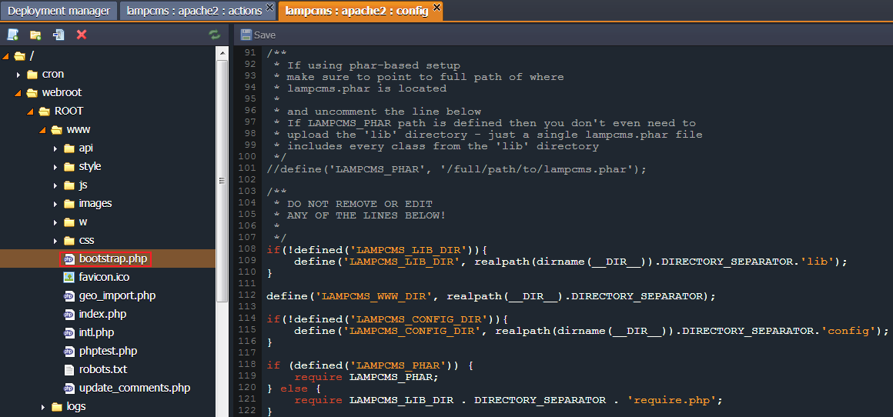

6\. Navigate to the **etc &gt; php.ini** configuration file to make sure you have the **Mongo** extension enabled. If for some reason you haven't - add the following line to this file and save the changes:

```
extension=mongo.so
```

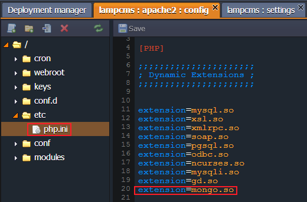

7\. Eventually, **restart** the Apache application server to apply the new configurations.

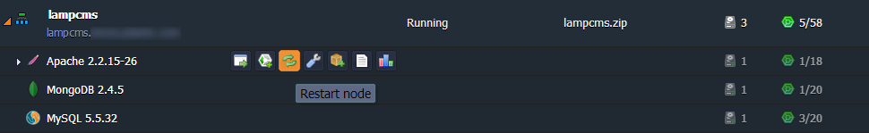

That's all! Now you have your own full-featured LampCMS in the cloud ready to work with.