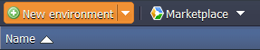

# How to Deploy Liferay

**Liferay Portal** is a popular enterprise Java-based web platform for building business solutions, equipped with the features, that are commonly required for the development of websites and portals. It includes a built-in web CMS with an assembly of themes, pages, portlets and gadgets available.

You can have a **Liferay** instance up and running within minutes using one-click install option.

The process is simple - just click **Get it hosted now**, type your email and install Liferay in a minute, skipping the steps of manual installation.

Find the full list of applications available for one-click installation at our [Marketplace page](https://www.virtuozzo.com/application-platform/marketplace/).

In case you would like to configure and run your Liferay instance manually, just follow the step-by-step instruction below.

## Create Environment

1\. Login to the platform dashboard using your credentials.

2\. Click **New environment** to set up an environment.

3\. In the appeared **Environment topology** window, select **Tomcat 7** as your application server at the **Java** tab and set the resources amount for it according to your needs, with the help of cloudlet sliders in the *Vertical scaling* section. Then type your environment name (for example, *liferay*) and click **Create**:

4\. In a minute or so your environment will be created and appear in the environment's list.

## Configure Application Server

Before installing Liferay, you need to make some configurations at the created environment.

1\. The latest version of the **Liferay Community Edition** package is available at the Liferay website's [download page](http://www.liferay.com/downloads/liferay-portal/available-releases). Navigate to it, choose the ***Bundle with Tomcat*** option from the corresponding drop-down list (inside the *Community* section) and select **Download**.

2\. Extract files from the archive you've just downloaded into the preferred directory at your local computer.

3\. Now you need to upload the downloaded Tomcat libraries, which will be required by the Liferay application. So switch back to the platform dashboard and select the **Config** button for your **Tomcat 7** server.

4\. In the opened **Configuration Manager** tab, find the **lib** directory and click on the **Upload** button next to it (it will appear while hovering over this directory). In the opened window select all the files inside the **liferay-portal-6.*x*-ce-ga*x*\tomcat-7.*x*.*x*\lib\ext** folder of the previously extracted archive and select **Open**.

5\. After the uploading is finished, navigate to the **home** folder and click the **New file** button (circled in the image below) at the top of the tools panel, to create a new ***portal-ext.properties*** configuration file.

Then insert just one code line inside the created file to complete the configuration of your server: 

***resource.repositories.root=${user.home}/liferay***

Click **Save**.

## Deploy Application

Now you need to upload and deploy the Liferay application package to your environment. As its size exceeds the limits for local files uploading (which stays at 150Mb), you'll need to upload it through a URL. So, perform the following:

1\. Return to the same [page](http://www.liferay.com/downloads/liferay-portal/available-releases) you've downloaded the archive with libraries at, scroll about halfway down the page to find the **Additional Files** section and select the button with a down-arrow next the box with the latest *Liferay Portal WAR* file.

2\. You'll be redirected to the SourceForge site and automatic downloading will start after a few seconds. Stop it as you don't need a file itself, but just a link to it, which can be copied by right-clicking at the ***direct link*** line and choosing the **Copy Link Address** option (or the similar one according to your browser) from the appeared context menu.

3\. Then switch to your dashboard once again and click on the **Upload** button at the **Deployment Manager** tab. In the opened **Upload archive** frame, select the **URL** tab at its top and paste the copied link to the Liferay ***.war*** package inside the same-named field. Click **Upload**.

4\. Once the package is uploaded, deploy it to the environment you have created previously by clicking the **Deploy** button next to the package name. You'll see the form shown below, therein you can set the desired context name (or leave it blank to use the default *ROOT* one). Click the **Deploy** button to proceed.

 
5\. Now **Open** your application **in browser**.

{}**Note:** On the first launch Liferay will install the needed dependencies and this process can require some time (up to 5 minutes depending on the amount of stated resources), so be patient.
{}

6\. Finally, after the page is successfully loaded, you can create your account, confirm the configuration and start using all the provided capabilities of this application!

And here is a video version of the same procedure:

<iframe src="https://www.youtube.com/embed/oRTxqGd1ko4" allowfullscreen="" frameborder="0" height="360" width="640"></iframe>

## What's next?

* [Tutorials by Category](/tutorials-by-category/)
* [Java Tutorials](/java-tutorials/)
* [Setting Up Environment](/setting-up-environment/)

