# How to Deploy Magnolia CMS

{}{}
**Magnolia** is an open-source Java-powered content management system, which uses JCR (Content Repository API for Java) to store, process and retrieve the data. Its block structure enables packaging of system core and all related components (like page editor, cache, repository, etc.) into separate modules, which variety results a high level of flexibility. Alongside, this CMS is simple enough to ensure easy content management even for unfamiliar users, whilst experienced developers will find it neatly adopted for advanced development due to seamless integration of extra tools.

This way, providing multiple ways of interaction for different types of users, Magnolia CMS can satisfy any management, business and marketing needs.

To instantly get a preconfigured and ready-to-work **Magnolia CMS** instance, run under the Community Edition license, use the following dedicated one-click installation widget:

Just click **Get it hosted now!** and type your email address in order to launch Magnolia, skipping the steps of manual installation (the full list of similar prepackaged solutions for quick deploy can be found at [platform Marketplace](/marketplace/)).

However, if you prefer to be aware of how the installation is run or need another version of this CMS, just check out the short video tutorial below to get insights on deploying **Magnolia CMS** to the platform.

<iframe width="560" height="315" src="https://www.youtube.com/embed/HNSExRqj1lY" frameborder="0" allowfullscreen=""></iframe>

To get more details, read through the guide below where we'll describe how to deploy **Magnolia CMS** inside the platform manually with the following steps:

* [Create New Environment](#create-new-environment)
* [Deploy the Magnolia CMS Package](#magnolia-cms-package-deployment)
* [Install Own Magnolia CMS Instance](#installing-magnolia-cms-copy)

## Create New Environment

So, log in to the platform dashboard with your credentials (or, if having no experience with our Platform yet, choose a suitable [hosting provider](https://www.virtuozzo.com/application-platform-partners/) among our partners and [create an account](/getting-started/#sign-up-how-to-create-an-account) first) and let's go on.

1\. Click **New environment** in the top left corner of the dashboard, switch to the **Java** tab and select **Tomcat 7 or 8** as your application server.

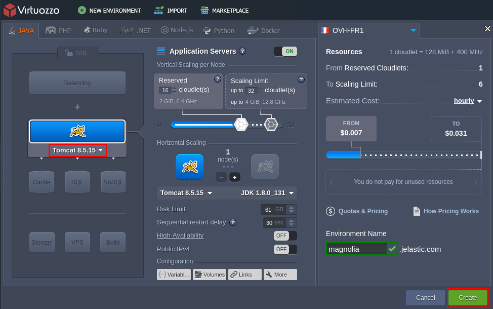

Then allocate the desired amount of resources for this node with [scaling limit](/automatic-vertical-scaling/) sliders, specify a [region](/environment-regions/) and *Name* for your new environment, and click **Create**. In a few minutes it should appear at the dashboard; meanwhile, we'll proceed further for not wasting the time.

## Magnolia CMS Package Deployment

For the time an environment is being created, you can download the **Magnolia CMS** package.

1\. Navigate to the Magnolia [download page](http://files.magnolia-cms.com/) and click on the preferred edition version in order to be redirected to the corresponding source files' storage.

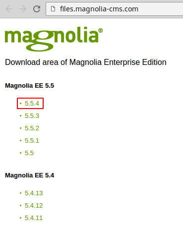

2\. In the opened page, find the ***War files*** section and **Copy link address** for the *magnolia-enterprise-standard-webapp* package.

{}**Note:** Magnolia CMS is a proprietary software, which requires a license purchase for its usage. However, you can get a 30-day [Enterprise Edition](https://www.magnolia-cms.com/get-started/developer-trial.html) license after a simple registration or leverage the free [Community Edition](https://docs.magnolia-cms.com/product-docs/6.2/Developing/Bundles-and-webapps.html#_community).{}

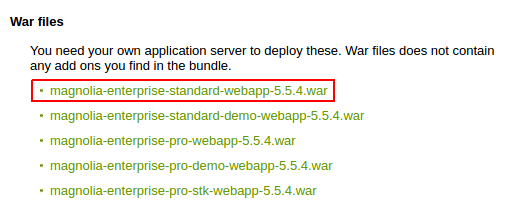

3\. Return to the platform dashboard (we assume the environment creation has already completed by this time) and click **Upload** under ***Deployment manager***.

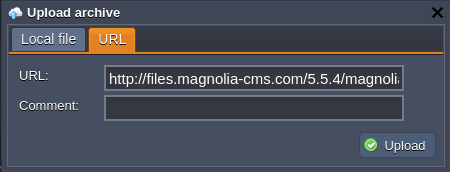

In the appeared dialog box, switch to the **URL** tab, paste the link you've just copied and **Upload** the package.

In a minute, your *WAR* file will be added to the list of available packages.

4\. Next, hover over the just uploaded project, click the **Deploy to&hellip;** button next to it and select the environment your application should be deployed to (*magnolia* in our case).

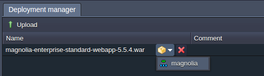

You can additionally specify the desired context name within the opened pop-up confirmation window (or leave the corresponding field blank for the default *ROOT* location to be used).

Wait until the deployment is successfully completed and proceed to the next section.

## Installing Magnolia CMS Copy

The deployed package contains the Magnolia launcher with a bunch of required modules, which will be automatically integrated during the following installation process.

1\. Click the **Open in browser** button in order to launch your Magnolia CMS instance.

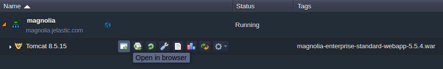

2\. In the opened Magnolia installation page you can review the list of modules that are to be installed.

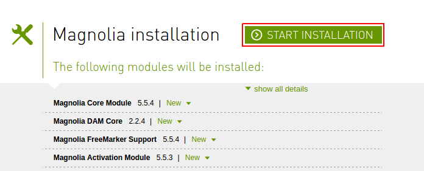

Select **Start Installation** when ready and wait for a couple of minutes until this operation is finished.

3\. Once all the appropriate operations have been accomplished, you will see the corresponding notification.

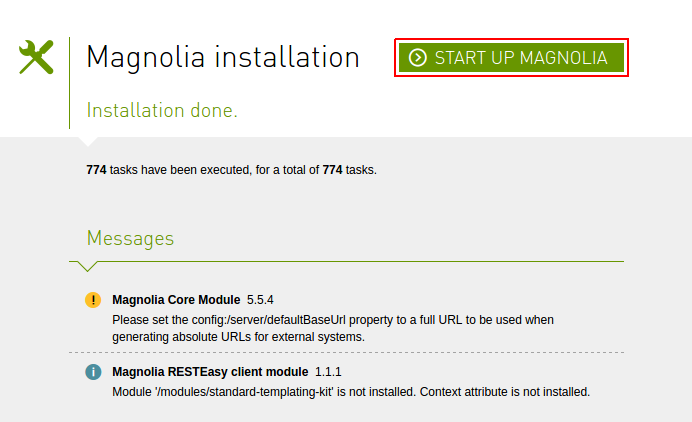

Now, click on the **Start Up Magnolia** button for being redirected to the Magnolia License page, where you'll be able to register your Magnolia CMS copy.

4\. In the opened page, refer to the link within the first step to receive a 30-day trial license and specify it alongside with your email address within the second section (or just fill in the appropriate fields if you've obtained it beforehand).

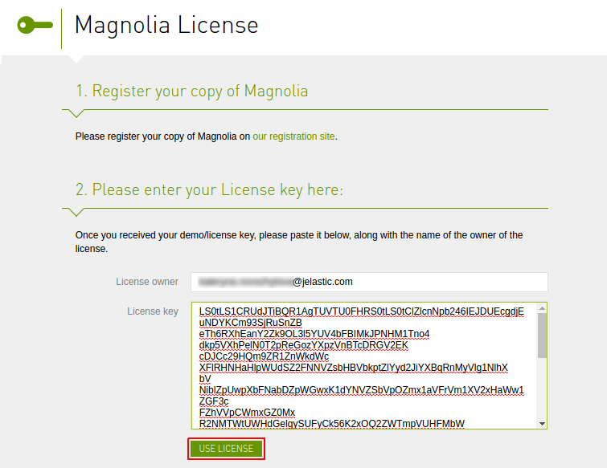

When finished, select **Use License**.

5\. Cool, here you are! Everything is ready - now you can log in to your own Magnolia CMS admin panel with the default *superuser* credentials (being specified as both your login and password).

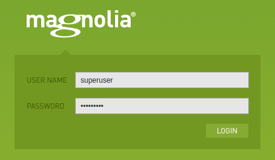

Click **Login** to pass the authentication and view the Magnolia CMS shell.

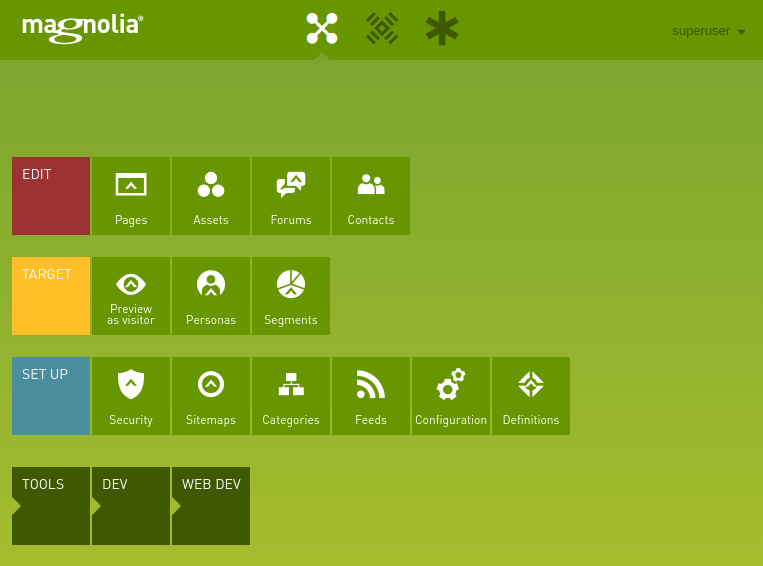

That's it! Your Magnolia content management system is up and running inside the platform! Now you can start organizing and managing the required content by following recommendations from the [Magnolia documentation](https://documentation.magnolia-cms.com/display/DOCS/Getting+started+with+Magnolia) official page.

{}In case you face any issues while deploying Magnolia CMS, feel free to appeal for our technical experts' assistance at [Stackoverflow](https://stackoverflow.com/questions/tagged/jelastic).{}

## What's next?

* [Tutorials by Category](/tutorials-by-category/)
* [Java Tutorials](/java-tutorials/)
* [Setting Up Environment](/setting-up-environment/)

