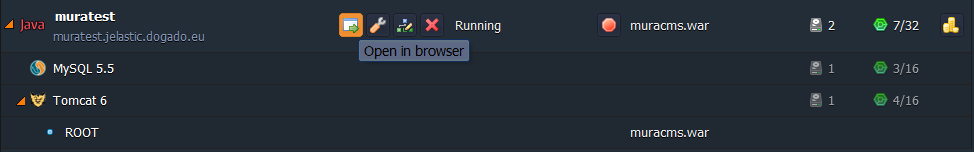

# Mura CMS in the Cloud

This step-by-step instruction shows how to deploy **[Mura CMS](https://getmura.com/)** to the PaaS without any code changes required in no time.

If you haven't used Mura yet, there are some advantages of  this open source web-based content management system, that you can get:

* it is easy to learn and use
* no black-box here (it provides a full set of features out of the box, its open architecture allows you to make changes and enhancements at any time)
* fits into any environment (it runs on all major server operating systems)
* easy app integration (it provides a number of approaches for integrating CFML applications into your Mura CMS environment)

Just like the platform makes easier the deployment process, Mura makes it easier and faster to build and update websites. So, let's combine these two great solutions and deploy **Mura CMS** into the platform.

## Create the Environment

1\. Log into the platform dashboard.

2\. Click the **Create environment** button:

3\. Choose **Tomcat** as your application server and **MySQL** as the database you want to use, set the cloudlets limit and type the name of  the environment. Switch on **Public IPv4** for MySQL. Then type your environment name, for example, *muratest*, and click **Create**.

{}**Note:** Public IP is a paid add-on, which is billed hourly. Pricing differs by hoster. You can find it within the dashboard.{}

Wait just a minute for your environment to be created.

4\. Click the **info** button for MySQL and you'll see your **Public IP** in the end of the drop-down list.

## Configure Database

1\. Click **Open in Browser** button for **MySQL**.

When you created the environment, the platform sent you the email with credentials to the database. Create an account and the database with the application using these credentials.

2\. Click **Config** button for Tomcat and upload MySQL connector to the **lib** folder.

## Upload Java Package

You need a CFML application server to run Mura CMS ([ColdFusion](http://www.adobe.com/coldfusion) or [Railo](https://www.getrailo.org/) or [OpenBD](http://www.openbluedragon.org/)). We'll use Railo server in this tutorial.

1\. Go to [Railo web site](https://www.getrailo.org/), click **Downloads** and download the latest Railo release as a WAR archive.

2\. Extract the files from the package you have just downloaded.

3\. Navigate to [www.getmura.com](https://getmura.com/), click on **Downloads**, fill in the suggested form or just skip it and download the source files for Mura CMS, which you can run using the CFML engine of your choice (**Mura Standard**).

4\. Unzip the package.

5\. Create a new folder in unpacked ***railo-x.x.x*** directory (e.g. *muracms*). Drop **admin, config, default, plugins, requirements, tasks, Application.cfc, index.cfm, MuraProxy.cfc** and **web.config** from **mura-x.x.x** directory to the folder, you have just created.

6\. Create a WAR file from the ***railo-x.x.x*** folder content (just put the content of this folder to another zip archive file, for example *muracms.zip*, and rename it to *muracms.war* or any name with the **.war** extension).

7\. Switch back to the platform dashboard and upload your Java package to the **Deployment manager**.

8\. Once the package is in the platform, deploy it to the environment you have created earlier.

## Set the Datasource

1\. Open your application in a web browser and you'll see Railo welcome page. Navigate to Railo **Web Admin** using the next URL format *http://mydomain.com/railo-context/admin/web.cfm* and submit your new password.

2\. Create a new datasource (in our case the type of datasource is MySQL).

3\. Then create a new database connection for MySQL database. Insert the name of the connection, specify the **host** which you want to use (enter your Public IPv4 for MySQL ), the name of the **database**, connection **port** (3306), type your database **username** and **password**. Also you can specify some extra settings such as connection limit, connection timeout, allowed operations and so on.

As you can see the connection has been successfully set.

## Install Mura CMS

1\. Go to **Mura CMS** setup wizard using the next URL format *http://mydomain.com/muracms* and fill in all the required fields (database type, datasource, you have created earlier within Railo Web Admin, database username,  password and admin email address).

2\. Finally you can finish the setup, log in with the default credentials (*admin/admin*) and begin to use Mura CMS.

## What's next?

* [Tutorials by Category](/tutorials-by-category/)
* [Java Tutorials](/java-tutorials/)
* [Setting Up Environment](/setting-up-environment/)