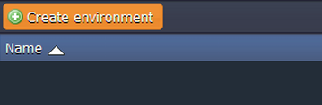

# How to Deploy OpenCMS

You can have a **OpenCMS** instance up and running within minutes using one-click install option.

The process is simple - just click **Get it hosted now**, type your email and install **OpenCMS** in a minute skipping the steps of manual installation.

## Instruction on Manual OpenCMS Installation

This is a step-by-step instruction on deploying [OpenCMS](http://www.opencms.org/), content management system, into PaaS. The platform can natively run any Java application with no code changes required so the procedure below is applicable to most Java applications.

### Create Environment

1\. Log into the platform dashboard.

2\. Click **Create environment** to set up a new environment.

3\. In the **Environment topology** window, select **Tomcat** as your application server and **Maria DB** as a database, type your environment name, for example, *opencms*, and click **Create**.

4\. In a minute your environment with both [Tomcat](/tomcat/) and **Maria DB** will be created and appears in the environments list.

### Upload Java Package

1\. Go to [OpenCMS web-site](http://www.opencms.org/) and download the latest OpenCMS distribution WAR file.

2\. Upload the downloaded Java WAR package using **Deployment manager**.

3\. Once the package is in the platform, deploy it to the environment you have just created.

### Configure Database

1\. Switch back to the platform dashboard and click **Open in Browser** button for **Maria DB**.

2\. While you were creating the environment, the platform sent you an email with credentials to the database. Create an account and the database with the application using these credentials.

 

### Configure OpenCMS

1\. Increase the limit of **max_allowed_packet** as [OpenCMS](http://www.opencms.org/) prompts you to do so.

2\. Restart the database.

### Install and Start OpenCMS

1\. Open the application in web browser (click **Open in Browser** buttom for your environment). You will get the next message:

It's ok but you need to launch OpenCMS startup. To do so, navigate to *http://{your_environment_name}.{[hoster's_domain](/paas-hosting-providers/)}/setup* and come through the **Setup Wizard** and accept the license agreement.

2\. In **OpenCMS Setup Wizard**, specify the URL of the database and the credentials, you have just provisioned.

 
Finally you can launch OpenCMS and use all its capabilities!

Hope this instruction will be useful for you!

## What's next?

* [Tutorials by Category](/tutorials-by-category/)
* [Java Tutorials](/java-tutorials/)
* [Setting Up Environment](/setting-up-environment/)

