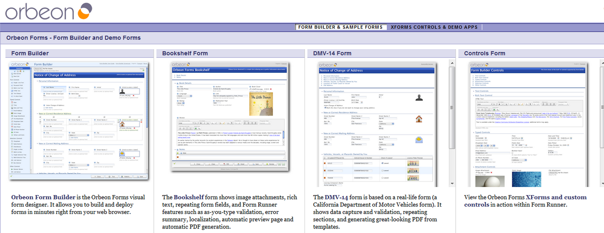

# How to deploy Orbeon Forms

**[Orbeon Forms](https://www.orbeon.com/)** is a very popular solution to build and deploy web forms. It is used all over the world in a number of industries. Let's deploy it to the platform right now!

It's pretty easy, just follow the few simple steps below.

## Create Environment

1\. Log into the platform dashboard.

2\. Click the **Create environment** button:

3\. In the **Environment topology** window select [Tomcat](/tomcat/) as your application server, type your environment name, for example, *orbeon*, and click **Create**.

It will take just a minute for your environment to be created.

## Upload Java Package

1\. Go to the [Orbeon web site](https://www.orbeon.com/) and download the latest **Orbeon Forms** community edition.

2\. Extract the files from the zip package you have just downloaded and upload the ***orbeon.war*** file to the **Deployment manager**.

3\. Once the package is in the platform, deploy it to the environment you have just created.

Now you can open **Orbeon Forms** in a web browser and use all its functions!

## What's next?

* [Tutorials by Category](/tutorials-by-category/)
* [Java Tutorials](/java-tutorials/)
* [Setting Up Environment](/setting-up-environment/)