# How to Deploy Xinco DMS

Here's a detailed instruction on how to deploy **[xinco DMS](http://www.xinco.org/)** to the platform. It is a Document Management System for files, text, URLs and contacts, featuring ACLs, version control, full text search and an FTP-like client. Xinco is a powerful and quite popular DMS, so we wanted to show you how it would work in the to the platform.

It's pretty easy, just follow the steps below.

## Create Environment

1\. Log into the platform dashboard.

2\. Click **Create environment** to set up a new environment.

3\. In the **Environment Topology** dialog,  pick your application server (for example, [Tomcat](/tomcat/)) and the database you want to use (for example **MySQL**). Then type your environment name, for example, *xinco*.

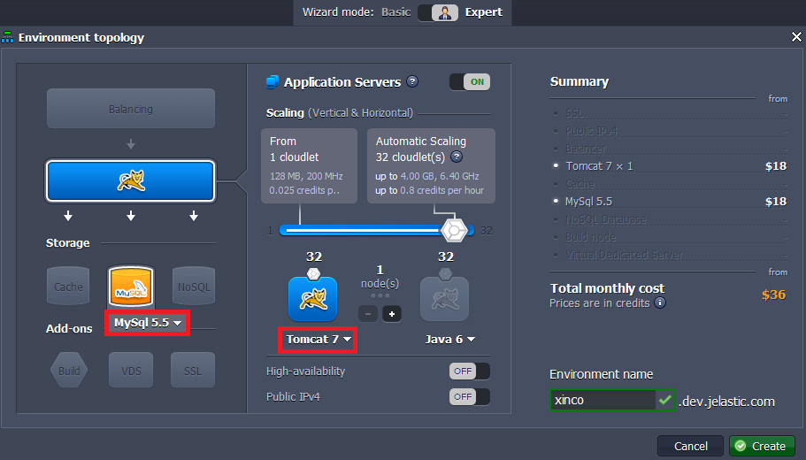

Wait just a minute for your environment to be created.

## Upload Java Package

1\. Navigate to [xinco.org](http://www.xinco.org//) and download the xinco DMS server as a zip file.

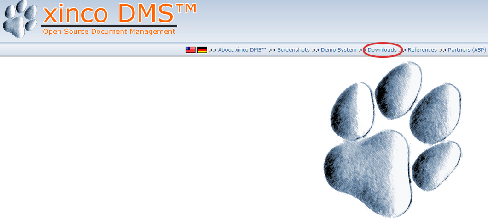

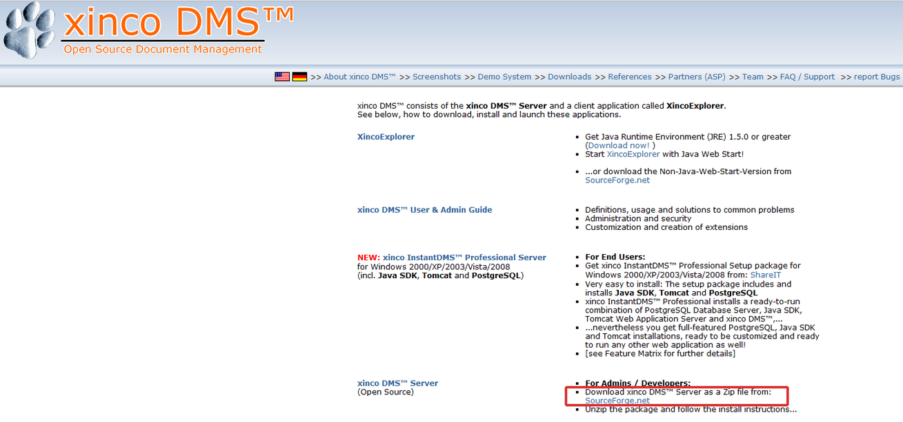

2\. Extract the files from zip package you have just downloaded and create a ***.WAR*** file from the **xinco** folder contents (xinco-DMS-3.00.00 M3/webapps/xinco).

3\. Upload your Java package to the **Deployment manager**.

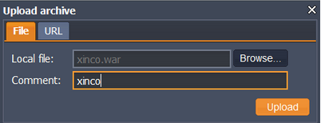

4\. Once the package is in the platform, deploy it to the environment you have just created.

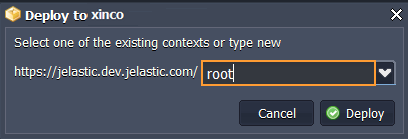

## Configure Database

1\. Click **Open in Browser** button for **MySQL**.

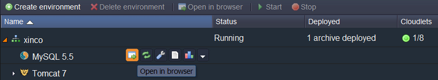

2\. When you created the environment, the platform sent you an email with credentials to the database. Use these credentials to create a user account and the database with the application.

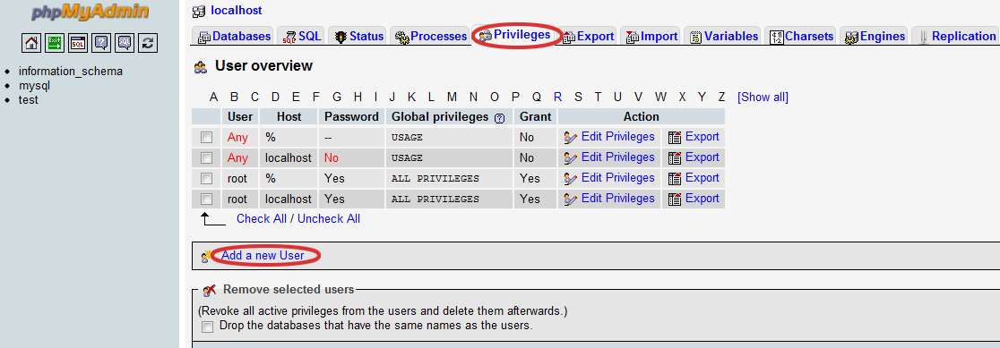

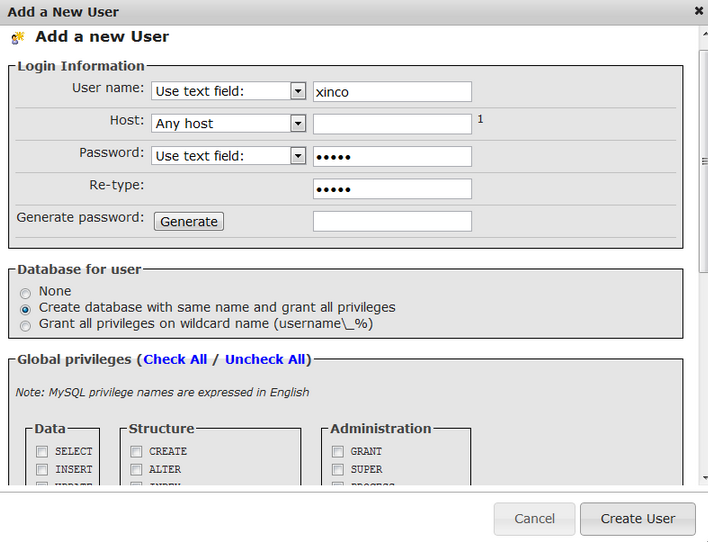

## Configure Xinco

1\. Go back to the platform dashboard click **Config** button for **Tomcat** and upload the **MySQL** connector to the **lib** folder.

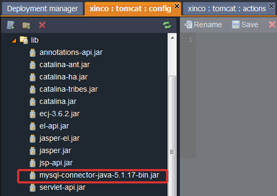

2\. Open the ***context.xml*** file (*webapps/ROOT/META-INF/context.xml*) and set the database configuration.

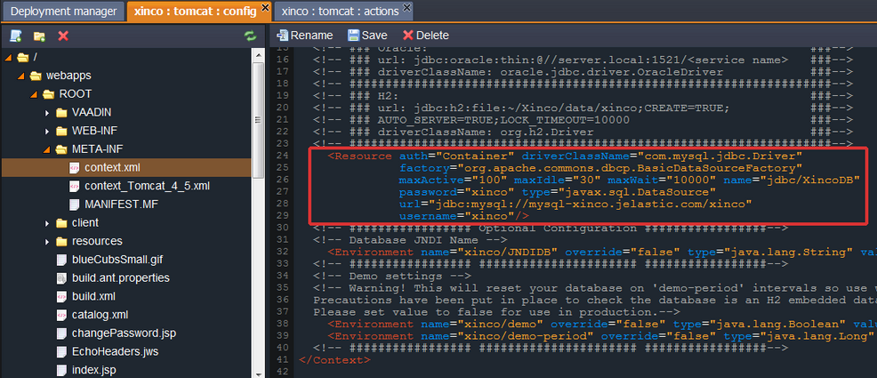

**Save** your changes and **restart** Tomcat.

## Start Xinco

Now you can launch **xinco DMS** in a web browser and use all it's cool functions!

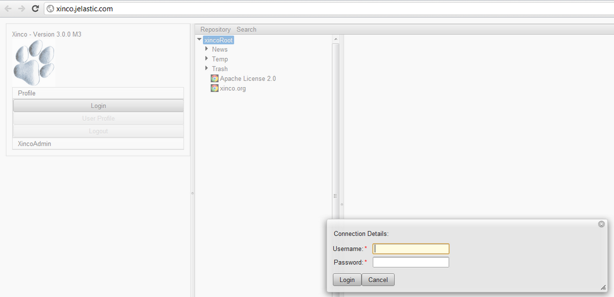

## What's next?

* [Tutorials by Category](/tutorials-by-category/)
* [Java Tutorials](/java-tutorials/)
* [Setting Up Environment](/setting-up-environment/)