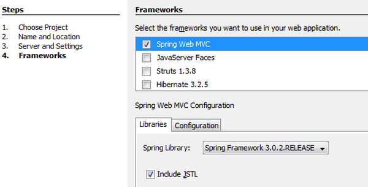
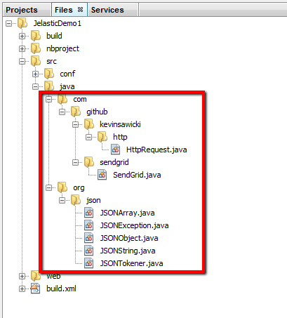
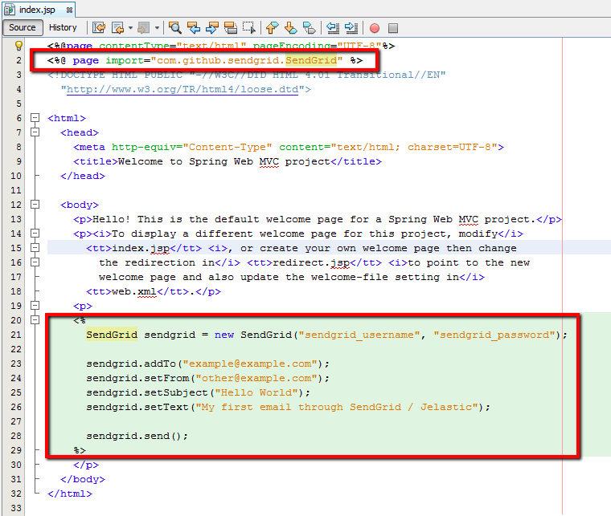
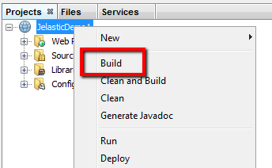
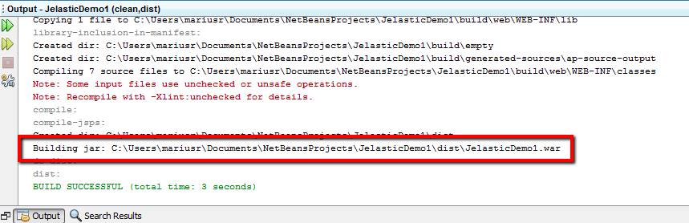
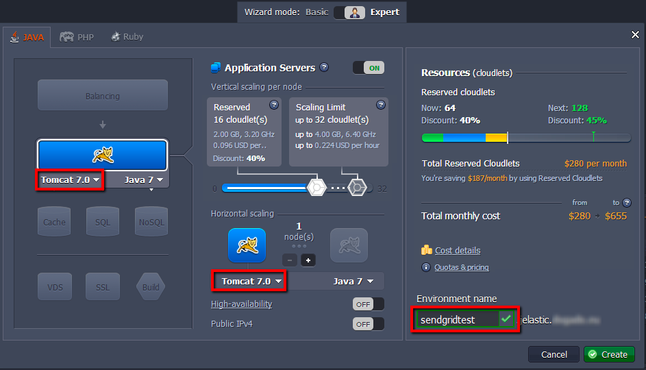
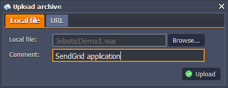
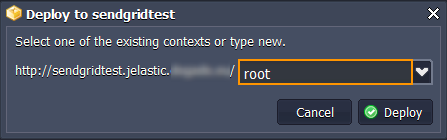
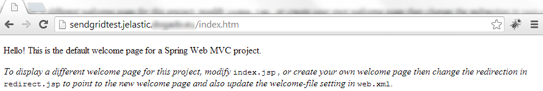
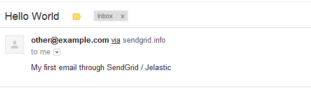

# Use SendGrid with Spring
**SendGrid** is easily integrated and reliable email infrastructure based on the cloud technologies. Using the platform and SendGrid interconnection you are able to send emails directly from your Java application, hosted with PaaS.

In the following instruction we will show how to integrate SendGrid into the simple Spring application, created within NetBeans IDE.  

#### **A. Sign Up for SendGrid**
For SendGrid using you should have your [SendGrid account](http://sendgrid.com/partner/jelastic) registered. For the beginning you can use free account version, which allows your application to send up to 200 emails per day. 

Note that some time is needed for the account to be verified.

Remember your SendGrid account username and password, we will use them in the following instruction steps. 

#### **B. Create an Application**
* Open the NetBeans development environment and create a new app. Choose the *Java Web* application type, state the name and location of your project, select application server (we will use *Tomcat 7*) and tick *Spring Web MVC* as framework you want to work with.


* Then add the [SendGrid Java library](https://github.com/sendgrid/sendgrid-java#via-copypaste) and its dependencies to your project as it is shown in the picture below.
<br class="kix-line-break">


For that:

* Place *SendGrid.java* file into the *src/java/com/github/sendgrid* folder
* Place *HttpRequest.java* library into the *src/java/com/github/kevinsawicki/http* folder
* place *[org.json library](http://www.json.org/java/index.html)* into the *src/java/org/json* folder


#### **C. Enable SendGrid for Your Application**
As a simple example, we will specify some configurations in the **web/WEB-INF/jsp/index.jsp** file in order to use SendGrid with our Java application.

First of all, make sure the SendGrid library is imported, i.e the following line is included:
```xml
    <%@page import="com.github.sendgrid.SendGrid" %> 
```
Add the following code to your application in the place you want to specify emails sending:
```java
<%
SendGrid sendgrid = new SendGrid("sendgrid_username", "sendgrid_password");
sendgrid.addTo("example@example.com");
sendgrid.setFrom("other@example.com");
sendgrid.setSubject("Hello World");
sendgrid.setText("My first email through SendGrid / Jelastic");

sendgrid.send();
%>
```



Note that in the described above example we've added the sending email code just in the page's body, i.e. email will be sent just after page is loaded.


#### **D. Build the Application in NetBeans**
* Let's create the **.war** file for your app. For that right-click on the project and choose *Build* line in the appeared menu.




* In the **Output** tab at the bottom of NetBeans window you can see the path to the created **.war** file.  



#### **E. Deploy on Platform**
* Log in to the dashboard via PaaS account.
* Press **Create Environment** button at the top left. 
* Choose app server you would like to use (e.g. **Tomcat 7**), state resource consumption limits for it, and enter the name for your new environment, for example, *sendgridtest*.

  
While specifying the name for your environment take into consideration that it will be included in your application's URL. 

* Use **Deployment Manager** for uploading your project package to the platform. You can also specify some comment to the uploaded app - it will be shown next to the project's name in the list of the uploaded packages.


* As soon as the package is uploaded, deploy it to the SendGrid environment. 



#### **F. Check Out Your Application in a Web Browser**

For now all is configured and we can run our application in order to check the emails sending. 

Press **Open in browser** button next to your environment. You will see the default welcome page like the following:


As you can remember, we've put the necessary code just in the page's body, so email is sent right away page is loaded. Therefore, check your email's inbox. 



If everything is ok, you'll see the test email, shown above. 

That's all! Now you have the basic SendGrid feature - email's sending - configured for you application. More useful features, such as adding categories and fields to your emails, you can implement using the [SendGrid documentation](http://sendgrid.com/).